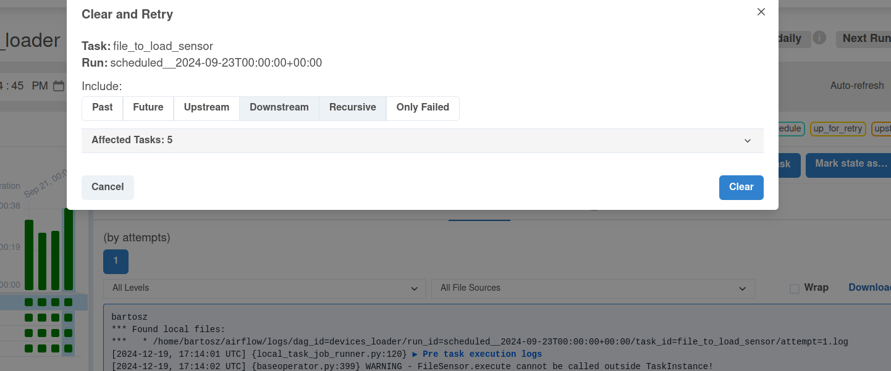

# Static late data integrator

## Data preparation
1. Prepare the directories:
```
BASE_DIR=/tmp/dedp/ch03/03-late-data/02-static-late-data-integrator-apache-airflow/
rm -rf $BASE_DIR
INPUT_DIR="${BASE_DIR}/dataset/input"
mkdir -p $INPUT_DIR
mkdir -p ${BASE_DIR}/dataset/output
```
2. Prepare the dataset files:
```

# These 2 files are for backfilling only
printf '{"id": "iphone-15", "brand_name": "apple", "full_name": "Apple iPhone 15", "processor_brand": "bionic"}
' >> "${INPUT_DIR}/2024-09-18.json"

printf '{"id": "iphone-16", "brand_name": "apple", "full_name": "Apple iPhone 16", "processor_brand": "bionic"}
' >> "${INPUT_DIR}/2024-09-19.json"

# These files are for the current runs
printf '{"id": "iphone-11", "brand_name": "apple", "full_name": "Apple iPhone 11", "processor_brand": "bionic"}
{"id": "iphone-12", "brand_name": "apple", "full_name": "Apple iPhone 12", "processor_brand": "bionic"}
{"id": "galaxy-a33", "brand_name": "samsun", "full_name": "Samsung Galaxy A33 5G (8GB RAM + 128GB)", "processor_brand": "exynos"}
' >> "${INPUT_DIR}/2024-09-20.json"

printf '{"id": "galaxy-a32", "brand_name": "samsung", "full_name": "Samsung Galaxy A32 5G", "processor_brand": "dimensity"}
{"id": "iphone-13", "brand_name": "apple", "full_name": "Apple iPhone 13", "processor_brand": "bionic"}
{"id": "redmi-note-10", "brand_name": "xiaomi", "full_name": "Xiaomi Redmi Note 10 5G", "processor_brand": "dimensity"}
{"id": "galaxy-a33", "brand_name": "samsung", "full_name": "Samsung Galaxy A33 5G (8GB RAM + 128GB)", "processor_brand": "exynos"}
' >> "${INPUT_DIR}/2024-09-21.json"

printf '{"id": "galaxy-m54", "brand_name": "samsung", "full_name": "Samsung Galaxy M54 5G", "processor_brand": "snapdragon"}
{"id": "redmi-note-9", "brand_name": "xiaom", "full_name": "Xiaomi Redmi Note 9 Pro (4GB RAM + 128GB)", "processor_brand": "snapdragon"}
' >> "${INPUT_DIR}/2024-09-22.json"

printf '{"id": "iphone-14", "brand_name": "apple", "full_name": "Apple iPhone 14", "processor_brand": "bionic"}' >> "${INPUT_DIR}/2024-09-23.json"
```

## Pipeline
1. Explain the [devices_loader.py](airflow%2Fdags%2Fdevices_loader.py)
* the job first copies the file of the current execution into an output directory
* next, the pipeline runs a backfilling part for two previous days 

2. Start the Airflow instance:
```
./start.sh
```
3. Access the Web UI at http://localhost:8080/login/ with dedp/dedp as login/password
4. Start the DAG and wait for the last run. The DAG should look like this:


## Simulate late data
1. As you saw, some of the files had only one row inside. It's on purpose as they will receive some late data now. Let's
run the following commands:
```
printf '{"id": "galaxy-m54", "brand_name": "samsung", "full_name": "Samsung Galaxy M54 5G", "processor_brand": "snapdragon"}
{"id": "redmi-note-9", "brand_name": "xiaom", "full_name": "Xiaomi Redmi Note 9 Pro (4GB RAM + 128GB)", "processor_brand": "snapdragon"}
{"id": "redmi-note-9-8gb", "brand_name": "xiaom", "full_name": "Xiaomi Redmi Note 9 Pro (8GB RAM + 128GB)", "processor_brand": "snapdragon"}
' > "${INPUT_DIR}/2024-09-22.json"

printf '{"id": "iphone-14", "brand_name": "apple", "full_name": "Apple iPhone 14", "processor_brand": "bionic"}
{"id": "galaxy-m51", "brand_name": "samsung", "full_name": "Samsung Galaxy M51 5G", "processor_brand": "snapdragon"}
{"id": "redmi-note-7", "brand_name": "xiaom", "full_name": "Xiaomi Redmi Note 7 Pro (4GB RAM + 128GB)", "processor_brand": "snapdragon"}
' > "${INPUT_DIR}/2024-09-23.json"
```

2. Since our static lookback window cover two past days besides the current date, to integrate files with late data
we can simply replay the last DAG run by cleaning the state:


3. After the execution, check if the output directory has new rows for two last dates:
```
cat ${BASE_DIR}/dataset/output/2024-09-22.json
{"id": "galaxy-m54", "brand_name": "samsung", "full_name": "Samsung Galaxy M54 5G", "processor_brand": "snapdragon"}
{"id": "redmi-note-9", "brand_name": "xiaom", "full_name": "Xiaomi Redmi Note 9 Pro (4GB RAM + 128GB)", "processor_brand": "snapdragon"}
{"id": "redmi-note-9-8gb", "brand_name": "xiaom", "full_name": "Xiaomi Redmi Note 9 Pro (8GB RAM + 128GB)", "processor_brand": "snapdragon"}

cat ${BASE_DIR}/dataset/output/2024-09-23.json
{"id": "iphone-14", "brand_name": "apple", "full_name": "Apple iPhone 14", "processor_brand": "bionic"}
{"id": "galaxy-m51", "brand_name": "samsung", "full_name": "Samsung Galaxy M51 5G", "processor_brand": "snapdragon"}
{"id": "redmi-note-7", "brand_name": "xiaom", "full_name": "Xiaomi Redmi Note 7 Pro (4GB RAM + 128GB)", "processor_brand": "snapdragon"}
```
