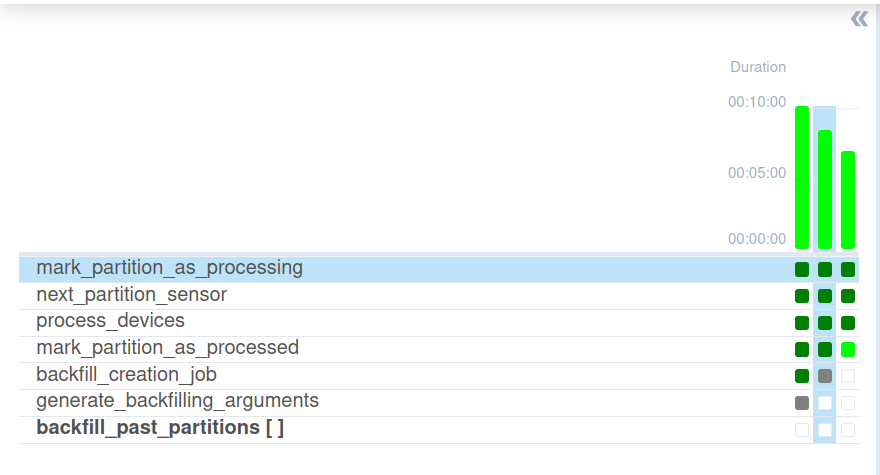
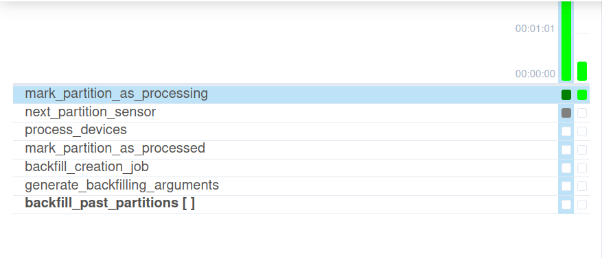
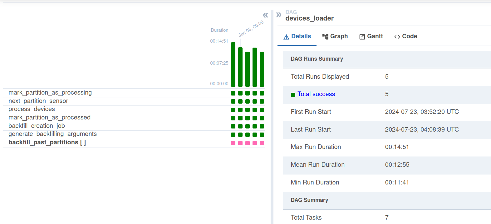
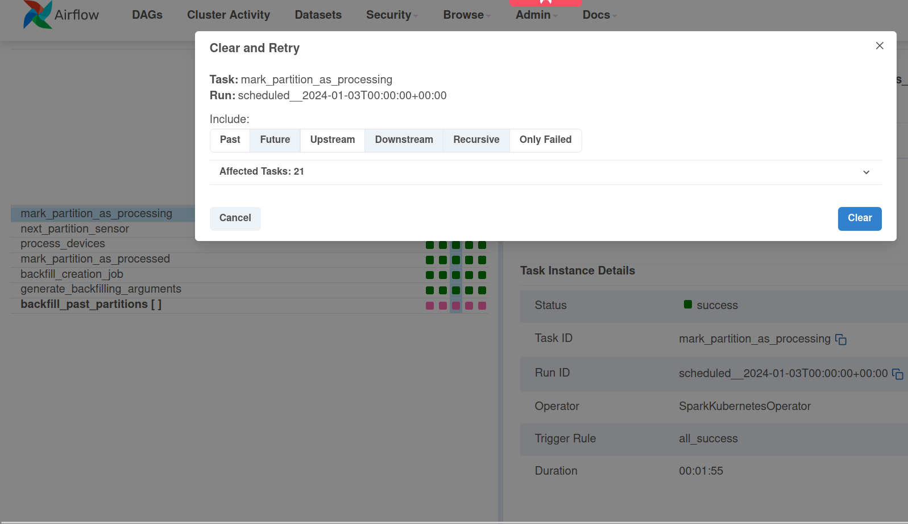
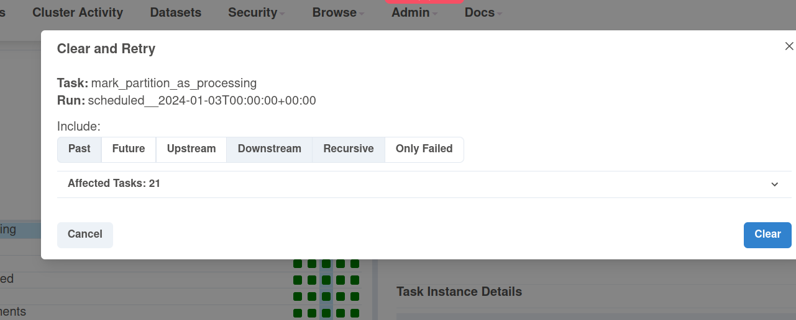
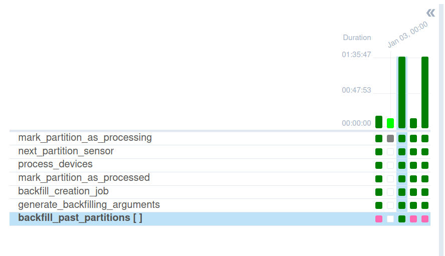
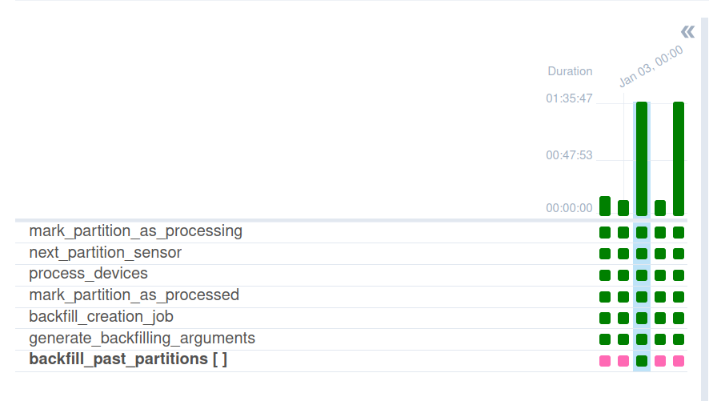

# Concurrent Late data integrator
## Data preparation
1. Generate datasets without the late data for the demo:
```
rm -rf /tmp/dedp/ch03/concurrent-late-data-integrator/dataset/devices
mkdir -p /tmp/dedp/ch03/concurrent-late-data-integrator/dataset/input
cd data-generator/dataset
docker-compose down --volumes; docker-compose up
```
2. Run the Delta table job for the first 7 partitions from the _data-generator_ project:
```
python load_devices_to_delta_table.py 2024-01-01
python load_devices_to_delta_table.py 2024-01-02
python load_devices_to_delta_table.py 2024-01-03
python load_devices_to_delta_table.py 2024-01-04
python load_devices_to_delta_table.py 2024-01-05
python load_devices_to_delta_table.py 2024-01-06
python load_devices_to_delta_table.py 2024-01-07
```
3. The dataset should look like in the following snippet:
```
$ tree /tmp/dedp/ch03/concurrent-late-data-integrator/dataset/devices -A
/tmp/dedp/ch03/concurrent-late-data-integrator/dataset/devices
├── _delta_log
│   ├── 00000000000000000000.json
│   ├── 00000000000000000001.json
│   ├── 00000000000000000002.json
│   ├── 00000000000000000003.json
│   ├── 00000000000000000004.json
│   ├── 00000000000000000005.json
│   └── 00000000000000000006.json
├── event_time=2024-01-01
│   └── part-00000-1cb1e099-21a3-468c-bd5f-28d59d4257e3.c000.snappy.parquet
├── event_time=2024-01-02
│   └── part-00000-d0787127-b587-40b2-9f79-f5f956f525e9.c000.snappy.parquet
├── event_time=2024-01-03
│   └── part-00000-6d518af5-b07a-42c4-9344-7b696d9a5bf2.c000.snappy.parquet
├── event_time=2024-01-04
│   └── part-00000-c97362bd-075f-4390-a88b-567e58189532.c000.snappy.parquet
├── event_time=2024-01-05
│   └── part-00000-3c4a3cde-1232-4abc-9c46-cf8569a580da.c000.snappy.parquet
├── event_time=2024-01-06
│   └── part-00000-c9e6f518-a3a0-423c-9d54-5e81cecc558e.c000.snappy.parquet
└── event_time=2024-01-07
    └── part-00000-1210aed2-4d73-4736-9ca4-74ff9181c185.c000.snappy.parquet

8 directories, 14 files
```

## Job preparation
1. Build the job Docker image:
```
cd backfilling-configurator
docker run   -ti --rm --user $(id -u):$(id -g) -v $PWD:$PWD:rw  -w $PWD hseeberger/scala-sbt:11.0.14.1_1.6.2_2.12.15  sbt clean assembly 

DOCKER_IMAGE_ARCHIVE_NAME=dedp_ch03_backfilling_configurator.tar
docker build -t dedp_ch03_backfilling_configurator .
docker save dedp_ch03_backfilling_configurator:latest > $DOCKER_IMAGE_ARCHIVE_NAME
```
2. Install and start minikube (`minikube start`): https://minikube.sigs.k8s.io/docs/start/
```
minikube start
```

3. Mount the dataset directory volume:
```
minikube mount "/tmp/dedp/ch03/concurrent-late-data-integrator/dataset:/data_for_demo" --uid 185 --gid 185
```
The command also makes the local datasets available for the Spark jobs running on Kubernetes. We're using here the 
`mount` after starting to avoid some of the issues mentioned here: https://github.com/kubernetes/minikube/issues/13397

The mount also defines the Spark user from the Docker image. Otherwise, the job can't write files to the output directory.

⚠️ Do not stop this process. Otherwise, you'll lose access to the dataset.
4. Upload the Docker image:
```
minikube image load $DOCKER_IMAGE_ARCHIVE_NAME
# check if the the image was correctly loaded
# You should see docker.io/library/dedp_ch03_backfilling_configurator:latest
minikube image ls
```
5. Create the demo namespace and a service account: 
```
K8S_NAMESPACE=dedp-ch03
kubectl create namespace $K8S_NAMESPACE
kubectl config set-context --current --namespace=$K8S_NAMESPACE
kubectl create serviceaccount spark-editor
kubectl create rolebinding spark-editor-role --clusterrole=edit --serviceaccount=$K8S_NAMESPACE:spark-editor
```
6. Install `SparkOperator` from Helm:
```
helm repo add spark-operator https://googlecloudplatform.github.io/spark-on-k8s-operator
helm install dedp-spark-operator spark-operator/spark-operator --namespace $K8S_NAMESPACE --create-namespace --set webhook.enable=true --set webhook.port=443
```
7. Start the K8S dashboard from a new tab 
```
minikube dashboard
``` 

## Pipeline
1. Explain the [devices_loader.py](airflow%2Fdags%2Fdevices_loader.py)
* the pipeline allows multiple execution except for 3 tasks:
  * _mark_partition_as_processing_ - because we want to have a sequential execution for the job that marks given partition
  as in progress to avoid concurrent scheduling
  * _mark_partition_as_processed_ - that's more the limitations of our state table which is a Delta Lake table; it's easier
  to support the concurrency just by limiting the threads. Besides that, the operation doesn't have the concurrency issue 
  as the update is targeted per partition
  * _backfill_creation_job_ - here we want to ensure that only one task triggers past partitions for backfilling; otherwise
    two tasks could detect the same past partitions for backfilling and trigger concurrent executions which we want to avoid
2. Start the Airflow instance:
```
./start.sh
```
3. Access the Web UI at http://localhost:8080/login/ with dedp/dedp as login/password
4. Start the DAG and wait for the last run. The DAG should progress with concurrent executions to the state present in the
last screenshot:








## Simulate late data
1. Return to the `data-generator` project and run again this command:
```
python load_devices_to_delta_table.py 2024-01-02
python load_devices_to_delta_table.py 2024-01-03
```
It should create late partition for an already processed DAG run.
2. Return to Apache Airflow UI to reprocess 2024-01-04 and 2024-01-05.


Ensure to check the "Past" and "Downstream" boxes as in the next screenshot:

3. Now, the restarted run should process its partition but also trigger the backfilling for the 
previously executed pipeline:


Besides, you should see the partitions in the backfilling configuration file for the execution time of 2024-01-03:

```
$  cat /tmp/dedp/ch03/concurrent-late-data-integrator/dataset/backfilling_configuration_2024-01-03.json
{"partitions":["event_time=2024-01-02"]}
```


4. The DAG should now look like:



5. Stop minikube: `minikube stop`
