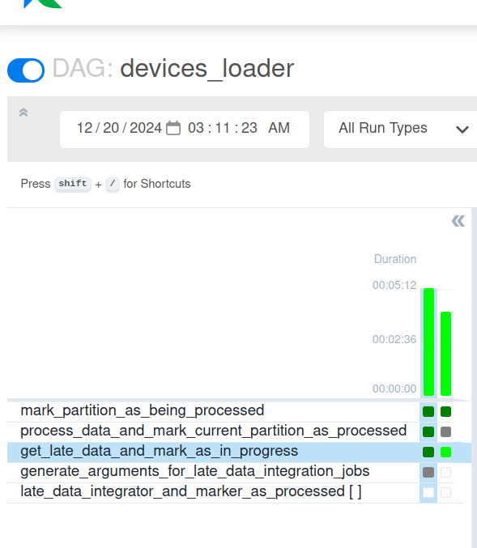
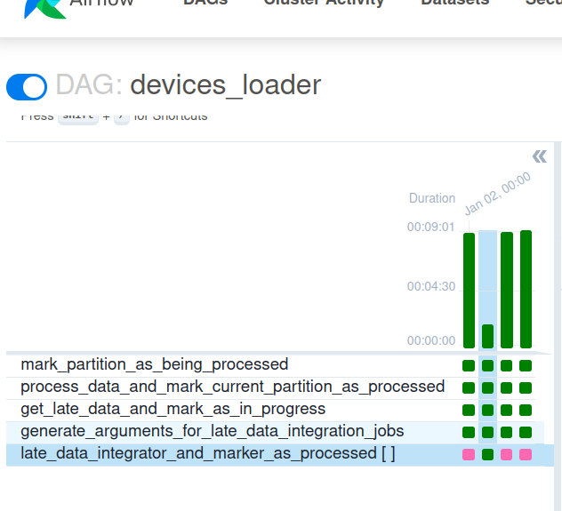
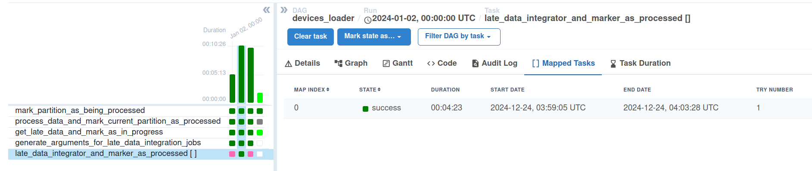
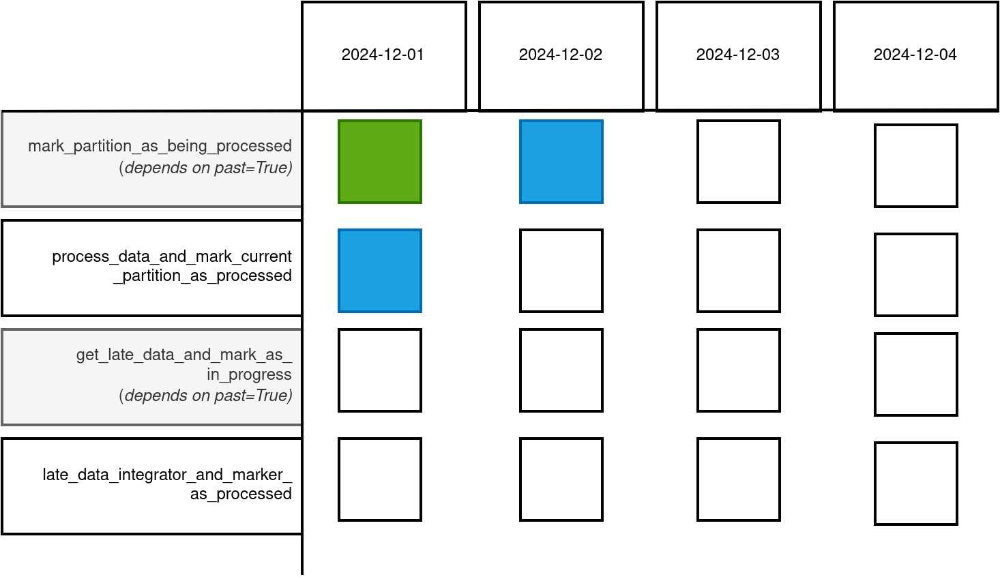

# Dynamic late data integrator - embedded job

## Data preparation
1. Generate datasets without the late data for the demo:
```
rm -rf /tmp/dedp/ch03/03-late-data/03-dynamic-late-data-integrator-apache-airflow-delta-lake-concurrent-embedded/
mkdir -p /tmp/dedp/ch03/03-late-data/03-dynamic-late-data-integrator-apache-airflow-delta-lake-concurrent-embedded/dataset/devices
mkdir -p /tmp/dedp/ch03/03-late-data/03-dynamic-late-data-integrator-apache-airflow-delta-lake-concurrent-embedded/dataset/input
cd data-generator/dataset
docker-compose down --volumes; docker-compose up
```
2. Run the Delta table job for the first 4 partitions from the _data-generator_ project:
```
python load_devices_to_delta_table.py 2024-01-01
python load_devices_to_delta_table.py 2024-01-02
python load_devices_to_delta_table.py 2024-01-03
python load_devices_to_delta_table.py 2024-01-04
```
3. The dataset should look like in the following snippet:
```
tree /tmp/dedp/ch03/03-late-data/03-dynamic-late-data-integrator-apache-airflow-delta-lake-concurrent-embedded/dataset/devices/ -A

/tmp/dedp/ch03/03-late-data/03-dynamic-late-data-integrator-apache-airflow-delta-lake-concurrent-embedded/dataset/devices/
├── _delta_log
│   ├── 00000000000000000000.json
│   ├── 00000000000000000001.json
│   ├── 00000000000000000002.json
│   └── 00000000000000000003.json
├── event_time=2024-01-01
│   └── part-00000-72792512-9e0f-4c1c-b9ef-14a599c37d2e.c000.snappy.parquet
├── event_time=2024-01-02
│   └── part-00000-786fa33d-36bf-4b0a-b907-b52109eea92c.c000.snappy.parquet
├── event_time=2024-01-03
│   └── part-00000-7d1c64c7-f88b-42af-b27e-41713e50cfac.c000.snappy.parquet
└── event_time=2024-01-04
    └── part-00000-9446c033-3683-4fd5-b83e-00623fd6f600.c000.snappy.parquet
```

## Job preparation
1. Build the job Docker image:
```
cd ../../late-data-integrator
docker run   -ti --rm --user $(id -u):$(id -g) -v $PWD:$PWD:rw  -w $PWD hseeberger/scala-sbt:11.0.14.1_1.6.2_2.12.15  sbt clean assembly 

DOCKER_IMAGE_ARCHIVE_NAME=dedp_ch03_late_data_integrator_embedded.tar
docker build -t dedp_ch03_late_data_integrator_embedded .
docker save dedp_ch03_late_data_integrator_embedded:latest > $DOCKER_IMAGE_ARCHIVE_NAME
```
2. Install and start minikube (`minikube start`): https://minikube.sigs.k8s.io/docs/start/
```
minikube start
```

3. Mount the dataset directory volume:
```
minikube mount "/tmp/dedp/ch03/03-late-data/03-dynamic-late-data-integrator-apache-airflow-delta-lake-concurrent-embedded/dataset:/data_for_demo" --uid 185 --gid 185
```
The command also makes the local datasets available for the Spark jobs running on Kubernetes. We're using here the 
`mount` after starting to avoid some of the issues mentioned here: https://github.com/kubernetes/minikube/issues/13397

The mount also defines the Spark user from the Docker image. Otherwise, the job can't write files to the output directory.

⚠️ Do not stop this process. Otherwise, you'll lose access to the dataset.
4. Upload the Docker image:
```
DOCKER_IMAGE_ARCHIVE_NAME=dedp_ch03_late_data_integrator_embedded.tar
minikube image load $DOCKER_IMAGE_ARCHIVE_NAME
# check if the the image was correctly loaded
# You should see docker.io/library/dedp_ch03_late_data_integrator_embedded:latest
minikube image ls
```
5. Create the demo namespace and a service account: 
```
K8S_NAMESPACE=dedp-ch03-late-data-conc-emb
kubectl create namespace $K8S_NAMESPACE
kubectl config set-context --current --namespace=$K8S_NAMESPACE
kubectl create serviceaccount spark-editor
kubectl create rolebinding spark-editor-role --clusterrole=edit --serviceaccount=$K8S_NAMESPACE:spark-editor
```
6. Install `SparkOperator` from Helm:
```
helm repo add spark-operator https://kubeflow.github.io/spark-operator
<!!! the jobs doesn't submit for version other than 1.1.27!!!! https://github.com/kubeflow/spark-operator/issues/1999
helm install dedp-spark-operator spark-operator/spark-operator --namespace $K8S_NAMESPACE --version 1.1.27 --create-namespace --set webhook.enable=true  --set webhook.port=443
```
7. Start the K8S dashboard from a new tab 
```
minikube dashboard
``` 

## Pipeline
1. Explain the [devices_loader.py](airflow%2Fdags%2Fdevices_loader.py)
* the job starts by loading data for the current partition and processing partitions with late data later
* _mark_partition_as_being_processed_ and _get_late_data_and_mark_as_in_progress_ run sequentially to avoid
scheduling concurrency that might lead to processing the same partition by two different runs
* the DAG uses a custom `SparkKubernetesOperatorWithDeferrableDriverPodOperator` that awaits for the driver
pod to complete
2. Start the Airflow instance:
```
./start.sh
```
3. Access the Web UI at http://localhost:8080/login/ with dedp/dedp as login/password
4. Start the DAG and wait for the last run. 
You should see the DAG transitioning from (concurrent execution but sequential on some dependent tasks):



to 


5. Verify the late data configuration files:
```
cat /tmp/dedp/ch03/03-late-data/03-dynamic-late-data-integrator-apache-airflow-delta-lake-concurrent-embedded/dataset/late_data_for_2024-01-01.json
{"partitions":[]}

cat /tmp/dedp/ch03/03-late-data/03-dynamic-late-data-integrator-apache-airflow-delta-lake-concurrent-embedded/dataset/late_data_for_2024-01-02.json
{"partitions":[]}

cat /tmp/dedp/ch03/03-late-data/03-dynamic-late-data-integrator-apache-airflow-delta-lake-concurrent-embedded/dataset/late_data_for_2024-01-03.json
{"partitions":[]}

cat /tmp/dedp/ch03/03-late-data/03-dynamic-late-data-integrator-apache-airflow-delta-lake-concurrent-embedded/dataset/late_data_for_2024-01-04.json
{"partitions":[]}
```


## Simulate late data
1. Return to the `data-generator` project and run again this command:
```
 python load_devices_to_delta_table.py 2024-01-01
 python load_devices_to_delta_table.py 2024-01-02
 python load_devices_to_delta_table.py 2024-01-03
```
It should create late partitions in the table.

```
tree /tmp/dedp/ch03/03-late-data/03-dynamic-late-data-integrator-apache-airflow-delta-lake-concurrent-embedded/dataset/devices/ -A

/tmp/dedp/ch03/03-late-data/03-dynamic-late-data-integrator-apache-airflow-delta-lake-concurrent-embedded/dataset/devices/
├── _delta_log
│   ├── 00000000000000000000.json
│   ├── 00000000000000000001.json
│   ├── 00000000000000000002.json
│   ├── 00000000000000000003.json
│   ├── 00000000000000000004.json
│   ├── 00000000000000000005.json
│   └── 00000000000000000006.json
├── event_time=2024-01-01
│   ├── part-00000-1d851734-0970-4170-8b98-a5dc20fa2d5b.c000.snappy.parquet
│   └── part-00000-72792512-9e0f-4c1c-b9ef-14a599c37d2e.c000.snappy.parquet
├── event_time=2024-01-02
│   ├── part-00000-786fa33d-36bf-4b0a-b907-b52109eea92c.c000.snappy.parquet
│   └── part-00000-84cfa289-1314-4cc2-bc97-77337337c656.c000.snappy.parquet
├── event_time=2024-01-03
│   ├── part-00000-47a3b04b-c98c-430a-b87e-d7ca1cd1dda2.c000.snappy.parquet
│   └── part-00000-7d1c64c7-f88b-42af-b27e-41713e50cfac.c000.snappy.parquet
└── event_time=2024-01-04
    └── part-00000-9446c033-3683-4fd5-b83e-00623fd6f600.c000.snappy.parquet
```

2. Return to Apache Airflow UI and reprocess the last 3 pipeline executions:


3. After the completion, verify the late data configuration files:
```
cat /tmp/dedp/ch03/03-late-data/03-dynamic-late-data-integrator-apache-airflow-delta-lake-concurrent-embedded/dataset/late_data_for_2024-01-01.json
{"partitions":[]}

cat /tmp/dedp/ch03/03-late-data/03-dynamic-late-data-integrator-apache-airflow-delta-lake-concurrent-embedded/dataset/late_data_for_2024-01-02.json
{"partitions":["event_time=2024-01-01"]}

cat /tmp/dedp/ch03/03-late-data/03-dynamic-late-data-integrator-apache-airflow-delta-lake-concurrent-embedded/dataset/late_data_for_2024-01-03.json
{"partitions":[]}

cat /tmp/dedp/ch03/03-late-data/03-dynamic-late-data-integrator-apache-airflow-delta-lake-concurrent-embedded/dataset/late_data_for_2024-01-04.json
{"partitions":[]}
```
The DAG should now include late data integration:





As you can notice, because of the `depends_on_past` flag, only the first pipeline captures 
the late data for 2024-01-01, avoiding duplicated backfillings. Moreover, the condition reading
late partitions only retrieves past partitions. It explains why two other partitions, explicitly backfilled
by the way, are omitted here.

4. Stop minikube: `minikube stop`

## Concurrency simulation
As you saw in the screenshots, the pipeline doesn't allow concurrent runs for some tasks that could create
duplicated runs if they were created at the same time. For the sake of simplicity, let's assume a pipeline with
the following configuration:

* disabled state
* daily trigger
* catch-up mode enabled 
* disabled date 2024-12-01
* current date 2024-12-05
* late data partitions: 2024-11-30, 2024-11-29

If you reenable the pipeline, due to the past dependency constraints on some tasks, it'll always 
keep one past-dependent task instance running, while allow multiple executions for the others. Below you
can find a simulation where the blue color marks tasks currently processed and the green one already processed:

