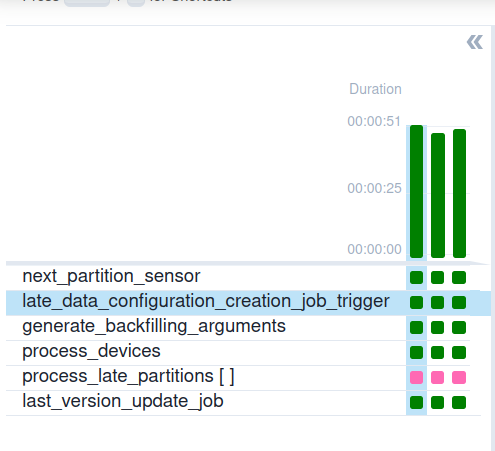
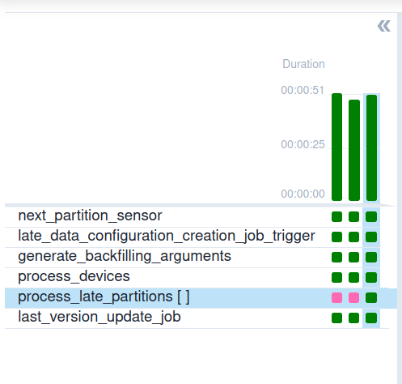

# Dynamic late data integrator - sequential runtime
## Data preparation
1. Generate datasets without the late data for the demo:
```
rm -rf /tmp/dedp/03-late-data/03-dynamic-late-data-integrator-apache-airflow-delta-lake-sequential/dataset/devices
mkdir -p /tmp/dedp/03-late-data/03-dynamic-late-data-integrator-apache-airflow-delta-lake-sequential/dataset/input
cd data-generator/dataset
docker-compose down --volumes; docker-compose up
```
2. Run the Delta table job for the first 3 partitions from the _data-generator_ project:
```
python load_devices_to_delta_table.py 2024-01-01
python load_devices_to_delta_table.py 2024-01-02
python load_devices_to_delta_table.py 2024-01-03
python load_devices_to_delta_table.py 2024-01-04
```
3. The dataset should look like in the following snippet:
```
tree -A /tmp/dedp/03-late-data/03-dynamic-late-data-integrator-apache-airflow-delta-lake-sequential/dataset/devices/
/tmp/dedp/03-late-data/03-dynamic-late-data-integrator-apache-airflow-delta-lake-sequential/dataset/devices/
├── _delta_log
│   ├── 00000000000000000000.json
│   ├── 00000000000000000001.json
│   ├── 00000000000000000002.json
│   └── 00000000000000000003.json
├── event_time=2024-01-01
│   └── part-00000-2a583f91-2d6c-448b-9779-c8fc4a4e674a.c000.snappy.parquet
├── event_time=2024-01-02
│   └── part-00000-dacef30c-69f8-4e3a-bb76-8f8dfeeb55c1.c000.snappy.parquet
├── event_time=2024-01-03
│   └── part-00000-3cfcf7e7-1461-439d-a8ef-f740fc35a314.c000.snappy.parquet
└── event_time=2024-01-04
    └── part-00000-f3ee3168-a241-4dbb-8ce4-a01d8dc07c19.c000.snappy.parquet
```

## Job preparation
1. Build the job Docker image:
```
cd ../late-data-integrator
docker run   -ti --rm --user $(id -u):$(id -g) -v $PWD:$PWD:rw  -w $PWD hseeberger/scala-sbt:11.0.14.1_1.6.2_2.12.15  sbt clean assembly 

DOCKER_IMAGE_ARCHIVE_NAME=dedp_ch03_late_data_integrator_sequential.tar
docker build -t dedp_ch03_late_data_integrator_sequential .
docker save dedp_ch03_late_data_integrator_sequential:latest > $DOCKER_IMAGE_ARCHIVE_NAME
```
2. Install and start minikube (`minikube start`): https://minikube.sigs.k8s.io/docs/start/
```
minikube start
```

3. Mount the dataset directory volume:
```
minikube mount "/tmp/dedp/03-late-data/03-dynamic-late-data-integrator-apache-airflow-delta-lake-sequential/dataset:/data_for_demo" --uid 185 --gid 185
```
The command also makes the local datasets available for the Spark jobs running on Kubernetes. We're using here the 
`mount` after starting to avoid some of the issues mentioned here: https://github.com/kubernetes/minikube/issues/13397

The mount also defines the Spark user from the Docker image. Otherwise, the job can't write files to the output directory.

⚠️ Do not stop this process. Otherwise, you'll lose access to the dataset.
4. Upload the Docker image:
```
DOCKER_IMAGE_ARCHIVE_NAME=dedp_ch03_late_data_integrator_sequential.tar
minikube image load $DOCKER_IMAGE_ARCHIVE_NAME
# check if the the image was correctly loaded
# You should see docker.io/library/dedp_ch03_late_data_integrator_sequential:latest
minikube image ls
```
5. Create the demo namespace and a service account: 
```
K8S_NAMESPACE=dedp-ch03-late-data-sequential
kubectl create namespace $K8S_NAMESPACE
kubectl config set-context --current --namespace=$K8S_NAMESPACE
kubectl create serviceaccount spark-editor
kubectl create rolebinding spark-editor-role --clusterrole=edit --serviceaccount=$K8S_NAMESPACE:spark-editor
```
6. Install `SparkOperator` from Helm:
```
helm repo add spark-operator https://kubeflow.github.io/spark-operator
helm install dedp-spark-operator spark-operator/spark-operator --namespace $K8S_NAMESPACE --version 1.1.27 --create-namespace --set webhook.enable=true  --set webhook.port=443
```
7. Start the K8S dashboard from a new tab 
```
minikube dashboard
``` 

## Pipeline
1. Explain the [devices_loader.py](airflow/dags/devices_loader.py)
* the job implements the Dynamic late data integrator pattern via two parallel branches
  * one to process the current partition
  * one to generate the late data configuration configuration
* upon processing the data, the job updates the last processed version and triggers backfilling for past partitions
  if some of them received late data
* the pipeline is sequential as:
  * it doesn't allow more than one run at a time
  * each task depends on the previous execution of the given task
  ```
  with DAG('devices_loader', max_active_runs=1,
         default_args={
             'depends_on_past': True,
  # ...
  ```
2. Start the Airflow instance:
```
./start.sh
```
3. Access the Web UI at http://localhost:8080/login/ with dedp/dedp as login/password
4. Start the DAG and wait for the last run. The DAG should look like this:

5. Verify the last processed version file and the most recent late data configuration:
```
# last processed version
cat /tmp/dedp/03-late-data/03-dynamic-late-data-integrator-apache-airflow-delta-lake-sequential/dataset/_last_processed_version
3

# most recent late data configuration
cat /tmp/dedp/03-late-data/03-dynamic-late-data-integrator-apache-airflow-delta-lake-sequential/dataset/late_data_configuration.json

{"partitions":[],"lastProcessedVersion":3}
```

## Simulate late data
1. Return to the `data-generator` project and run again this command:
```
 python load_devices_to_delta_table.py 2024-01-01
```
It should create late partition for an already processed DAG run.
```
tree -A /tmp/dedp/03-late-data/03-dynamic-late-data-integrator-apache-airflow-delta-lake-sequential/dataset/devices/
/tmp/dedp/03-late-data/03-dynamic-late-data-integrator-apache-airflow-delta-lake-sequential/dataset/devices/

├── _delta_log
│   ├── 00000000000000000000.json
│   ├── 00000000000000000001.json
│   ├── 00000000000000000002.json
│   ├── 00000000000000000003.json
│   └── 00000000000000000004.json
├── event_time=2024-01-01
│   ├── part-00000-2a583f91-2d6c-448b-9779-c8fc4a4e674a.c000.snappy.parquet
│   └── part-00000-ee45c6a4-06b6-45b4-945a-95136b577077.c000.snappy.parquet
├── event_time=2024-01-02
│   └── part-00000-dacef30c-69f8-4e3a-bb76-8f8dfeeb55c1.c000.snappy.parquet
├── event_time=2024-01-03
│   └── part-00000-3cfcf7e7-1461-439d-a8ef-f740fc35a314.c000.snappy.parquet
└── event_time=2024-01-04
    └── part-00000-f3ee3168-a241-4dbb-8ce4-a01d8dc07c19.c000.snappy.parquet
```

2. Return to Apache Airflow UI and reprocess the most recent task:

Now, the restarted run should process its partition but also trigger the backfilling for the 
previously executed pipeline:

3. Verify the last processed version file and the most recent backfilling configuration:
```
# last processed version
cat /tmp/dedp/03-late-data/03-dynamic-late-data-integrator-apache-airflow-delta-lake-sequential/dataset/_last_processed_version
4

# most recent late data configuration
cat /tmp/dedp/03-late-data/03-dynamic-late-data-integrator-apache-airflow-delta-lake-sequential/dataset/late_data_configuration.json

{"partitions":[{"event_time":"2024-01-01"}],"lastProcessedVersion":4}
```

4. The DAG should now look like:



5. Stop minikube: `minikube stop`
