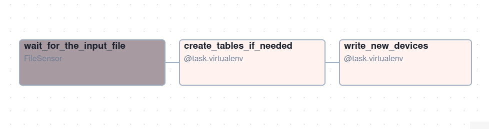
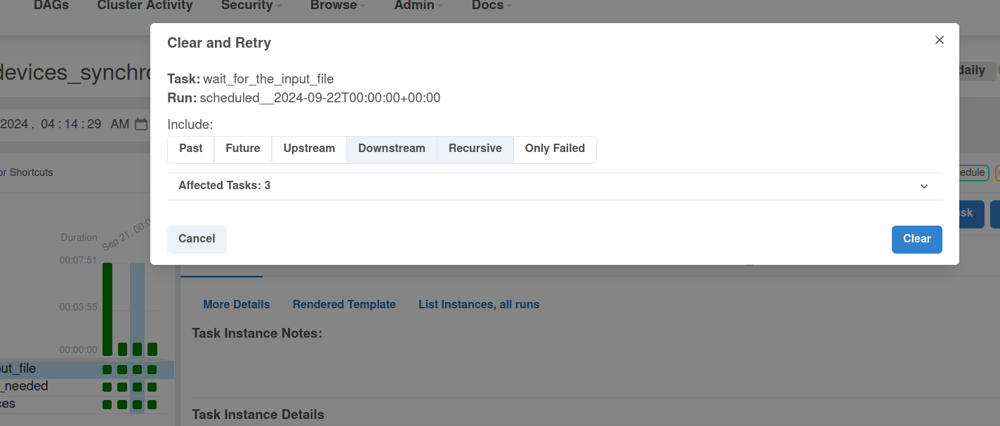

# Overwriter - Apache Airflow and Delta Lake


1. Prepare the input datasets:
```
INPUT_DIR=/tmp/dedp/ch04/01-overwriting/02-data-overwrite-airflow-delta-lake/input

mkdir -p $INPUT_DIR

printf '{"id": "iphone-11", "brand_name": "apple", "full_name": "Apple iPhone 11", "processor_brand": "bionic"}
{"id": "iphone-12", "brand_name": "apple", "full_name": "Apple iPhone 12", "processor_brand": "bionic"}
' >> "${INPUT_DIR}/20240920.json"

printf '{"id": "galaxy-a32", "brand_name": "samsung", "full_name": "Samsung Galaxy A32 5G", "processor_brand": "dimensity"}
{"id": "iphone-13", "brand_name": "apple", "full_name": "Apple iPhone 13", "processor_brand": "bionic"}
{"id": "redmi-note-10", "brand_name": "xiaomi", "full_name": "Xiaomi Redmi Note 10 5G", "processor_brand": "dimensity"}
{"id": "galaxy-a33", "brand_name": "samsung", "full_name": "Samsung Galaxy A33 5G (8GB RAM + 128GB)", "processor_brand": "exynos"}
' >> "${INPUT_DIR}/20240921.json"

printf '{"id": "galaxy-", "brand_name": "samsung", "full_name": "Samsung Galaxy M54 5G", "processor_brand": "snapdragon"}
{"id": "iphone-", "brand_name": "apple", "full_name": "Apple iPhone 14", "processor_brand": "bionic"}
' >> "${INPUT_DIR}/20240922.json"

printf '{"id": "galaxy-m32", "brand_name": "samsung", "full_name": "Samsung Galaxy M32 (6GB RAM + 128GB)", "processor_brand": "helio"}
{"id": "iphone-se-4", "brand_name": "apple", "full_name": "Apple iPhone SE 4", "processor_brand": "bionic"}
{"id": "pixel-7", "brand_name": "google", "full_name": "Google Pixel 7 Pro 5G", "processor_brand": "google"}
' >> "${INPUT_DIR}/20240923.json"

```

The file for `20240922.json` is explicitly left with incomplete ids.

2. Start the Apache Airflow instance:
```
./start.sh
```

3. Open the Apache Airflow UI and connect: http://localhost:8080 (admin/admin)

4. Explain the tasks of [devices_synchronizer.py](dags/devices_synchronizer.py)



* the DAG has the following tasks 
  * the _wait_for_the_input_file_ that waits for the file to be created
  * the _create_tables_if_needed_ creates the _devices_; you can delegate
  this responsibility to another project
  * the _write_new_devices_ that overwrites the data generated by the previous run;
    * the logic relies on Apache Airflow's execution time and uses it in the Delta Lake's `replaceWhere` predicate

5. Enable the _devices_synchronizer_ pipeline

6. After completing, run the _devices_reader_ DAG. It should print the content of the devices table as:
```
+-------------+----------+---------------------------------------+---------------+--------------+
[2024-12-12, 04:11:07 UTC] {process_utils.py:191} INFO - |id           |brand_name|full_name                              |processor_brand|execution_time|
[2024-12-12, 04:11:07 UTC] {process_utils.py:191} INFO - +-------------+----------+---------------------------------------+---------------+--------------+
[2024-12-12, 04:11:07 UTC] {process_utils.py:191} INFO - |iphone-11    |apple     |Apple iPhone 11                        |bionic         |20240920      |
[2024-12-12, 04:11:07 UTC] {process_utils.py:191} INFO - |iphone-12    |apple     |Apple iPhone 12                        |bionic         |20240920      |
[2024-12-12, 04:11:07 UTC] {process_utils.py:191} INFO - |galaxy-a32   |samsung   |Samsung Galaxy A32 5G                  |dimensity      |20240921      |
[2024-12-12, 04:11:07 UTC] {process_utils.py:191} INFO - |iphone-13    |apple     |Apple iPhone 13                        |bionic         |20240921      |
[2024-12-12, 04:11:07 UTC] {process_utils.py:191} INFO - |redmi-note-10|xiaomi    |Xiaomi Redmi Note 10 5G                |dimensity      |20240921      |
[2024-12-12, 04:11:07 UTC] {process_utils.py:191} INFO - |galaxy-a33   |samsung   |Samsung Galaxy A33 5G (8GB RAM + 128GB)|exynos         |20240921      |
[2024-12-12, 04:11:07 UTC] {process_utils.py:191} INFO - |galaxy-      |samsung   |Samsung Galaxy M54 5G                  |snapdragon     |20240922      |
[2024-12-12, 04:11:07 UTC] {process_utils.py:191} INFO - |iphone-      |apple     |Apple iPhone 14                        |bionic         |20240922      |
[2024-12-12, 04:11:07 UTC] {process_utils.py:191} INFO - |galaxy-m32   |samsung   |Samsung Galaxy M32 (6GB RAM + 128GB)   |helio          |20240923      |
[2024-12-12, 04:11:07 UTC] {process_utils.py:191} INFO - |iphone-se-4  |apple     |Apple iPhone SE 4                      |bionic         |20240923      |
[2024-12-12, 04:11:07 UTC] {process_utils.py:191} INFO - |pixel-7      |google    |Google Pixel 7 Pro 5G                  |google         |20240923      |
[2024-12-12, 04:11:07 UTC] {process_utils.py:191} INFO - +-------------+----------+---------------------------------------+---------------+--------------+
```

As you can see, two entries from the 20240922.json file are incomplete. You can assume your data provider did a mistake
and after your demand, you got a new file.

7. Run:
```
printf '{"id": "galaxy-m54", "brand_name": "samsung", "full_name": "Samsung Galaxy M54 5G", "processor_brand": "snapdragon"}
{"id": "iphone-14", "brand_name": "apple", "full_name": "Apple iPhone 14", "processor_brand": "bionic"}
' > "${INPUT_DIR}/20240922.json"
```
8. Backfill the _devices_synchronizer_ for 2024-09-22 only.


8. Run the _devices_reader_. It should print the table with the erroneous devices replaced by the good ones:
```
+-------------+----------+---------------------------------------+---------------+--------------+
[2024-12-12, 04:16:50 UTC] {process_utils.py:191} INFO - |id           |brand_name|full_name                              |processor_brand|execution_time|
[2024-12-12, 04:16:50 UTC] {process_utils.py:191} INFO - +-------------+----------+---------------------------------------+---------------+--------------+
[2024-12-12, 04:16:50 UTC] {process_utils.py:191} INFO - |iphone-11    |apple     |Apple iPhone 11                        |bionic         |20240920      |
[2024-12-12, 04:16:50 UTC] {process_utils.py:191} INFO - |iphone-12    |apple     |Apple iPhone 12                        |bionic         |20240920      |
[2024-12-12, 04:16:50 UTC] {process_utils.py:191} INFO - |galaxy-a32   |samsung   |Samsung Galaxy A32 5G                  |dimensity      |20240921      |
[2024-12-12, 04:16:50 UTC] {process_utils.py:191} INFO - |iphone-13    |apple     |Apple iPhone 13                        |bionic         |20240921      |
[2024-12-12, 04:16:50 UTC] {process_utils.py:191} INFO - |redmi-note-10|xiaomi    |Xiaomi Redmi Note 10 5G                |dimensity      |20240921      |
[2024-12-12, 04:16:50 UTC] {process_utils.py:191} INFO - |galaxy-a33   |samsung   |Samsung Galaxy A33 5G (8GB RAM + 128GB)|exynos         |20240921      |
[2024-12-12, 04:16:50 UTC] {process_utils.py:191} INFO - |galaxy-m54   |samsung   |Samsung Galaxy M54 5G                  |snapdragon     |20240922      |
[2024-12-12, 04:16:50 UTC] {process_utils.py:191} INFO - |iphone-14    |apple     |Apple iPhone 14                        |bionic         |20240922      |
[2024-12-12, 04:16:50 UTC] {process_utils.py:191} INFO - |galaxy-m32   |samsung   |Samsung Galaxy M32 (6GB RAM + 128GB)   |helio          |20240923      |
[2024-12-12, 04:16:50 UTC] {process_utils.py:191} INFO - |iphone-se-4  |apple     |Apple iPhone SE 4                      |bionic         |20240923      |
[2024-12-12, 04:16:50 UTC] {process_utils.py:191} INFO - |pixel-7      |google    |Google Pixel 7 Pro 5G                  |google         |20240923      |
[2024-12-12, 04:16:50 UTC] {process_utils.py:191} INFO - +-------------+----------+---------------------------------------+---------------+--------------+
```

Put differently, the job overwritten the entries matching the `execution_time = "20240922"` predicate only!
