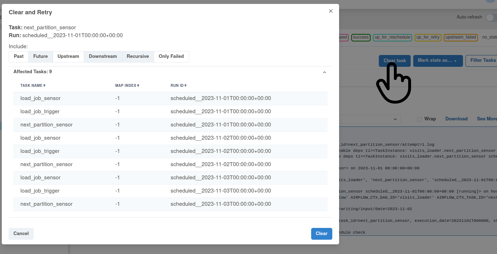

# Overwriting - data overwriter
# Dataset preparation
1. Generate the dataset for the demo:
```
cd dataset
mkdir -p /tmp/dedp/ch04/overwriting/data_overwriting/input
mkdir -p /tmp/dedp/ch04/overwriting/data_overwriting/output
docker-compose down --volumes; docker-compose up
```

## PySpark job preparation
1. Build the job Docker image:
```
cd ../visits-loader-job
DOCKER_IMAGE_ARCHIVE_NAME=depd_visits_loader.tar
docker build -t depd_visits_loader .
docker save depd_visits_loader:latest > $DOCKER_IMAGE_ARCHIVE_NAME
```
2. Install and start minikube (`minikube start`): https://minikube.sigs.k8s.io/docs/start/
```
minikube start
```

3. Mount the dataset directory volume:
```
minikube mount "/tmp/dedp/ch04/overwriting/data_overwriting:/data_for_demo" --uid 185 --gid 185
```
The command also makes the local datasets available for the Spark jobs running on Kubernetes. We're using here the 
`mount` after starting to avoid some of the issues mentioned here: https://github.com/kubernetes/minikube/issues/13397

The mount also defines the Spark user from the Docker image. Otherwise, the job can't write files to the output directory.

⚠️ Do not stop this process. Otherwise, you'll lose access to the dataset.
4. Upload the Docker image:
```
minikube image load $DOCKER_IMAGE_ARCHIVE_NAME
# check if the the image was correctly loaded
# You should see docker.io/library/depd_visits_loader:latest
minikube image ls
```
5. Create the demo namespace and a service account: 
```
K8S_NAMESPACE=dedp-ch04
kubectl create namespace $K8S_NAMESPACE
kubectl config set-context --current --namespace=$K8S_NAMESPACE
kubectl create serviceaccount spark-editor
kubectl create rolebinding spark-editor-role --clusterrole=edit --serviceaccount=$K8S_NAMESPACE:spark-editor
```
6. Install `SparkOperator` from Helm:
```
helm repo add spark-operator https://googlecloudplatform.github.io/spark-on-k8s-operator
helm install dedp-spark-operator spark-operator/spark-operator --namespace $K8S_NAMESPACE --create-namespace --set webhook.enable=true --set webhook.port=443
```
7. Start the K8S dashboard from a new tab 
```
minikube dashboard
```
8. Explain the [visits_loader.py](visits-loader-job%2Fvisits_loader.py)
* it copies input files to a different location
* the most important part here is the `mode('overwrite')` that always replaces the existing data in the output
  storage

## Orchestration layer
1. Explain the [visits_loader.py](airflow%2Fdags%2Fvisits_loader.py)
* the pipeline starts with a sensor waiting for the next partition to be available; 
  it's our readiness marker 
* next, the job DAG starts the data loading job and quits
* once the job submitted, it runs a sensor to check the job's outcome
💡 by using this `fire & forget` approach, the orchestration resources are freed and can be used for other tasks; otherwise 
the sensor would wait as long as the job didn't complete
2. Start the Apache Airflow instance:
```
cd airflow
./start.sh
```
3. Access the Web UI at http://localhost:8080/login/ with dedp/dedp as login/password
4. Start the `visits_loader` DAG and wait for all the three scheduled executions to complete.
5. Check the outcome:
```
$ tree /tmp/dedp/ch04/overwriting/data_overwriting/output -DA
/tmp/dedp/ch04/overwriting/data_overwriting/output
├── [Jan 30 05:46]  date=2023-11-01
│   ├── [Jan 30 05:46]  part-00000-261d4939-e697-4ea8-b8e1-3c6e484a56a8-c000.txt
│   └── [Jan 30 05:46]  _SUCCESS
├── [Jan 30 05:47]  date=2023-11-02
│   ├── [Jan 30 05:47]  part-00000-796dfe90-23ab-4112-acf5-55151a02addc-c000.txt
│   └── [Jan 30 05:47]  _SUCCESS
└── [Jan 30 05:48]  date=2023-11-03
    ├── [Jan 30 05:48]  part-00000-4c533850-4dd3-4ff3-8ace-2fef447e9b03-c000.txt
    └── [Jan 30 05:48]  _SUCCESS

3 directories, 6 files
```
6. Clean the pipelines to restart them:

7. Wait for the completion.
8. Check the result; thanks to the overwriting mode, you shouldn't see any duplicates:
```
$ tree /tmp/dedp/ch04/overwriting/data_overwriting/output -DA
/tmp/dedp/ch04/overwriting/data_overwriting/output
├── [Jan 30 05:51]  date=2023-11-01
│   ├── [Jan 30 05:51]  part-00000-6f7f734c-8f4f-4d37-8ba9-f9817504aa02-c000.txt
│   └── [Jan 30 05:51]  _SUCCESS
├── [Jan 30 05:52]  date=2023-11-02
│   ├── [Jan 30 05:52]  part-00000-4367a1b6-794a-41cc-bc9a-4bad884f8f36-c000.txt
│   └── [Jan 30 05:52]  _SUCCESS
└── [Jan 30 05:54]  date=2023-11-03
    ├── [Jan 30 05:54]  part-00000-33d3b739-1480-4b1a-b6df-b28bf215e524-c000.txt
    └── [Jan 30 05:54]  _SUCCESS

3 directories, 6 files
```
You should see the same number of files but with different creation times.
9. Stop minikube: `minikube stop`