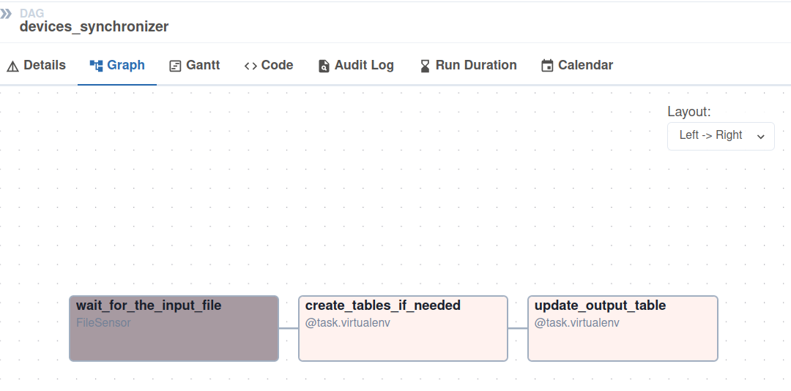
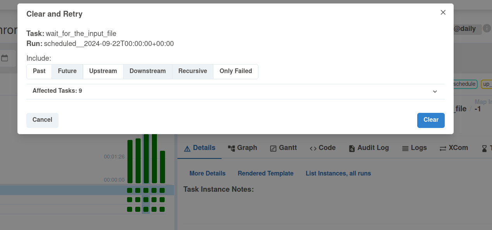

# Merger - Apache Airflow and Delta Lake


1. Prepare the input datasets:
```
INPUT_DIR=/tmp/dedp/ch04/02-updates/01-merger-apache-airflow-delta-lake-state-table/input

mkdir -p $INPUT_DIR

printf '{"id": "iphone-11", "brand_name": "apple", "full_name": "Apple iPhone 11", "processor_brand": "bionic"}
{"id": "iphone-12", "brand_name": "apple", "full_name": "Apple iPhone 12", "processor_brand": "bionic"}
{"id": "galaxy-a33", "brand_name": "samsun", "full_name": "Samsung Galaxy A33 5G (8GB RAM + 128GB)", "processor_brand": "exynos"}
' >> "${INPUT_DIR}/20240920.json"

printf '{"id": "galaxy-a32", "brand_name": "samsung", "full_name": "Samsung Galaxy A32 5G", "processor_brand": "dimensity"}
{"id": "iphone-13", "brand_name": "apple", "full_name": "Apple iPhone 13", "processor_brand": "bionic"}
{"id": "redmi-note-10", "brand_name": "xiaomi", "full_name": "Xiaomi Redmi Note 10 5G", "processor_brand": "dimensity"}
{"id": "galaxy-a33", "brand_name": "samsung", "full_name": "Samsung Galaxy A33 5G (8GB RAM + 128GB)", "processor_brand": "exynos"}
' >> "${INPUT_DIR}/20240921.json"

printf '{"id": "galaxy-m54", "brand_name": "samsung", "full_name": "Samsung Galaxy M54 5G", "processor_brand": "snapdragon"}
{"id": "iphone-14", "brand_name": "apple", "full_name": "Apple iPhone 14", "processor_brand": "bionic"}
{"id": "redmi-note-9", "brand_name": "xiaom", "full_name": "Xiaomi Redmi Note 9 Pro (4GB RAM + 128GB)", "processor_brand": "snapdragon"}
' >> "${INPUT_DIR}/20240922.json"

printf '{"id": "galaxy-m32", "brand_name": "samsung", "full_name": "Samsung Galaxy M32 (6GB RAM + 128GB)", "processor_brand": "helio"}
{"id": "iphone-se-4", "brand_name": "apple", "full_name": "Apple iPhone SE 4", "processor_brand": "bionic"}
{"id": "pixel-7", "brand_name": "google", "full_name": "Google Pixel 7 Pro 5G", "processor_brand": "google"}
{"id": "redmi-note-9", "brand_name": "xiaomi", "full_name": "Xiaomi Redmi Note 9 Pro (4GB RAM + 128GB)", "processor_brand": "snapdragon"}
' >> "${INPUT_DIR}/20240923.json"

# Intentional duplicate
printf '{"id": "galaxy-m32", "brand_name": "samsung", "full_name": "Samsung Galaxy M32 (6GB RAM + 128GB)", "processor_brand": "helio"}
{"id": "iphone-se-4", "brand_name": "apple", "full_name": "Apple iPhone SE 4", "processor_brand": "bionic"}
{"id": "pixel-7", "brand_name": "google", "full_name": "Google Pixel 7 Pro 5G", "processor_brand": "google"}
{"id": "redmi-note-9", "brand_name": "xiaomi", "full_name": "Xiaomi Redmi Note 9 Pro (4GB RAM + 128GB)", "processor_brand": "snapdragon"}
' >> "${INPUT_DIR}/20240924.json"
```

2. Start the Apache Airflow instance:
```
cd ../
./start.sh
```

3. Open the Apache Airflow UI and connect: http://localhost:8080 (admin/admin)

4. Explain the tasks of [devices_synchronizer.py](dags/devices_synchronizer.py)



* the DAG has two tasks 
  * the _wait_for_the_input_file_ that waits for the file to be created
  * the _create_tables_if_needed_ creates the _devices_ and _versions_ tables if they don't exist
  * the _update_output_table_ that performs the idempotent `MERGE` on the table, such as:
    * detect if we have the previous execution of the pipeline
      * if no, skip
      * if yes, read the Delta table version associated to this run
        * if the version doesn't exist or if it's the same as the most recent table version, skip
        * if the version does exist and is lower than the most recent version, restore the table to this version
    * perform the `MERGE` between the maybe restored table and the data from the file
    * update the _versions_ table so that the next run will be able to read the version created by the previous run

5. Enable the _devices_synchronizer_ pipeline

6. After completing, run the _devices_reader_ DAG. It should print
the content of both tables, as:
```
+-------------+----------+-----------------------------------------+---------------+
[2024-10-02, 09:41:14 UTC] {process_utils.py:191} INFO - |id           |brand_name|full_name                                |processor_brand|
[2024-10-02, 09:41:14 UTC] {process_utils.py:191} INFO - +-------------+----------+-----------------------------------------+---------------+
[2024-10-02, 09:41:14 UTC] {process_utils.py:191} INFO - |galaxy-a32   |samsung   |Samsung Galaxy A32 5G                    |dimensity      |
[2024-10-02, 09:41:14 UTC] {process_utils.py:191} INFO - |galaxy-a33   |samsung   |Samsung Galaxy A33 5G (8GB RAM + 128GB)  |exynos         |
[2024-10-02, 09:41:14 UTC] {process_utils.py:191} INFO - |galaxy-m32   |samsung   |Samsung Galaxy M32 (6GB RAM + 128GB)     |helio          |
[2024-10-02, 09:41:14 UTC] {process_utils.py:191} INFO - |galaxy-m54   |samsung   |Samsung Galaxy M54 5G                    |snapdragon     |
[2024-10-02, 09:41:14 UTC] {process_utils.py:191} INFO - |iphone-11    |apple     |Apple iPhone 11                          |bionic         |
[2024-10-02, 09:41:14 UTC] {process_utils.py:191} INFO - |iphone-12    |apple     |Apple iPhone 12                          |bionic         |
[2024-10-02, 09:41:14 UTC] {process_utils.py:191} INFO - |iphone-13    |apple     |Apple iPhone 13                          |bionic         |
[2024-10-02, 09:41:14 UTC] {process_utils.py:191} INFO - |iphone-14    |apple     |Apple iPhone 14                          |bionic         |
[2024-10-02, 09:41:14 UTC] {process_utils.py:191} INFO - |iphone-se-4  |apple     |Apple iPhone SE 4                        |bionic         |
[2024-10-02, 09:41:14 UTC] {process_utils.py:191} INFO - |pixel-7      |google    |Google Pixel 7 Pro 5G                    |google         |
[2024-10-02, 09:41:14 UTC] {process_utils.py:191} INFO - |redmi-note-10|xiaomi    |Xiaomi Redmi Note 10 5G                  |dimensity      |
[2024-10-02, 09:41:14 UTC] {process_utils.py:191} INFO - |redmi-note-9 |xiaomi    |Xiaomi Redmi Note 9 Pro (4GB RAM + 128GB)|snapdragon     |
[2024-10-02, 09:41:14 UTC] {process_utils.py:191} INFO - +-------------+----------+-----------------------------------------+---------------+
[2024-10-02, 09:41:14 UTC] {process_utils.py:191} INFO - 
```

```
+-----------+-------------------+
[2024-10-02, 09:42:00 UTC] {process_utils.py:191} INFO - |job_version|delta_table_version|
[2024-10-02, 09:42:00 UTC] {process_utils.py:191} INFO - +-----------+-------------------+
[2024-10-02, 09:42:00 UTC] {process_utils.py:191} INFO - |20240920   |1                  |
[2024-10-02, 09:42:00 UTC] {process_utils.py:191} INFO - |20240921   |2                  |
[2024-10-02, 09:42:00 UTC] {process_utils.py:191} INFO - |20240922   |3                  |
[2024-10-02, 09:42:00 UTC] {process_utils.py:191} INFO - |20240923   |4                  |
[2024-10-02, 09:42:00 UTC] {process_utils.py:191} INFO - |20240924   |5                  |
[2024-10-02, 09:42:00 UTC] {process_utils.py:191} INFO - +-----------+-------------------+
```

7. Simulate backfilling by running the _devices_synchronizer_ from 2024-09-22.


8. Run the _devices_reader_. It should print the same content for the devices table and some version changes for the 
versions table:
```
+-------------+----------+-----------------------------------------+---------------+
[2024-10-02, 09:49:23 UTC] {process_utils.py:191} INFO - |id           |brand_name|full_name                                |processor_brand|
[2024-10-02, 09:49:23 UTC] {process_utils.py:191} INFO - +-------------+----------+-----------------------------------------+---------------+
[2024-10-02, 09:49:23 UTC] {process_utils.py:191} INFO - |galaxy-a32   |samsung   |Samsung Galaxy A32 5G                    |dimensity      |
[2024-10-02, 09:49:23 UTC] {process_utils.py:191} INFO - |galaxy-a33   |samsung   |Samsung Galaxy A33 5G (8GB RAM + 128GB)  |exynos         |
[2024-10-02, 09:49:23 UTC] {process_utils.py:191} INFO - |galaxy-m32   |samsung   |Samsung Galaxy M32 (6GB RAM + 128GB)     |helio          |
[2024-10-02, 09:49:23 UTC] {process_utils.py:191} INFO - |galaxy-m54   |samsung   |Samsung Galaxy M54 5G                    |snapdragon     |
[2024-10-02, 09:49:23 UTC] {process_utils.py:191} INFO - |iphone-11    |apple     |Apple iPhone 11                          |bionic         |
[2024-10-02, 09:49:23 UTC] {process_utils.py:191} INFO - |iphone-12    |apple     |Apple iPhone 12                          |bionic         |
[2024-10-02, 09:49:23 UTC] {process_utils.py:191} INFO - |iphone-13    |apple     |Apple iPhone 13                          |bionic         |
[2024-10-02, 09:49:23 UTC] {process_utils.py:191} INFO - |iphone-14    |apple     |Apple iPhone 14                          |bionic         |
[2024-10-02, 09:49:23 UTC] {process_utils.py:191} INFO - |iphone-se-4  |apple     |Apple iPhone SE 4                        |bionic         |
[2024-10-02, 09:49:23 UTC] {process_utils.py:191} INFO - |pixel-7      |google    |Google Pixel 7 Pro 5G                    |google         |
[2024-10-02, 09:49:23 UTC] {process_utils.py:191} INFO - |redmi-note-10|xiaomi    |Xiaomi Redmi Note 10 5G                  |dimensity      |
[2024-10-02, 09:49:23 UTC] {process_utils.py:191} INFO - |redmi-note-9 |xiaomi    |Xiaomi Redmi Note 9 Pro (4GB RAM + 128GB)|snapdragon     |
[2024-10-02, 09:49:23 UTC] {process_utils.py:191} INFO - +-------------+----------+-----------------------------------------+---------------+
```


```
+-----------+-------------------+
[2024-10-02, 09:50:03 UTC] {process_utils.py:191} INFO - |job_version|delta_table_version|
[2024-10-02, 09:50:03 UTC] {process_utils.py:191} INFO - +-----------+-------------------+
[2024-10-02, 09:50:03 UTC] {process_utils.py:191} INFO - |20240920   |1                  |
[2024-10-02, 09:50:03 UTC] {process_utils.py:191} INFO - |20240921   |2                  |
[2024-10-02, 09:50:03 UTC] {process_utils.py:191} INFO - |20240922   |6                  |
[2024-10-02, 09:50:03 UTC] {process_utils.py:191} INFO - |20240923   |7                  |
[2024-10-02, 09:50:03 UTC] {process_utils.py:191} INFO - |20240924   |8                  |
[2024-10-02, 09:50:03 UTC] {process_utils.py:191} INFO - +-----------+-------------------+
```