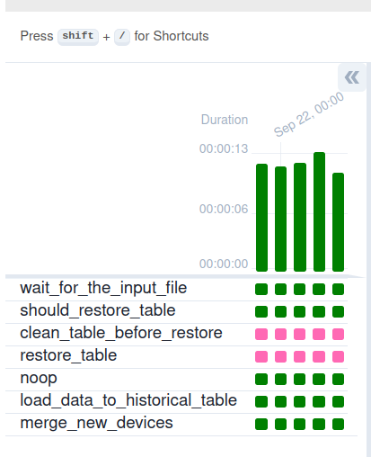
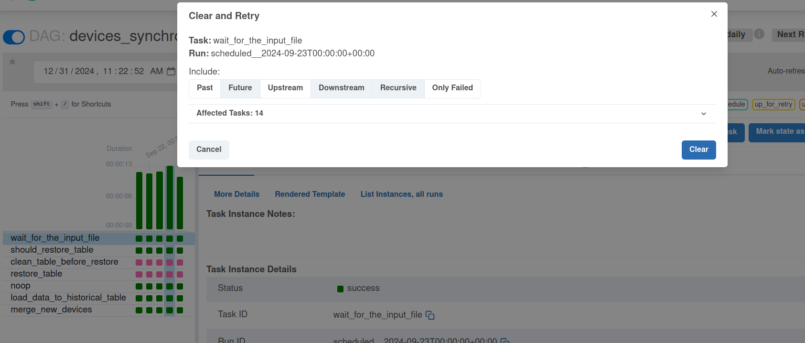
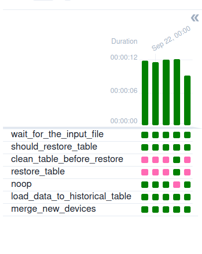

# Stateful merger - PostgreSQL

1. Prepare the input datasets:
```
INPUT_DIR=/tmp/dedp/ch04/02-updates/02-stateful-merger-apache-airflow-postgresql/input

mkdir -p $INPUT_DIR

printf 'id;brand_name;full_name;processor_brand
iphone-11;apple;Apple iPhone 11;bionic
iphone-12;apple;Apple iPhone 12;bionic
galaxy-a33;samsun;Samsung Galaxy A33 5G (8GB RAM + 128GB);exynos
' > "${INPUT_DIR}/20240920.csv"

printf 'id;brand_name;full_name;processor_brand
galaxy-a32;samsung;Samsung Galaxy A32 5G;dimensity
iphone-13;apple;Apple iPhone 13;bionic
redmi-note-10;xiaomi;Xiaomi Redmi Note 10 5G;dimensity
galaxy-a33;samsung;Samsung Galaxy A33 5G (8GB RAM + 128GB);exynos
' > "${INPUT_DIR}/20240921.csv"

printf 'id;brand_name;full_name;processor_brand
galaxy-m54;samsung;Samsung Galaxy M54 5G;snapdragon
iphone-14;apple;Apple iPhone 14;bionic
redmi-note-9;xiaom;Xiaomi Redmi Note 9 Pro (4GB RAM + 128GB);snapdragon
' > "${INPUT_DIR}/20240922.csv"

printf 'id;brand_name;full_name;processor_brand
galaxy-m32;samsung;Samsung Galaxy M32 (6GB RAM + 128GB);helio
iphone-se-4;apple;Apple iPhone SE 4;bionic
pixel-7;google;Google Pixel 7 Pro 5G;google
redmi-note-9;xiaomi;Xiaomi Redmi Note 9 Pro (4GB RAM + 128GB);snapdragon
' > "${INPUT_DIR}/20240923.csv"

# Intentional duplicate
printf 'id;brand_name;full_name;processor_brand
galaxy-m32;samsung;Samsung Galaxy M32 (6GB RAM + 128GB);helio
iphone-se-4;apple;Apple iPhone SE 4;bionic
pixel-7;google;Google Pixel 7 Pro 5G;google
redmi-note-9;xiaomi;Xiaomi Redmi Note 9 Pro (4GB RAM + 128GB);snapdragon
' > "${INPUT_DIR}/20240924.csv"
```

2. Start the Apache Airflow instance:
```
./start.sh
```
3. Open the Apache Airflow UI and connect: http://localhost:8080 (dedp/dedp)
4. Start the PostgreSQL database:
```
cd docker
docker-compose down --volumes; docker-compose up
```

5. Explain the [devices_synchronizer.py](dags/devices_synchronizer.py)
* the pipeline runs a SQL query to verify whether the workflow follows the backfilling or real-time mode
  * in case of backfilling, the number of rows with the execution time greater than the current execution time
    is higher than 0
* if no backfilling scenario is detected, the pipeline follows noop branch
  * otherwise, the pipeline restores the table to the last valid state which is the state prior the merge
* later, the pipeline loads new data to merge from the input CSV file to a table 
  * the loading process is idempotent as it removes already inserted rows for the given execution time (`{{ ts }}` from the query)
* in the end, the workflow completes with a `MERGE` statement

6. Run the `devices_synchronizer`. It should run only once.
7. Check the results in the database:
```
docker exec -ti dedp_postgresql psql --user dedp_test -d dedp
dedp=# SELECT COUNT(*) FROM dedp.devices;
 count 
-------
    12
(1 row)


dedp=# SELECT * FROM dedp.devices ORDER BY id ASC;
      id       | brand_name |                 full_name                 | processor_brand 
---------------+------------+-------------------------------------------+-----------------
 galaxy-a32    | samsung    | Samsung Galaxy A32 5G                     | dimensity
 galaxy-a33    | samsung    | Samsung Galaxy A33 5G (8GB RAM + 128GB)   | exynos
 galaxy-m32    | samsung    | Samsung Galaxy M32 (6GB RAM + 128GB)      | helio
 galaxy-m54    | samsung    | Samsung Galaxy M54 5G                     | snapdragon
 iphone-11     | apple      | Apple iPhone 11                           | bionic
 iphone-12     | apple      | Apple iPhone 12                           | bionic
 iphone-13     | apple      | Apple iPhone 13                           | bionic
 iphone-14     | apple      | Apple iPhone 14                           | bionic
 iphone-se-4   | apple      | Apple iPhone SE 4                         | bionic
 pixel-7       | google     | Google Pixel 7 Pro 5G                     | google
 redmi-note-10 | xiaomi     | Xiaomi Redmi Note 10 5G                   | dimensity
 redmi-note-9  | xiaomi     | Xiaomi Redmi Note 9 Pro (4GB RAM + 128GB) | snapdragon
(12 rows)
```

And the pipeline should look like this:


8. Fix the dataset for 2024-09-23, it shouldn't duplicate the 2024-09-24:
```
printf 'id;brand_name;full_name;processor_brand
galaxy-m12;samsung;Samsung Galaxy M12 (6GB RAM + 128GB);helio
iphone-se-5;apple;Apple iPhone SE 5;bionic
' > "${INPUT_DIR}/20240923.csv"

cat "${INPUT_DIR}/20240923.csv"
id;brand_name;full_name;processor_brand
galaxy-m12;samsung;Samsung Galaxy M12 (6GB RAM + 128GB);helio
iphone-se-5;apple;Apple iPhone SE 5;bionic
```

9. Backfill pipelines from 2024-09-23:


10. After completing, check the results again:
```
dedp=# SELECT COUNT(*) FROM dedp.devices;
 count 
-------
    13
(1 row)


dedp=# SELECT * FROM dedp.devices ORDER BY id ASC;
      id       | brand_name |                 full_name                 | processor_brand 
---------------+------------+-------------------------------------------+-----------------
 galaxy-a32    | samsung    | Samsung Galaxy A32 5G                     | dimensity
 galaxy-a33    | samsung    | Samsung Galaxy A33 5G (8GB RAM + 128GB)   | exynos
 galaxy-m12    | samsung    | Samsung Galaxy M12 (6GB RAM + 128GB)      | helio
 galaxy-m54    | samsung    | Samsung Galaxy M54 5G                     | snapdragon
 iphone-11     | apple      | Apple iPhone 11                           | bionic
 iphone-12     | apple      | Apple iPhone 12                           | bionic
 iphone-13     | apple      | Apple iPhone 13                           | bionic
 iphone-14     | apple      | Apple iPhone 14                           | bionic
 iphone-se-4   | apple      | Apple iPhone SE 4                         | bionic
 iphone-se-5   | apple      | Apple iPhone SE 5                         | bionic
 pixel-7       | google     | Google Pixel 7 Pro 5G                     | google
 redmi-note-10 | xiaomi     | Xiaomi Redmi Note 10 5G                   | dimensity
 redmi-note-9  | xiaomi     | Xiaomi Redmi Note 9 Pro (4GB RAM + 128GB) | snapdragon
(13 rows)
```

The pipeline should be like:
