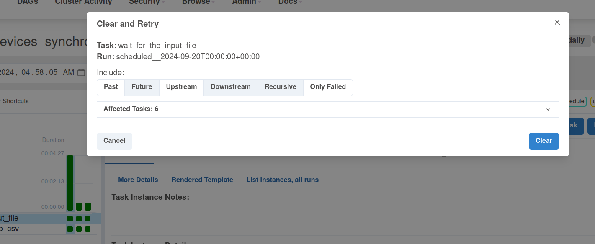

# Keyed idempotency - Apache Airflow and files


1. Prepare the input datasets:
```
INPUT_DIR=/tmp/dedp/ch04/03-database/01-keyed-idempotency-airflow-files/input

mkdir -p $INPUT_DIR

printf '{"id": "iphone-11", "brand_name": "apple", "full_name": "Apple iPhone 11", "processor_brand": "bionic"}
{"id": "iphone-12", "brand_name": "apple", "full_name": "Apple iPhone 12", "processor_brand": "bionic"}
{"id": "galaxy-a33", "brand_name": "samsun", "full_name": "Samsung Galaxy A33 5G (8GB RAM + 128GB)", "processor_brand": "exynos"}
' >> "${INPUT_DIR}/20240920.json"

printf '{"id": "galaxy-a32", "brand_name": "samsung", "full_name": "Samsung Galaxy A32 5G", "processor_brand": "dimensity"}
{"id": "iphone-13", "brand_name": "apple", "full_name": "Apple iPhone 13", "processor_brand": "bionic"}
{"id": "redmi-note-10", "brand_name": "xiaomi", "full_name": "Xiaomi Redmi Note 10 5G", "processor_brand": "dimensity"}
{"id": "galaxy-a33", "brand_name": "samsung", "full_name": "Samsung Galaxy A33 5G (8GB RAM + 128GB)", "processor_brand": "exynos"}
' >> "${INPUT_DIR}/20240921.json"

printf '{"id": "galaxy-m54", "brand_name": "samsung", "full_name": "Samsung Galaxy M54 5G", "processor_brand": "snapdragon"}
{"id": "iphone-14", "brand_name": "apple", "full_name": "Apple iPhone 14", "processor_brand": "bionic"}
{"id": "redmi-note-9", "brand_name": "xiaom", "full_name": "Xiaomi Redmi Note 9 Pro (4GB RAM + 128GB)", "processor_brand": "snapdragon"}
' >> "${INPUT_DIR}/20240922.json"
```

2. Start the Apache Airflow instance:
```
./start.sh
```

3. Open the Apache Airflow UI and connect: http://localhost:8080 (admin/admin)

4. Explain the tasks of [devices_synchronizer.py](dags/devices_synchronizer.py)


* the DAG has the following tasks 
  * the _wait_for_the_input_file_ that waits for the file to be created
  * the _transform_json_to_csv_ converts JSON files into CSV ones
    * it leverages the Keyed idempotency pattern to write output files with the name coming from the 
      Apache Airflow's execution context; that way no matter how many times we run a given execution,
      each time it'll create one file

5. Enable the _devices_synchronizer_ pipeline

6. After completing, check the content of the CSV files:
```
bartosz@bartosz:~$ cat /tmp/dedp/ch04/03-database/01-keyed-idempotency-airflow-files/input/20240920.csv 
iphone-11,apple,Apple iPhone 11,bionic
iphone-12,apple,Apple iPhone 12,bionic
galaxy-a33,samsun,Samsung Galaxy A33 5G (8GB RAM + 128GB),exynos

bartosz@bartosz:~$ cat /tmp/dedp/ch04/03-database/01-keyed-idempotency-airflow-files/input/20240921.csv 
galaxy-a32,samsung,Samsung Galaxy A32 5G,dimensity
iphone-13,apple,Apple iPhone 13,bionic
redmi-note-10,xiaomi,Xiaomi Redmi Note 10 5G,dimensity
galaxy-a33,samsung,Samsung Galaxy A33 5G (8GB RAM + 128GB),exynos

bartosz@bartosz:~$ cat /tmp/dedp/ch04/03-database/01-keyed-idempotency-airflow-files/input/20240922.csv 
galaxy-m54,samsung,Samsung Galaxy M54 5G,snapdragon
iphone-14,apple,Apple iPhone 14,bionic
redmi-note-9,xiaom,Xiaomi Redmi Note 9 Pro (4GB RAM + 128GB),snapdragon
```

As you can notice, there is no header. Let's put it back and rerun the pipeline.

7. Put back the header by uncommenting the following lines from devices_synchronizer.py:

```
#if line_number == 0:
#    header = json_data.keys()
#    csv_writer.writerow(header)
```

8. Replay the devices_synchronizer pipeline:


9. After completing, check the CSV files:

```
bartosz@bartosz:~$ cat /tmp/dedp/ch04/03-database/01-keyed-idempotency-airflow-files/input/20240920.csv 
id,brand_name,full_name,processor_brand
iphone-11,apple,Apple iPhone 11,bionic
iphone-12,apple,Apple iPhone 12,bionic
galaxy-a33,samsun,Samsung Galaxy A33 5G (8GB RAM + 128GB),exynos

bartosz@bartosz:~$ cat /tmp/dedp/ch04/03-database/01-keyed-idempotency-airflow-files/input/20240921.csv 
id,brand_name,full_name,processor_brand
galaxy-a32,samsung,Samsung Galaxy A32 5G,dimensity
iphone-13,apple,Apple iPhone 13,bionic
redmi-note-10,xiaomi,Xiaomi Redmi Note 10 5G,dimensity
galaxy-a33,samsung,Samsung Galaxy A33 5G (8GB RAM + 128GB),exynos

bartosz@bartosz:~$ cat /tmp/dedp/ch04/03-database/01-keyed-idempotency-airflow-files/input/20240922.csv 
id,brand_name,full_name,processor_brand
galaxy-m54,samsung,Samsung Galaxy M54 5G,snapdragon
iphone-14,apple,Apple iPhone 14,bionic
redmi-note-9,xiaom,Xiaomi Redmi Note 9 Pro (4GB RAM + 128GB),snapdragon
```

As you can see, thanks to the idempotent name (key in the context of the Keyed idempotency), we avoided duplicated
files after backfilling.