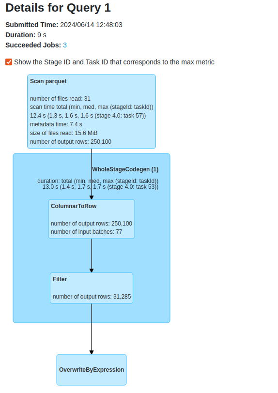
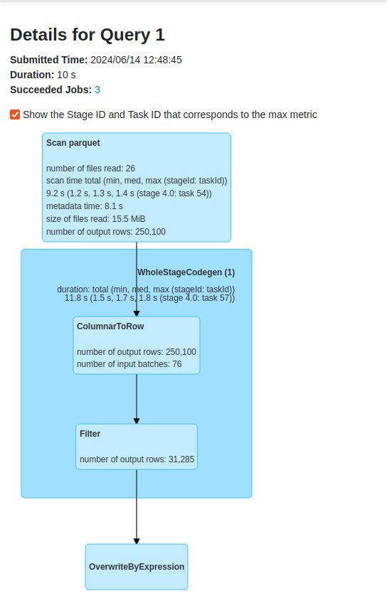

# Records organization - Z-Order sort in Delta Lake

1. Generate the dataset:
```
cd dataset
mkdir -p /tmp/dedp/ch08/02-records-organization/02-sorter-delta-lake/input
docker-compose down --volumes; docker-compose up
```

⚠️ The generator will generate 500 000 visits. It can take up to 5 minutes to complete, depending on your hardware.

2. Explain the [create_sorted_table.py](create_sorted_table.py)
* the job creates a new visits Delta table and optimizes it with the Z-Order on the visit_id and page columns
* besides, it also writes a table with the flat, hence not optimized, structure
* each table has approximately 12 000 records, to show how Z-Ordering can be efficient compared to the not ordered table
3. Run the `create_sorted_table.py`
4. Select one visit_id:
```
$ head -1  /tmp/dedp/ch08/02-records-organization/02-sorter-delta-lake/input/dataset.json  
{"visit_id": "140208954313600_0", "event_time": "2023-11-01T00:00:00+00:00", "user_id": "140208954313600_0f043aff-a551-46d2-adf8-b9d15b72ac54", "keep_private": false, "page": "index", "context": {"referral": "Facebook", "ad_id": "ad 3", "user": {"ip": "5.49.42.205", "login": "jennifer54", "connected_since": null}, "technical": {"browser": "Safari", "browser_version": "20.1", "network_type": "LAN", "device_type": "MacBook", "device_version": "5.0"}}}
```
5. Change the query condition in the `config.py`:
```python
def get_visit_id() -> str:
    return "140393799289728_0"
```
This attribute will be used in queries interacting with the flatten and Z-Ordered Delta Lake tables.
6. Run the `load_flat_table.py` and open [http://localhost:4040/SQL/execution/?id=1](http://localhost:4040/SQL/execution/?id=1)
Verify the number of files read for the query:


7. Run the `load_sorted_table.py` and open [http://localhost:4040/SQL/execution/?id=1](http://localhost:4040/SQL/execution/?id=1)
Verify the number of files read for the query: 


As you can see, the Z-Ordered table optimized the table storage by sorting the records and compacting the related 
ones together. As a result, there are 5 files less on the storage layer than for the flattened table.

* **Flatten table**
```
less /tmp/dedp/ch08/02-records-organization/02-sorter-delta-lake/visits-table-flat/_delta_log/00000000000000000000.json | grep "add" | wc -l
31
```

* **Z-Ordered table**
```
less /tmp/dedp/ch08/02-records-organization/02-sorter-delta-lake/visits-table-zordered/_delta_log/00000000000000000001.json | grep "add" | wc -l
26

less /tmp/dedp/ch08/02-records-organization/02-sorter-delta-lake/visits-table-zordered/_delta_log/00000000000000000001.json | grep "remove" | wc -l
31
```

⚠️ There is a slight difference in the overall execution time but you shouldn't pay attention to it in an isolated test cases.
   Multiple benchmarks (e.g. [https://delta.io/blog/2023-06-03-delta-lake-z-order/](https://delta.io/blog/2023-06-03-delta-lake-z-order/)) 
   made on top of bigger datasets exist and prove the advantage of Z-Order. 