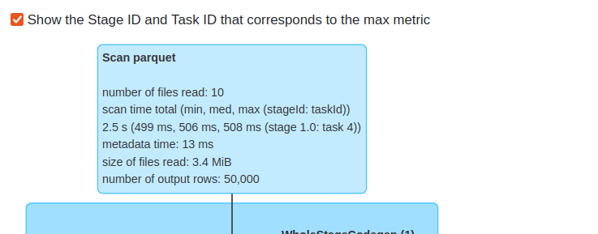

# Access optimization - Apache Spark and Apache Parquet metadata

1. Generate the dataset:
```
cd dataset
mkdir -p /tmp/dedp/ch08/03-access-optimization/01-metadata-enhancer-apache-spark-apache-parquet/input
docker-compose down --volumes; docker-compose up
```

2. Explain [write_datasets.py](write_datasets.py)
* the job creates an Apache Parquet and JSON datasets for the input users data
3. Run the `write_datasets.py`
4. Run the `read_datasets.py`. When you open Spark UI at http://localhost:4040, you should see that the Apache
Parquet read took 3.4MB while the JSON one 11MB:




It's due to the metadata layer present in Apache Parquet and involved in the reading process ("metadata time" metric).

5. You can also check the statistics for each generated Apache Parquet file:
```
docker run --rm -v "/tmp/dedp/ch08/03-access-optimization/01-metadata-enhancer-apache-spark-apache-parquet/output-parquet:/tmp/parquet" hangxie/parquet-tools:v1.20.7  meta /tmp/parquet/part-00001-3c52ae6f-aeea-4364-aac3-7fc69d63e898-c000.snappy.parquet
```

You should see various attributes, such as the number of nulls, min and max values, and type:
```
{
  "NumRowGroups": 1,
  "RowGroups": [
    {
      "NumRows": 5000,
      "TotalByteSize": 680822,
      "Columns": [
        {
          "PathInSchema": [
            "Id"
          ],
          "Type": "BYTE_ARRAY",
          "Encodings": [
            "PLAIN",
            "RLE",
            "BIT_PACKED"
          ],
          "CompressedSize": 180463,
          "UncompressedSize": 200035,
          "NumValues": 5000,
          "NullCount": 0,
          "MaxValue": "fffbe4f8-8d88-43d2-a9a5-54bf536de75b",
          "MinValue": "0018e1dc-1b80-4410-92f6-5261d2dadf35",
          "CompressionCodec": "SNAPPY"
        },
        {
          "PathInSchema": [
            "Login"
          ],
          "Type": "BYTE_ARRAY",
          "Encodings": [
            "PLAIN",
            "RLE",
            "BIT_PACKED"
          ],
          "CompressedSize": 31524,
          "UncompressedSize": 120035,
          "NumValues": 5000,
          "NullCount": 0,
          "MaxValue": "user_140292460490445",
          "MinValue": "user_140292460440490",
          "CompressionCodec": "SNAPPY"
        },
        {
          "PathInSchema": [
            "Email"
          ],
          "Type": "BYTE_ARRAY",
          "Encodings": [
            "PLAIN",
            "RLE",
            "BIT_PACKED"
          ],
          "CompressedSize": 32353,
          "UncompressedSize": 225035,
          "NumValues": 5000,
          "NullCount": 0,
          "MaxValue": "user_140292460490445@abcdefghijklmnop.com",
          "MinValue": "user_140292460440490@abcdefghijklmnop.com",
          "CompressionCodec": "SNAPPY"
        },
        {
          "PathInSchema": [
            "Registered_datetime"
          ],
          "Type": "INT96",
          "Encodings": [
            "PLAIN_DICTIONARY",
            "RLE",
            "BIT_PACKED"
          ],
          "CompressedSize": 57377,
          "UncompressedSize": 68193,
          "NumValues": 5000,
          "NullCount": 0,
          "CompressionCodec": "SNAPPY"
        },
        {
          "PathInSchema": [
            "First_connection_datetime"
          ],
          "Type": "INT96",
          "Encodings": [
            "PLAIN_DICTIONARY",
            "RLE",
            "BIT_PACKED"
          ],
          "CompressedSize": 30493,
          "UncompressedSize": 33762,
          "NumValues": 5000,
          "NullCount": 2504,
          "CompressionCodec": "SNAPPY"
        },
        {
          "PathInSchema": [
            "Last_connection_datetime"
          ],
          "Type": "INT96",
          "Encodings": [
            "PLAIN_DICTIONARY",
            "RLE",
            "BIT_PACKED"
          ],
          "CompressedSize": 26637,
          "UncompressedSize": 33762,
          "NumValues": 5000,
          "NullCount": 2504,
          "CompressionCodec": "SNAPPY"
        }
      ]
    }
  ]
}
```