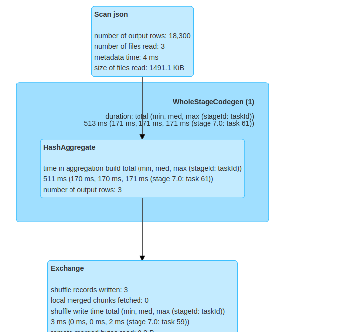
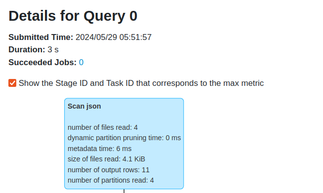
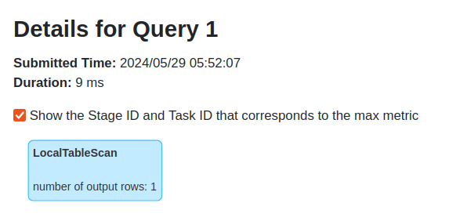
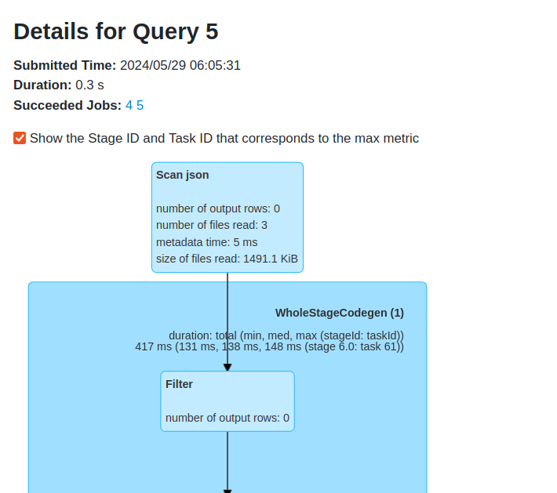
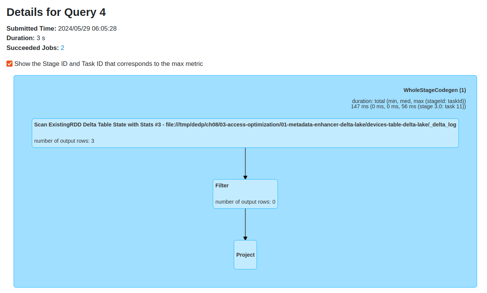
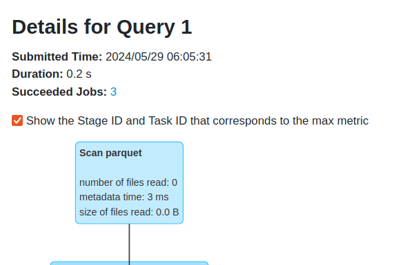

# Access optimization - metadata enhancer with Delta Lake


1. Generate the dataset:
```
cd dataset
mkdir -p /tmp/dedp/ch08/03-access-optimization/01-metadata-enhancer-delta-lake/input/
docker-compose down --volumes; docker-compose up
```
2. Explain [tables_creator.py](tables_creator.py)
* the code creates a Delta Lake table and a JSON dataset
  * both have the input records written 3 times
3. Run the `tables_creator.py`
4. Query both tables by running `tables_reader.py`

When you analyze the execution plans, you'll realize that the JSON reader physically reads the data. The  
execution plan from the UI shows reading 3 JSON files and performing a shuffle, hence the data operation:



When it comes to Delta Lake, the execution plan has two steps. The first step builds the Delta Lake table 
by analyzing the commit log:



The second step relies on this created table to count the rows locally:



It's possible thanks to the metadata statistics layer present in each commit file:
```
$ head -1 /tmp/dedp/ch08/03-access-optimization/01-metadata-enhancer-delta-lake/devices-table-delta-lake/_delta_log/00000000000000000000.json 
{"commitInfo":{"timestamp":1716954694590,"operation":"WRITE","operationParameters":{"mode":"Overwrite","partitionBy":"[]"},
"readVersion":0,"isolationLevel":"Serializable","isBlindAppend":false,
"operationMetrics":{"numFiles":"1",
   --> "numOutputRows":"6100",
"numOutputBytes":"50437"},"engineInfo":"Apache-Spark/3.5.0 Delta-Lake/3.0.0","txnId":"4585c53c-0490-4a2c-9ffa-74ebceae87d2"}}

$ head -1 /tmp/dedp/ch08/03-access-optimization/01-metadata-enhancer-delta-lake/devices-table-delta-lake/_delta_log/00000000000000000001.json 
{"commitInfo":{"timestamp":1716954696546,"operation":"WRITE","operationParameters":{"mode":"Append","partitionBy":"[]"},
"readVersion":1,"isolationLevel":"Serializable","isBlindAppend":true,
"operationMetrics":{"numFiles":"1",
   --> "numOutputRows":"6100",
"numOutputBytes":"50437"},"engineInfo":"Apache-Spark/3.5.0 Delta-Lake/3.0.0","txnId":"d1c22b13-2008-4dc0-9108-be8e25456b9d"}}

$ head -1 /tmp/dedp/ch08/03-access-optimization/01-metadata-enhancer-delta-lake/devices-table-delta-lake/_delta_log/00000000000000000002.json 
{"commitInfo":{"timestamp":1716954699407,"operation":"WRITE","operationParameters":{"mode":"Append","partitionBy":"[]"},
"readVersion":2,"isolationLevel":"Serializable","isBlindAppend":true,
"operationMetrics":{"numFiles":"1",
   --> "numOutputRows":"6100",
"numOutputBytes":"50437"},"engineInfo":"Apache-Spark/3.5.0 Delta-Lake/3.0.0","txnId":"0ebb0c61-bcad-483a-be69-97e5cd2d1733"}}
```

5. Besides, the commit logs store per-file statistics, such as the min and max values:
```
$ tail -1 /tmp/dedp/ch08/03-access-optimization/01-metadata-enhancer-delta-lake/devices-table-delta-lake/_delta_log/00000000000000000002.json 
{"add":{"path":"part-00000-8cc8fd97-ace6-4653-8b16-0f98547a2727-c000.snappy.parquet","partitionValues":{},"size":50437,
"modificationTime":1716954699391,"dataChange":true,
"stats":"{
   \"numRecords\":6100,
   \"minValues\":
      {\"type\":\"galaxy\",\"full_name\":\"APPLE iPhone 11 (White, 64 GB)\",\"version\":\"Android 10\"},
   \"maxValues\":
      {\"type\":\"mac\",\"full_name\":\"Yoga 7i (14\\\" Intel) 2 in 1 Lapto�\",\"version\":\"v17169535721658688\"},
   \"nullCount\":{\"type\":0,\"full_name\":0,\"version\":0}}"}}
```

A query engine like Apache Spark can leverage these fields to optimize the execution and skip irrelevant files.

6. Run the `tables_reader_null_type.py`.
Although the results are the same and both are correct, the query plans are different. First, the JSON reader
did the physical reading of the 3 files:



Delta Lake yet again relied on the metadata layer. Apache Spark prepared the Delta files to read by first 
analyzing the commit log entries:


And only later, counting the number of occurrences. Since none of the commit log entries had the _nullCount_ 
greater than 0, the execution simply did nothing:
