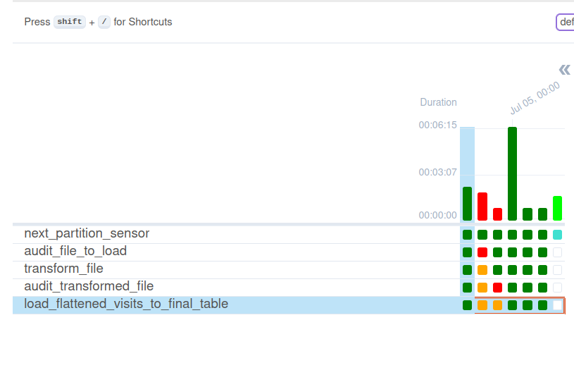

# Audit Write Audit Publish - Apache Airflow and PostgreSQL

1. Prepare the dataset:
```
cd dataset
mkdir -p /tmp/dedp/ch09/01-quality-enforcement/01-audit-write-audit-publish-apache-airflow-postgresql/input
docker-compose down --volumes; docker-compose up
```

2. Start the PostgreSQL instance:
```
cd docker
docker-compose down --volumes; docker-compose up
```

3. Let's alter some of the generated files to make them fail at different audit steps:
* failure for the first audit step:
```
echo "{incomplete json"|cat - /tmp/dedp/ch09/01-quality-enforcement/01-audit-write-audit-publish-apache-airflow-postgresql/input/date=2024-07-02/dataset.json > /tmp/out && mv /tmp/out /tmp/dedp/ch09/01-quality-enforcement/01-audit-write-audit-publish-apache-airflow-postgresql/input/date=2024-07-02/dataset.json
```

* failure for the second audit step:
```
echo '{"visit_id": null, "event_time": "2024-07-24T00:02:00+00:00", "user_id": "140402948930432_d34c12c4-4001-435c-9aaa-1c69374a11a2", "keep_private": true, "page": "home", "context": {"referral": "Google Search", "ad_id": "ad 3", "user": {"ip": "152.174.151.9", "login": "kathymurray", "connected_since": null}, "technical": {"browser": "Chrome", "browser_version": "22.0", "network_type": "Wi-Fi", "device_type": "iPad", "device_version": "2.0"}}}' >>  /tmp/dedp/ch09/01-quality-enforcement/01-audit-write-audit-publish-apache-airflow-postgresql/input/date=2024-07-03/dataset.json 
echo '{"visit_id": "abc", "event_time": "2024-07-24T00:02:00+00:00", "user_id": null, "keep_private": true, "page": "home", "context": {"referral": "Google Search", "ad_id": "ad 3", "user": {"ip": "152.174.151.9", "login": "kathymurray", "connected_since": null}, "technical": {"browser": "Chrome", "browser_version": "22.0", "network_type": "Wi-Fi", "device_type": "iPad", "device_version": "2.0"}}}' >>  /tmp/dedp/ch09/01-quality-enforcement/01-audit-write-audit-publish-apache-airflow-postgresql/input/date=2024-07-03/dataset.json 
```


3. Explain the [visits_synchronizer.py](dags%2Fvisits_synchronizer.py)
* the code implements two audit steps:
  * _audit_file_to_load_ checks whether the input file has an expected number of lines and expected minimal size
  * _audit_transformed_file_ validates the transformed file doesn't include any `nulls`
* besides, it does a simple step of flattening a nested JSON into a CSV and loading it lated to a PostgreSQL table

4. Start the Apache Airflow instance:
```
cd ../
./start.sh
```

5. Open the Apache Airflow UI and connect: http://localhost:8080 (dedp/dedp)


6. Enable the DAG.

7. After running the pipelines for 6 generated datasets, you should see 2 executions fail at the aforementioned audit steps:
