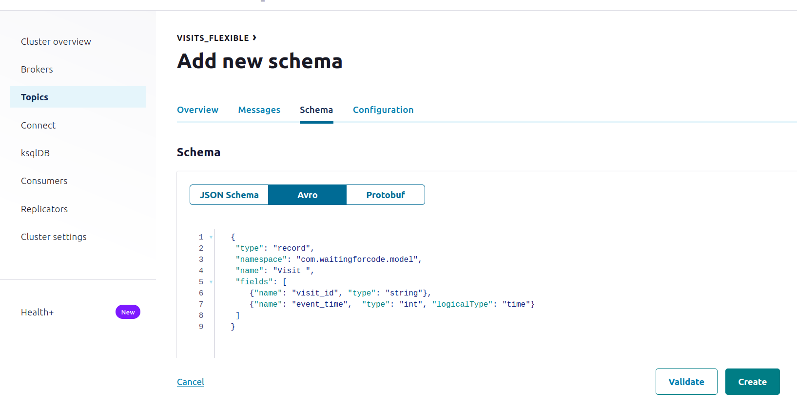
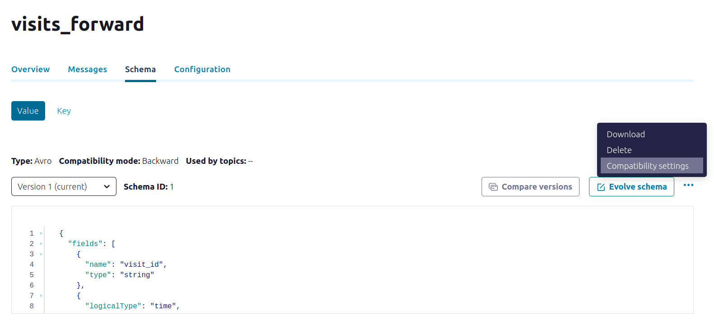
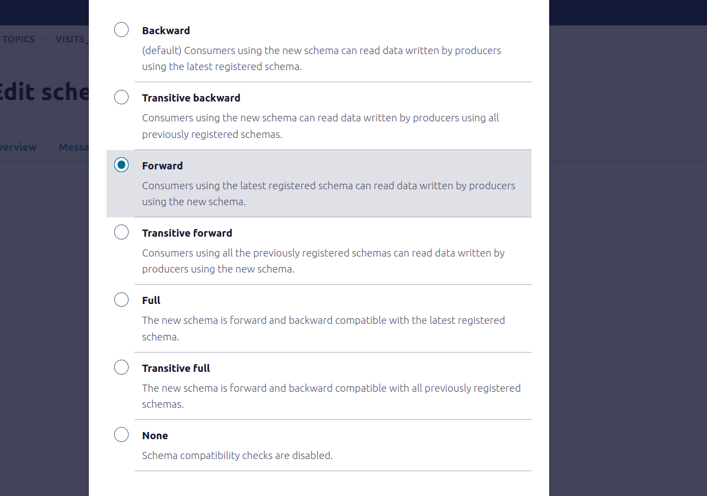

# Schema enforcer - Apache Kafka

1. Start the Docker containers 
```
cd docker/
docker-compose down --volumes; docker-compose up
```

2. Explain the [topic_visits_flexible_consumer.py](topic_visits_flexible_consumer.py)
* it's a simple Kafka consumer the relies on schema registry to ensure the safety of the processed rows:
  (`'schema.registry.url': 'http://localhost:8081'` config)
* besides, it deserializes the input record and counts the number of records per visit_id

3. Go to [http://localhost:9021/clusters/MkU3OEVBNTcwNTJENDM2Qk/management/create-topic](http://localhost:9021/clusters/MkU3OEVBNTcwNTJENDM2Qk/management/create-topic) and  create a _visits_flexible_ topic where the producers can put any records they want, i.e. including the 
rows with breaking changes. The schema will be:
```
{
 "type": "record",
 "namespace": "com.waitingforcode.model",
 "name": "Visit",
 "fields": [
 	{"name": "visit_id", "type": "string"},
 	{"name": "event_time",  "type": "int", "logicalType": "time"}
 ]
}
```



4. Explain the [topic_visits_flexible_v1_producer.py](topic_visits_flexible_v1_producer.py)
* the producer creates a records with both visit_id and event_time fields, accordingly to the schema 
loaded from schemas/ directory 

5. Start `topic_visits_flexible_consumer.py`
6. Start `topic_visits_flexible_v1_producer.py`. The consumer should be running correctly since there is no schema consistency issues.

7. Stop `topic_visits_flexible_v1_producer.py`. 

8. Explain the [topic_visits_flexible_v2_producer.py](topic_visits_flexible_v2_producer.py)
* the new producer uses an incompatible schema with the visit_id field, so far considered as required, removed

9. Start `topic_visits_flexible_v2_producer.py`.

At this moment, the consumer should fail, as it's still expecting the visit_id field and
the producer made an incompatible change, and our data store couldn't enforce the schema to prevent the consumers from 
failing.

The expected error message is:
```
Got None >> {'event_time': 1722830073000}
Traceback (most recent call last):
  File "chapter-09/01-quality-enforcement/03-schema-enforcer-apache-kafka/topic_visits_flexible_consumer.py", line 25, in <module>
    visit_id = polled_records.value()['visit_id']
 KeyError: 'visit_id'
```

10. Let's run now a safer version of the same code. The safer version ensures that any consumer with the old 
schema can process the data produced with the new schema version. For that, we're going to create a new topic 
_visits_forward_ with the same schema as before, so:
```
{
 "type": "record",
 "namespace": "com.waitingforcode.model",
 "name": "Visit",
 "fields": [
 	{"name": "visit_id", "type": "string"},
 	{"name": "event_time",  "type": "int", "logicalType": "time"}
 ]
}
```

11. But this time, we're going to define schema compatibility to _forward_:




12. Start the `topic_visits_forward_consumer.py`
* it does the same thing as the previous consumer; the single difference is the input topic 

13. Start `topic_visits_forward_v1_producer.py`. The producer and consumer should be running correctly.

14. Start `topic_visits_forward_v2_producer.py`.
The producer should fail with the following exception:
```
confluent_kafka.avro.error.ClientError: Incompatible Avro schema:409 message:{'error_code': 409, 'message': 'Schema being registered is incompatible with an earlier schema for subject "visits_forward-value", 
  details: [{errorType:\'READER_FIELD_MISSING_DEFAULT_VALUE\', description:\'The field \'visit_id\' at path \'/fields/0\' in the old schema 
  has no default value and is missing in the new schema\', additionalInfo:\'visit_id\'}, {oldSchemaVersion: 1}, {oldSchema: \'{"type":"record","name":"Visit","namespace":"com.waitingforcode.model",
  "fields":[{"name":"visit_id","type":"string"},{"name":"event_time","type":"int","logicalType":"time"}]}\'}, {validateFields: \'false\', compatibility: \'FORWARD\'}]'}
```
As you can see, here the validation was made according to the compatibility level defined. Consequently, the consumer 
is still up and running, while any producers breaking the compatibility are failing.