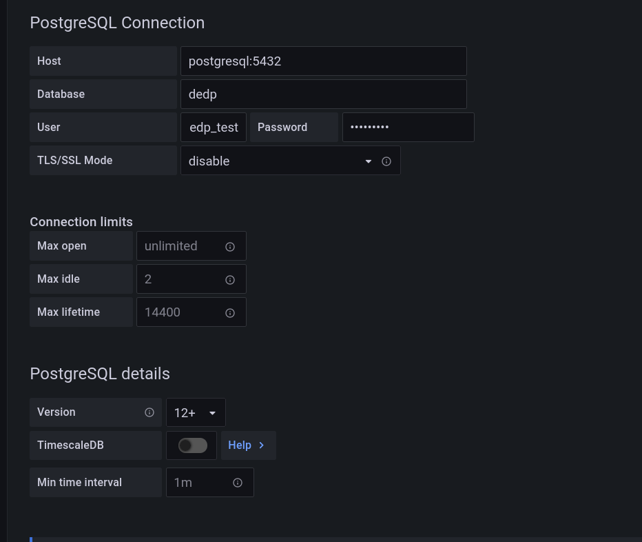
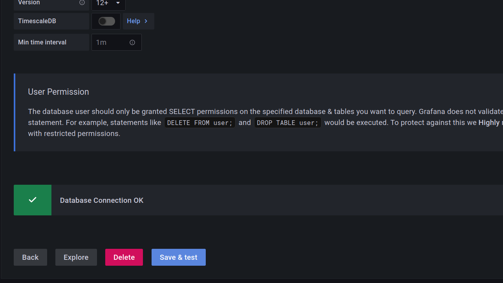
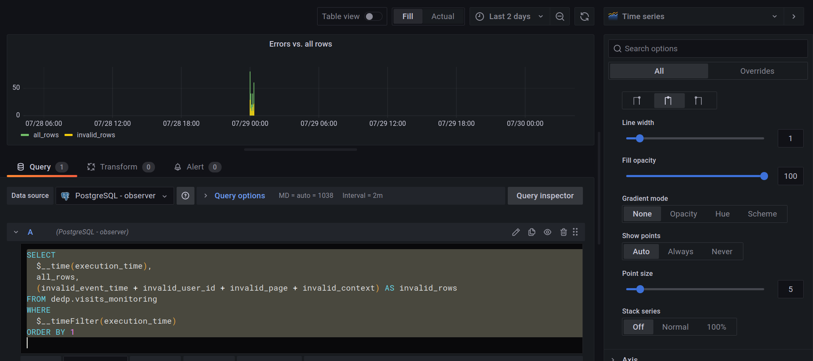
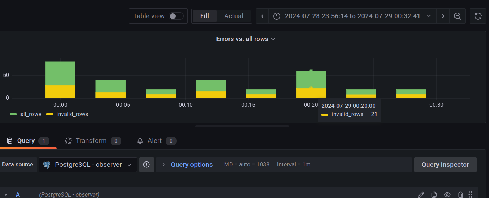
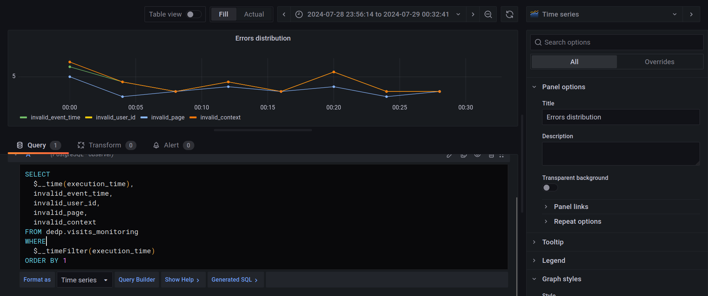
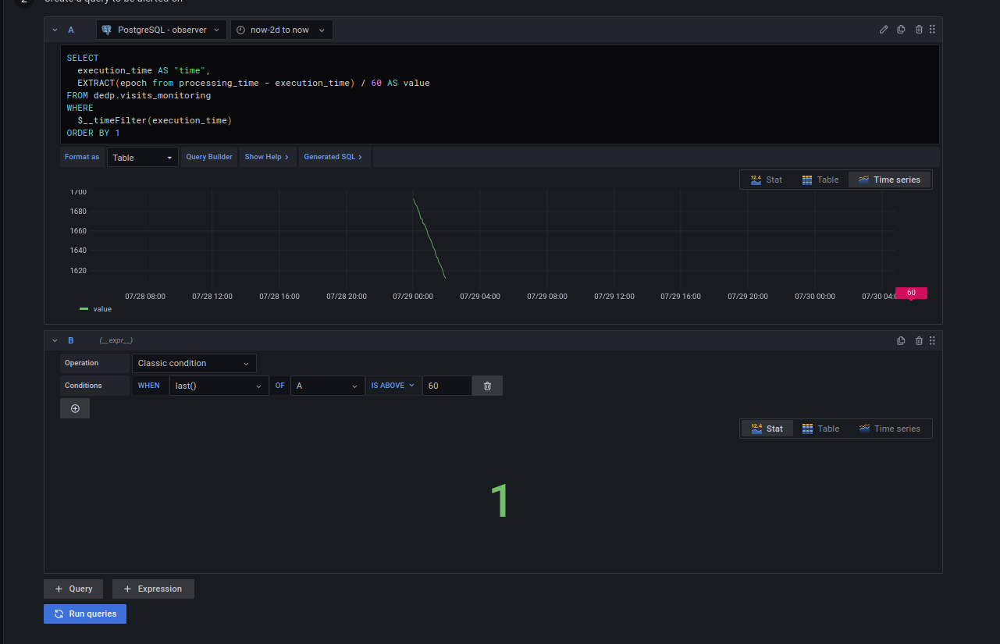
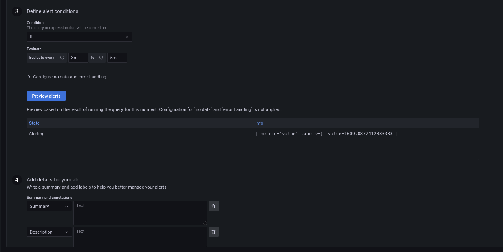

# Offline observer - Apache Airflow and PostgreSQL

1. Prepare the dataset:
```
cd docker
docker-compose down --volumes; docker-compose up
```

2. Explain the [passthrough_visits_synchronizer.py](dags%2Fpassthrough_visits_synchronizer.py) DAG
* it's the data job we're going to observe; it simply moves new records generated by the data-generator started before
from _visits_input_ to _visits_output_ table

3. Explain the [offline_observer.py](dags%2Foffline_observer.py) DAG
* it's the data observation job
* it starts by generating a new _observation state_ which consists of the first and last row id processed in the given
execution
* next, the job generates the new observation by analyzing the data quality of the selected rows
  * the analysis focuses on missing rows for all the fields of the _visits_output_ table and writing the result to
  _visits_monitoring_ that we're going to use to build a dashboard

4. Start the Apache Airflow instance:
```
cd ../
./start.sh
```

5. Open the Apache Airflow UI and connect: http://localhost:8080 (dedp/dedp)

6. Enable both DAGs.

7. The DAGs run every 2 and four minutes and they're reprocessing the data from yesterday. Wait few minutes before moving
to the next step.

8. Open the Grafana dashboard: http://localhost:3000 (admin/admin)

9. Add a new PostgreSQL data source:
* host: postgresql:5432
* database: dedp
* user/password: dedp_test
* TLS/SSL Mode: disable
* Version: 12+



After clicking on "Save & test", you should see a confirmation message:

 

10. Add the first dashboard that will show the impact of errors to the valid rows:

Use directly the SQL query editor and add the following query:
```sql
SELECT
  $__time(execution_time),
  all_rows,
  (invalid_event_time + invalid_user_id + invalid_page + invalid_context) AS invalid_rows
FROM dedp.visits_monitoring
WHERE
  $__timeFilter(execution_time)
ORDER BY 1
```

The query uses Grafana's macros to extract the time and apply the Grafana's dashboards filtering conditions.

Since the display is based on the Apache Airflow's logical date, change the time to "Last 2 days". Besides to represent
this type of dependency, let's use the "Bar chart". You can configure it in the right panel, under "Graph styles" section
(Style=Bars, Fill opacity=100)



You can also zoom to the specific dates by interacting with the bars area:



11. Add another dashboard to zoom at the errors and see their distribution:

```sql
SELECT
  $__time(execution_time),
  invalid_event_time,
  invalid_user_id,
  invalid_page,
  invalid_context
FROM dedp.visits_monitoring
WHERE
  $__timeFilter(execution_time)
ORDER BY 1
```




12. Add the last dashboard that computes the lag between the execution date and the real processing time. 

```sql
SELECT
  $__time(execution_time),
  EXTRACT(epoch from processing_time - execution_time) / 60 AS processing_lat
FROM dedp.visits_monitoring
WHERE
  $__timeFilter(execution_time)
ORDER BY 1
```

**TODO screenshot**

13. Finally, you can define an alert that will trigger whenever the lag reaches 1 hour:

