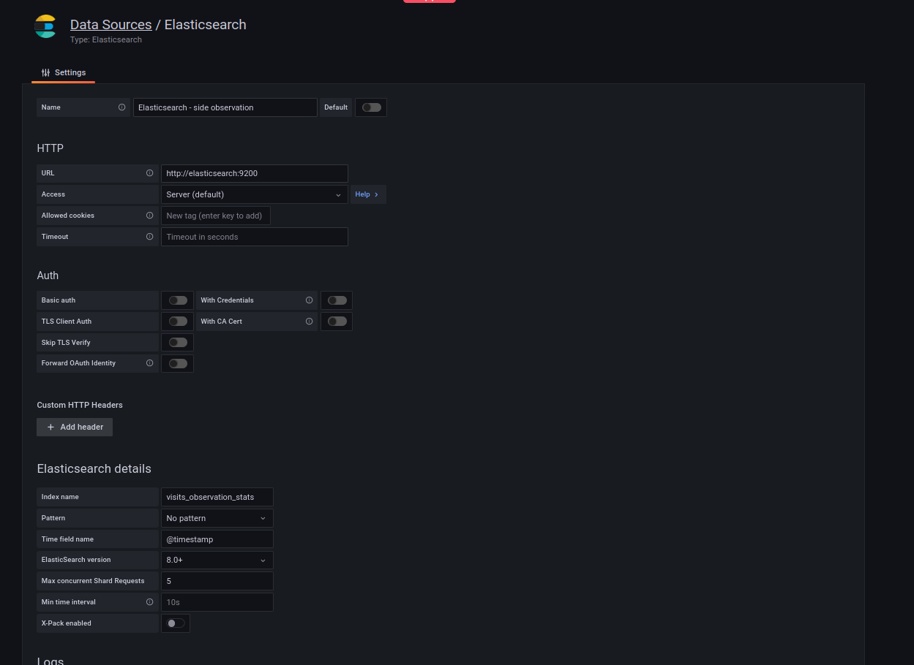
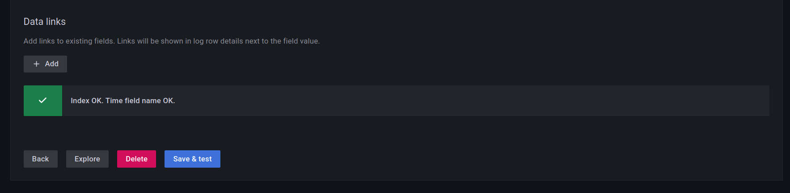
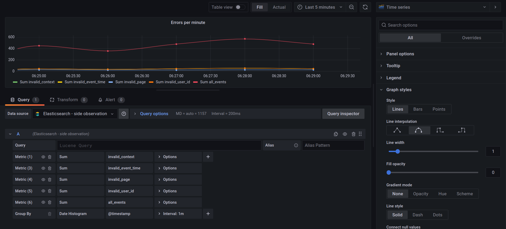
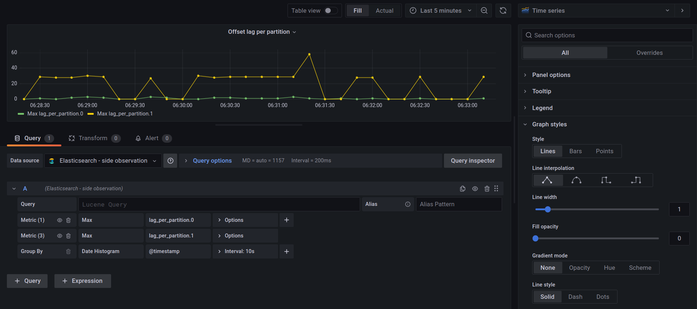
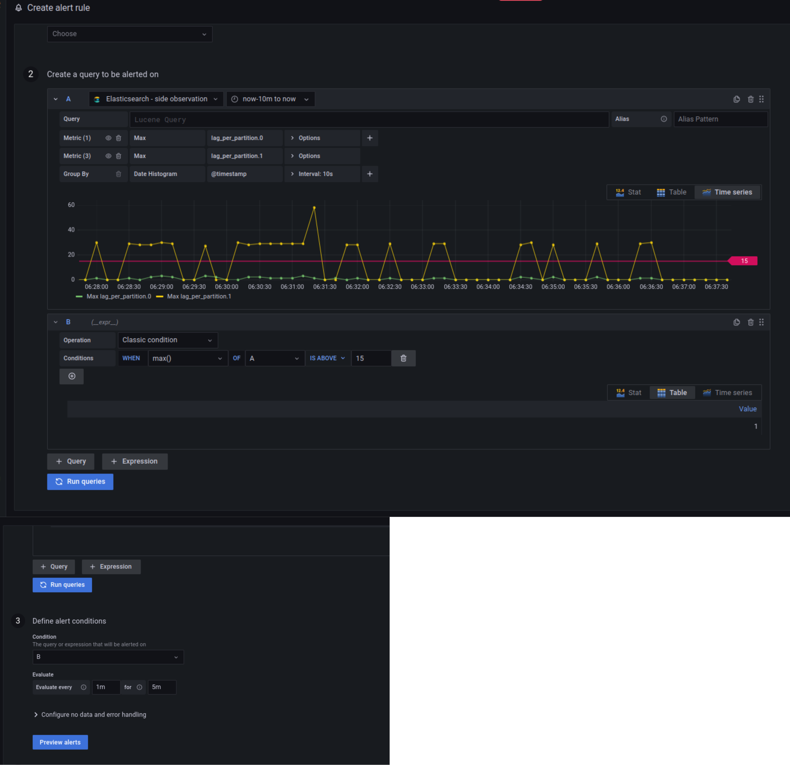
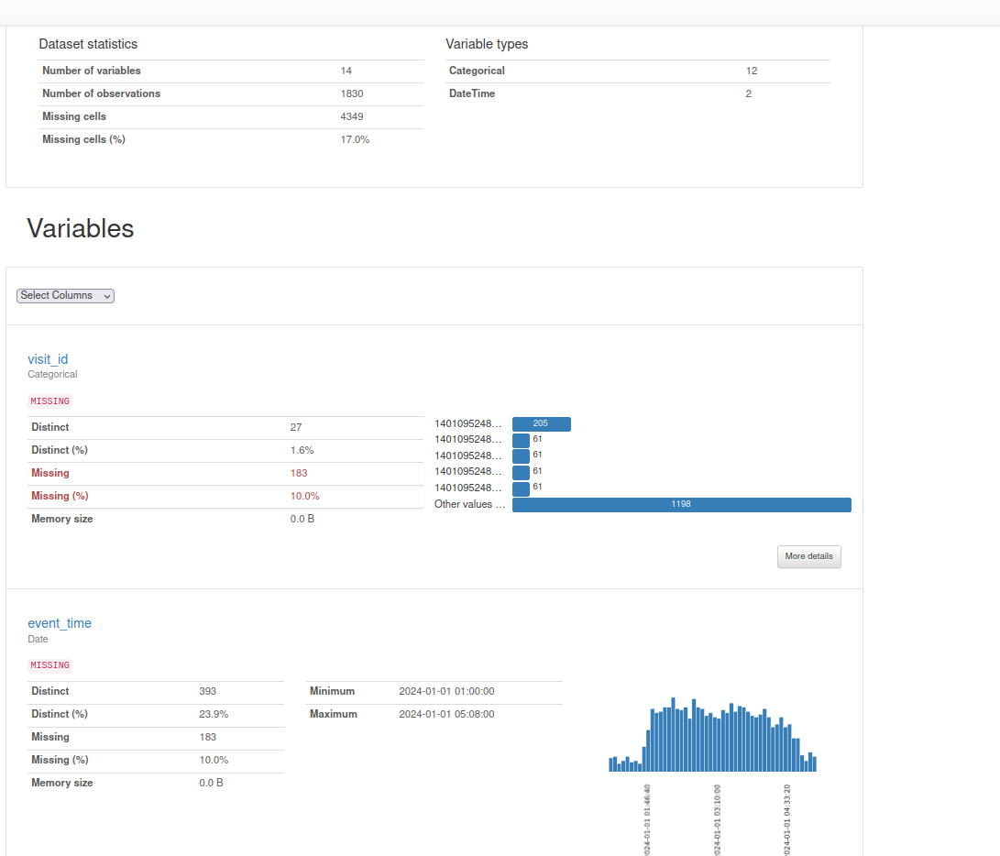
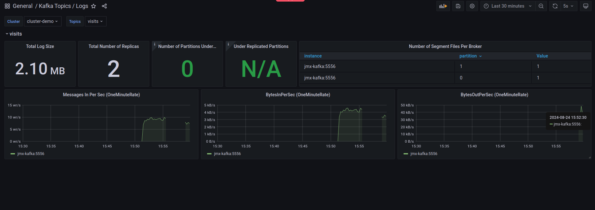
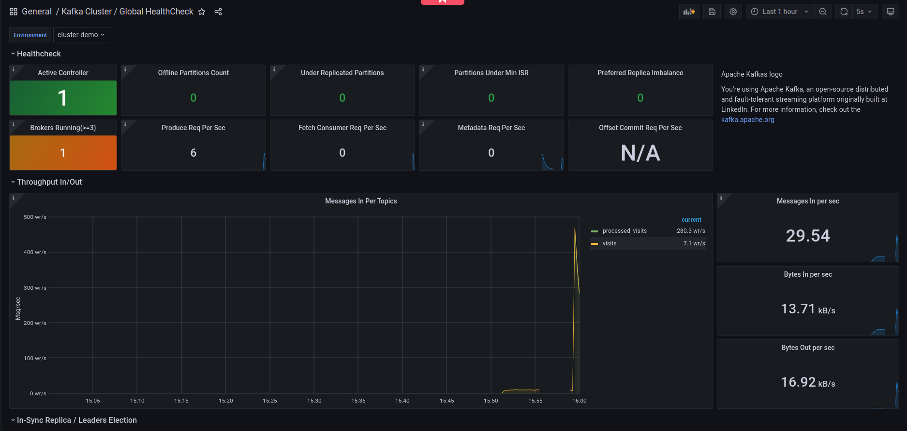
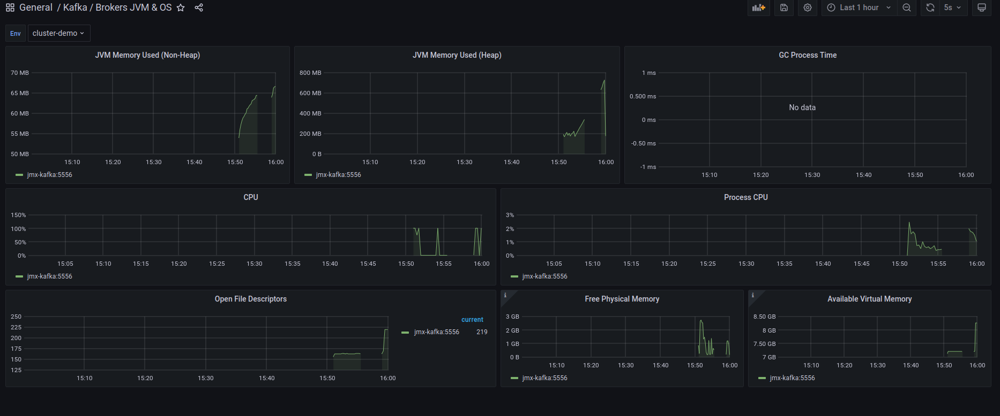

# Online observer - Apache Spark with Apache Kafka

1. Start Apache Kafka broker with data generator:
```
mkdir -p /tmp/dedp/chapter-09/03-quality-observation/02-online-observer-apache-spark-apache-kafka/profiles
cd dataset
docker-compose down --volumes; docker-compose up
```

2. Explain the [passthrough_visits_processor_job.py](passthrough_visits_processor_job.py):
* it's the job we're going to observe in this demo
* it does nothing but copying records from one Apache Kafka topic to another
* however, it doesn't use the `writeStream.format("kafka")` directly as we want to add an observation part
  * the observation part is written after generating records to the output topic and covers:
    * data quality - it analyzes the emptiness of some fields; the fields are important for our downstream consumers
    but since they're JSON messages, we don't have a way to enforce their quality
    * job lag - it analyzes the progress of the job by comparing the offsets from 
      the accumulators, with the most recent offsets in the topic
    * dataset profile - it analyzes the shape of the current `DataFrame` and creates its profile with _ydata-profiling_ library
      The profile is later saved as an HTML report.

3. Start `passthrough_visits_processor_job.py`

4. Go to Grafana (http://localhost:3000/login; admin/admin) and add a new Elasticsearch data source:
* URL: http://elasticsearch:9200 
* Index name: visits_observation_stats
* Time field name: @timestamp
* Elasticsearch version: 8.0+



After clicking on "Save & test", you should see the following:


5. Let's now create some dashboards from "Add new panel". The first will show the distribution of errors 
per minute.

The query should look like:


6. Let's also add the second dashboard that will show the evolving lag:

As you can see, there is a processing skew and one partition is late:



7. As the last part of our offline observation let's add an alert that will trigger 
whenever there is a lag bigger than 15 offsets for a 5 minutes period:
 



8. Besides, you should also notice dataset profile reports generated under `/tmp/dedp/chapter-09/03-quality-observation/01-offline-observer-apache-spark-apache-kafka/profiles/`, such as:


9. Additionally, Apache Kafka broker exposes JMX metrics at http://localhost:5556/metrics
* JMX provides tools for managing and monitoring JVM-based applications
* Kafka is JVM-based; JMX exporter collects relevant metrics and exposes them from a webserver

10. Grafana has some ready-to-use dashboards for Apache Kafka, and so we can see:

* the load on the _visits_ topic



* throughout in the cluster



* JVM and OS metrics



Those are examples of hardware-related online observation metrics, often exposed or gather automatically by a library
or service.

**Credits for the dashboards go to Streamthoughts and their great ready-to-use dashboards:
[https://github.com/streamthoughts/kafka-monitoring-stack-docker-compose/tree/a3fb3a6e38ca84bbecee38291d894868e841beed/grafana/dashboards](https://github.com/streamthoughts/kafka-monitoring-stack-docker-compose/tree/a3fb3a6e38ca84bbecee38291d894868e841beed/grafana/dashboards)**