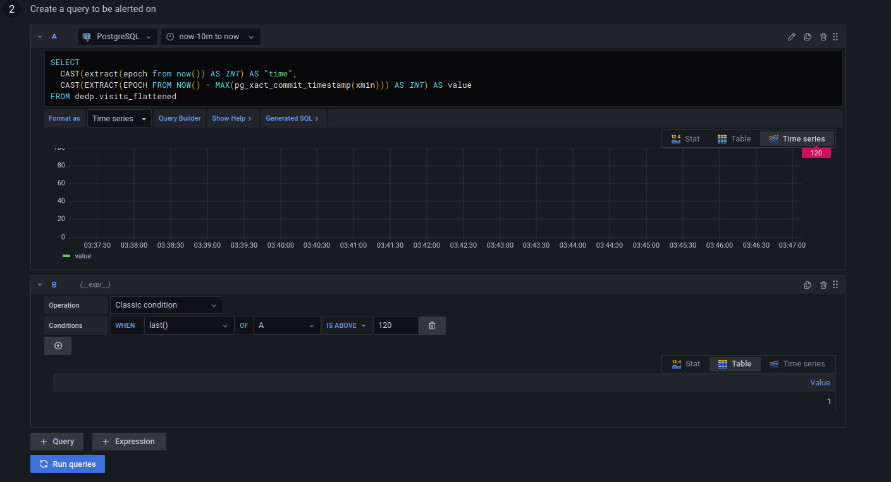
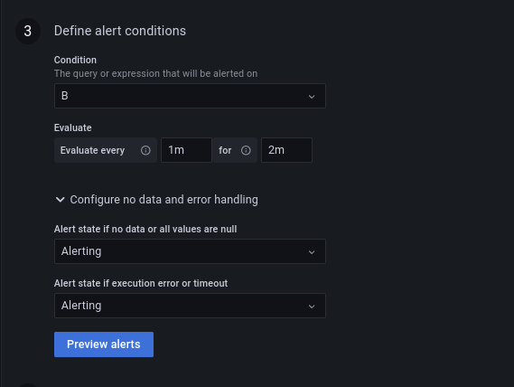

# Flow interruption detector - Apache Airflow and PostgreSQL


1. Prepare the dataset:
```
cd dataset
mkdir -p /tmp/dedp/ch10/01-data-detectors/01-flow-interruption-apache-airflow-postgresql-grafana/input
docker-compose down --volumes; docker-compose up
```

2. Start the Docker containers:
```
cd docker
docker-compose down --volumes; docker-compose up
```

3. Explain the [visits_synchronizer.py](dags%2Fvisits_synchronizer.py)
* the job processes the input visits and loads them to the visits table that we're going to monitor

4. Start the Apache Airflow instance:
```
cd ../
./start.sh
```

5. Open the Apache Airflow UI and connect: http://localhost:8080 (dedp/dedp)

6. Enable the `visits_synchronizer` DAG.

7. After completing the 6 planed runs, go to Grafana: (http://localhost:3000/login; admin/admin) 

8. Create a new alert:

* Add a PostgreSQL new data source:
  * Host: postgresql:5432
  * Database: dedp
  * User/password: dedp_test
  * TLS/SSL: disable
  * PostgreSQL details / version: 12+
  * Click on "Save & test"; you should see "Database connection OK"

* "+ Create > Folder", call it _alerts_


* Add a new alert from Alerting > Alert rules > New alert rule
  * Configure the rule:
    * name: "Visits loader flow interruption"
    * type: Grafana-managed alert
    * folder: alerts
  * Set this to the "A" part after clicking on "Edit SQL": 
```sql
SELECT
  CAST(extract(epoch from now()) AS INT) AS "time",
  CAST(EXTRACT(EPOCH FROM NOW() - MAX(pg_xact_commit_timestamp(xmin))) AS INT) AS value
FROM dedp.visits_flattened
```

  * Configure the "B" part as below:

<small>We're configuring the alert to fail if the difference between the current time and the last loaded
time is small (2 minutes = 120 seconds); It's only for our demo purposes. On your production workload, you'll 
rely on the pipeline schedule, and so in our case, trigger an alert if the refresh hasn't happened for the last 24 hours at least</small>

  * Configure the "Alert conditions" as below:
  

  * Click on "Save and exit"

9. Go to the alerts page at [http://localhost:3000/alerting/list](http://localhost:3000/alerting/list). The page should
show the alert in the _Normal_ state first, and after approximately 1 minute, it should move to the _Pending_ state:


10. Since we configured the evaluation window to 2 minutes, wait extra 2-3 minutes to see the alert passing to the _Firing_ state:


11. Create a new dataset: 
```
mkdir /tmp/dedp/ch10/01-data-detectors/01-flow-interruption-apache-airflow-postgresql-grafana/input/date\=2024-07-08/
cp /tmp/dedp/ch10/01-data-detectors/01-flow-interruption-apache-airflow-postgresql-grafana/input/date\=2024-07-07/dataset.json /tmp/dedp/ch10/01-data-detectors/01-flow-interruption-apache-airflow-postgresql-grafana/input/date\=2024-07-08/dataset.json
```

12. Wait for the DAG run for 2024-07-08 from http://localhost:8080/dags/visits_synchronizer/grid to succeeed:


13. Wait 1-2 minutes to see the alert passing to the _Normal_ state again:


You can also click on the "Show state history" button to see the most recent alert changes:
