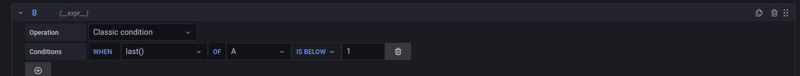
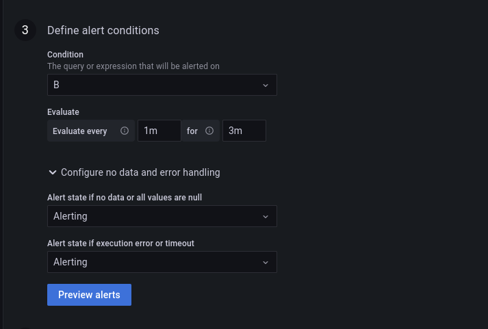
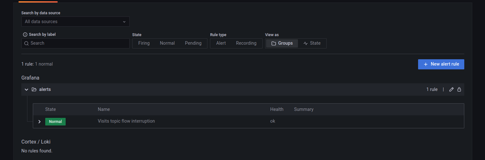
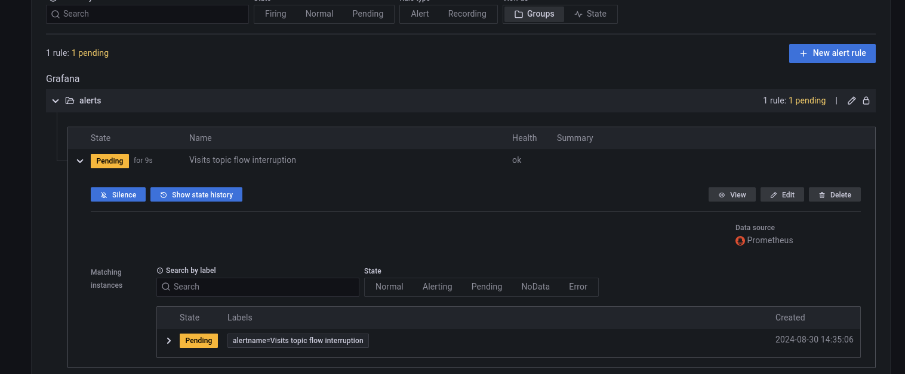
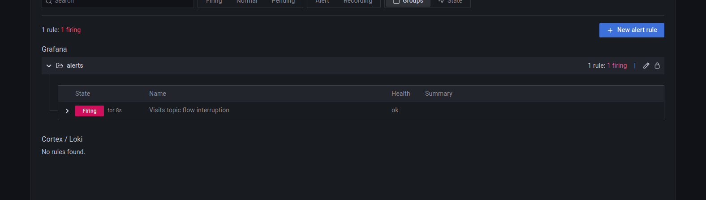
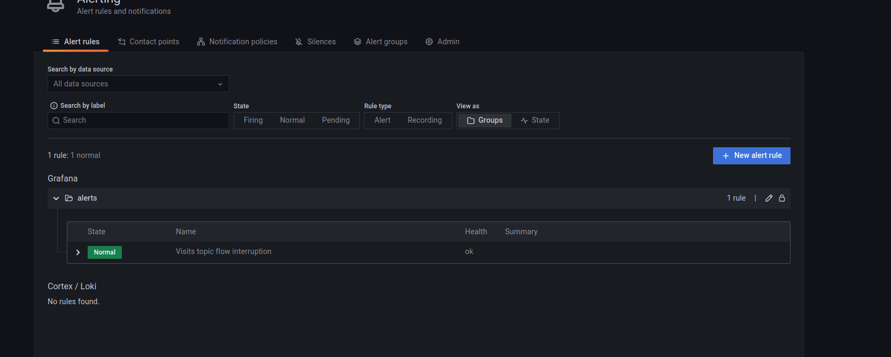
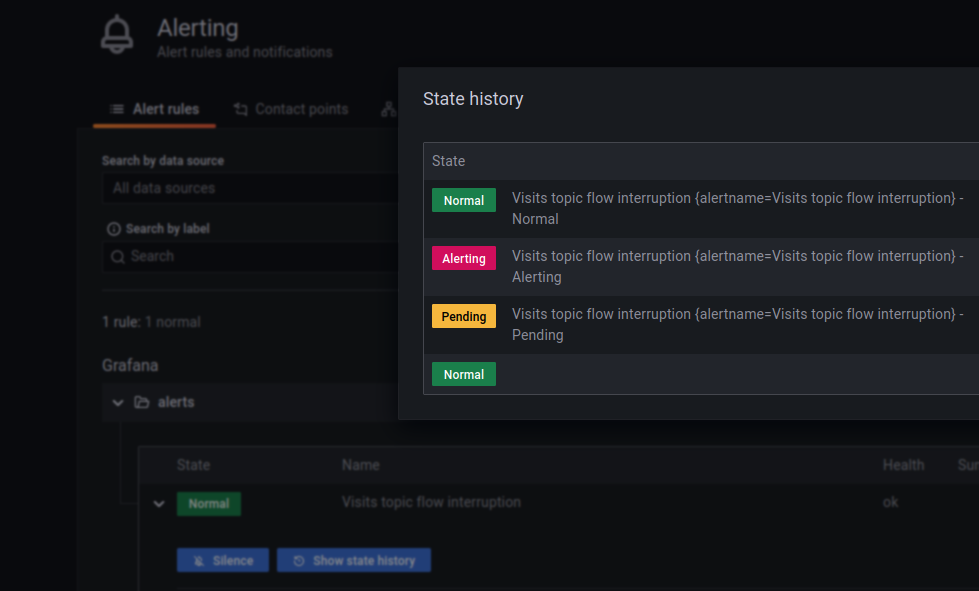

# Flow interruption detector - Apache Kafka and Grafana

1. Start the containers:
```
cd docker
docker-compose down --volumes; docker-compose up
```

2. Explain [data_producer_job.py](data_producer_job.py)
* it's our data generator that writes keyed records to _visits_ topic in Apache Kafka

3. Go to Grafana (http://localhost:3000/login; admin/admin) 

4. Run `data_producer_job.py`.

5. Now it's time to add the detector in the alerting part. For that:

* "+ Create > Folder", call it _alerts_
* Alerting > Alert rules > New alert rule
* Configure the rule:
  * name: "Visits topic flow interruption"
  * type: Grafana-managed alert
  * folder: alerts
* Set this to the Metrics browser: `sum without(instance)(rate(kafka_server_brokertopicmetrics_messagesin_total{topic="visits"}[1m]))`
* Configure the "B" part as below:



* Configure the "Alert conditions" as below:



* Click on "Save and exit"

6. Go to the alerts page at [http://localhost:3000/alerting/list](http://localhost:3000/alerting/list). The page should
show the alert in the _Normal_ state:


7. Stop the `data_producer_job.py`. 
8. Refresh the alerts page after 1-2 minutes. The alert should pass to the _Pending_ state:


9. Since we configured the evaluation window to 3 minutes, wait extra 2-3 minutes to see the alert passing to the _Firing_ state:


10. Restart the `data_producer_job.py`.

11. Wait 1-2 minutes to see the alert passing to the _Normal_ state again:


You can also click on the "Show state history" button to see the most recent alert changes:

