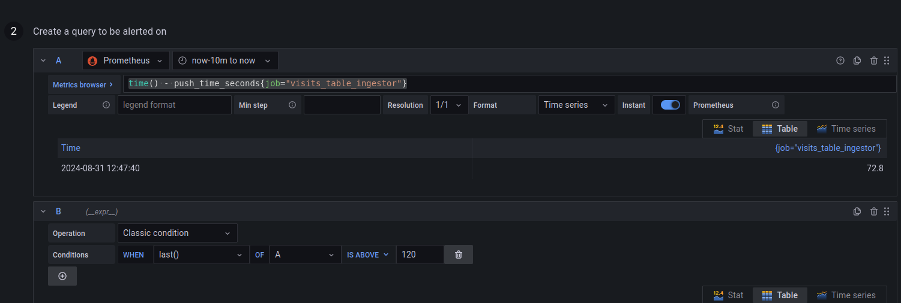
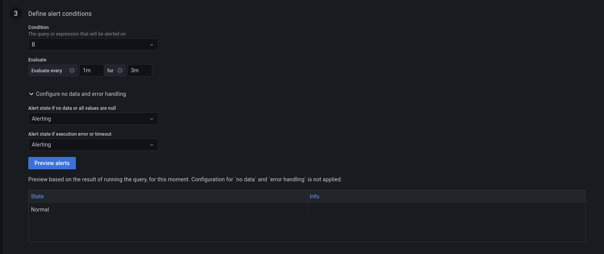
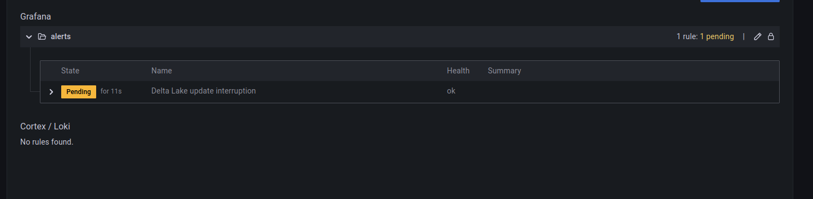
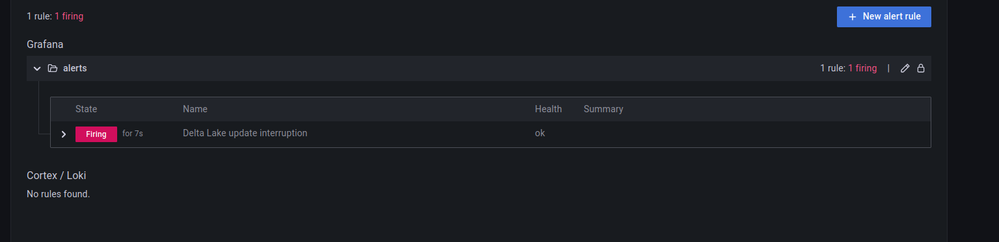
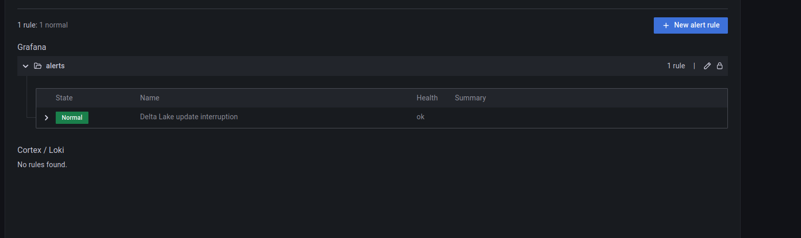
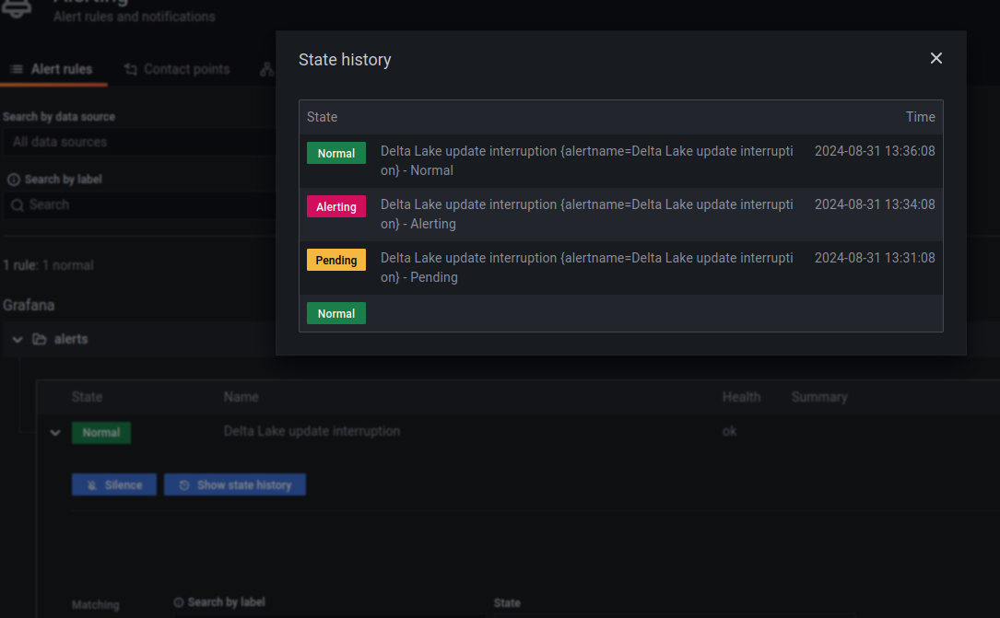

# Flow interruption detector - Delta Lake

1. Start Apache Kafka broker and generate the dataset:
```
rm -rf /tmp/dedp/ch10/01-data-detectors/01-flow-interruption-detector-delta-lake-grafana/
mkdir -p /tmp/dedp/ch10/01-data-detectors/01-flow-interruption-detector-delta-lake-grafana/checkpoint
cd docker
docker-compose down --volumes; docker-compose up
```

2. Explain the [tables_creator.py](tables_creator.py)
* the code creates a table to store the visits we're going to observe

3. Run the `tables_creator.py`

4. Explain the [visits_writer_job.py](visits_writer_job.py)
* the job inserts new visits to the monitored Delta Lake table
* besides inserting the visits, the job also sends an event to the _Prometheus Push Gateway_ that is a persistent Prometheus
storage that can be queried from Grafana to get some metrics not natively exported by JMX or any other connector
  * that's the case of our refresh event; Delta Lake is a static storage system and it doesn't provide any metrics natively.
  You can eventually rely on the ones of your storage system, such as last file written on disk, or last object created for
  a given prefix in the object store, if any of those is available. In our example, we're relying on this Prometheus'
  extensibility to monitor the Delta Lake table refreshes


5. Run the `visits_writer_job.py` and stop it after 2 minutes.

6. Run `tables_reader.py`. You should see some data in the table:

```+--------+
|count(1)|
+--------+
|     147|
+--------+
```

7. Go to Grafana (http://localhost:3000/login; admin/admin)
8. Add the detector in the alerting part:

* "+ Create > Folder", call it _alerts_
* Alerting > Alert rules > New alert rule
* Configure the rule:
  * name: "Delta Lake update interruption"
  * type: Grafana-managed alert
  * folder: alerts
* Set this to the Metrics browser: `time() - push_time_seconds{job="visits_table_ingestor"}`
* Configure the "B" part as below:



* Configure the "Define alert conditions" as below:



* Click on "Save and exit"

9. Go to [http://localhost:3000/alerting/list](http://localhost:3000/alerting/list); the alert should be in "_Pending_" state:



10. Wait 3-4 minutes to see the alert passing to the "_Firing_" state:


11. Restart the `visits_writer_job.py`. After 1-2 minutes, the alert should be back to the "_Normal_" state:


...and the history should show the changes:
