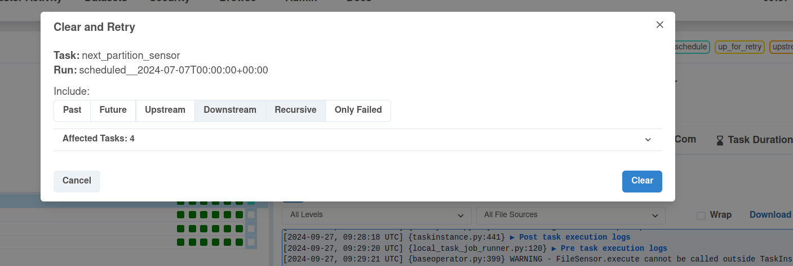
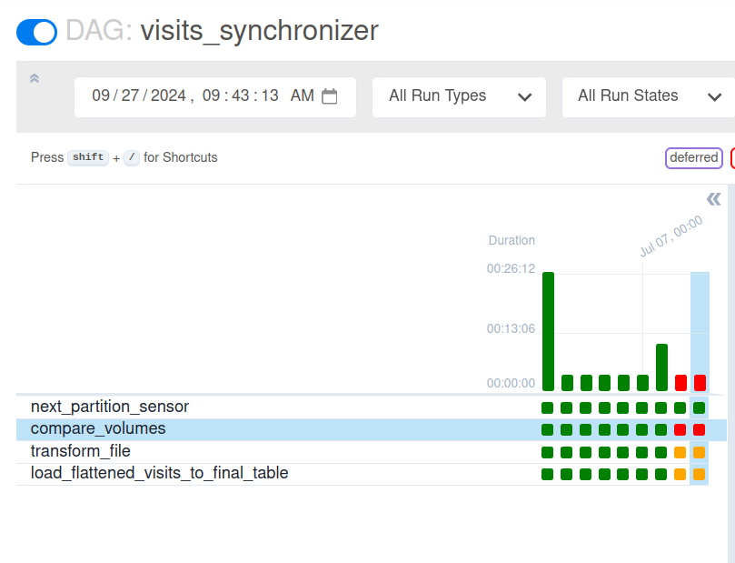

# Skew detector - Apache Airflow and PostgreSQL


1. Prepare the dataset:
```
cd dataset
mkdir -p /tmp/dedp/ch10/01-data-detectors/02-skew-detector-apache-airflow-postgresql/input
docker-compose down --volumes; docker-compose up
```

2. Start the Docker containers:
```
cd docker
docker-compose down --volumes; docker-compose up
```

3. Explain the [visits_synchronizer.py](dags%2Fvisits_synchronizer.py)
* the job processes the input visits and loads them to the visits table that we're going to monitor
* the interesting thing for us is the `compare_volumes` function that compares the size of files to load 
  * if the currently loaded file is 50% bigger or smaller than the previous one, the function raises an exception and 
    the pipeline stops

4. Start the Apache Airflow instance:
```
cd ../
./start.sh
```

5. Open the Apache Airflow UI and connect: http://localhost:8080 (dedp/dedp)

6. Enable the `visits_synchronizer` DAG.

7. All runs should complete as expected.

8. Let's create some of the missing files that are going to break the 50% skew constraints:
```
mkdir date\=2024-07-08
head -n 2 date\=2024-07-07/dataset.json | tee date\=2024-07-08/dataset.json

mkdir date\=2024-07-09
cat date\=2024-07-06/dataset.json date\=2024-07-07/dataset.json > date\=2024-07-09/dataset.json

mkdir date\=2024-07-10
cp date\=2024-07-06/dataset.json date\=2024-07-10/dataset.json
```

9. Clear the state of the last _next_partition_sensor_ so that Airflow can restart it immediately:



10. Now 2 executions should fail because of the smaller and bigger datasets:

