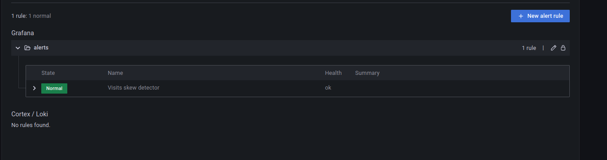

# Skew detector - Apache Kafka and Grafana

1. Start the containers:
```
cd docker
docker-compose down --volumes; docker-compose up
```

2. Explain [data_producer_job.py](data_producer_job.py)
* it's our data generator that writes keyed records to _visits_ topic in Apache Kafka
* as you can notice, the partition 0 is skewed as 5 out of 7 rows are written there

3. Go to Grafana (http://localhost:3000/login; admin/admin) 

4. Go to the "Kafka Topics / Logs" dashboard from Dashboards > Browse and select the visits topic. 
The dashboard should be missing the per-partition view at this point.

5. Run `data_producer_job.py`.

6. Let's add an alert on that by leveraging the relative standard deviation (RSD). 

* "+ Create > Folder", call it _alerts_


* Add a new alert from Alerting > Alert rules > New alert rule
* Configure the rule:
  * name: "Visits skew detector"
  * type: Grafana-managed alert
  * folder: alerts
* Set this to the "A" part: 
`stddev(sum(kafka_log_size{topic='visits'}) by (partition)) / avg(kafka_log_size{topic='visits'}) * 100`

* Configure the "B" part as:


* Configure the "Alert conditions" as below:


* Click on "Save and exit"

9. Go to the alerts page at [http://localhost:3000/alerting/list](http://localhost:3000/alerting/list). The page should
show the alert in the _Normal_ state first, and after approximately 1 minute, it should move to the _Pending_ state:


10. Since we configured the evaluation window to 2 minutes, wait extra 2-3 minutes to see the alert passing to the _Firing_ state:


11. Run `data_producer_balanced.py`

12. Wait 1-2 minutes to see the alert passing to the _Normal_ state again:


You can also click on the "Show state history" button to see the most recent alert changes:


13. Run `data_producer_little_skew.py`

14. This new skew is below our skewness threshold of 10%. For that reason the alert won't be triggered. You can 
check the current status by clicking the "view" button in the alerts page:

