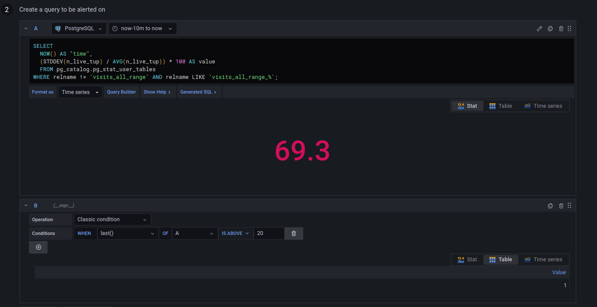
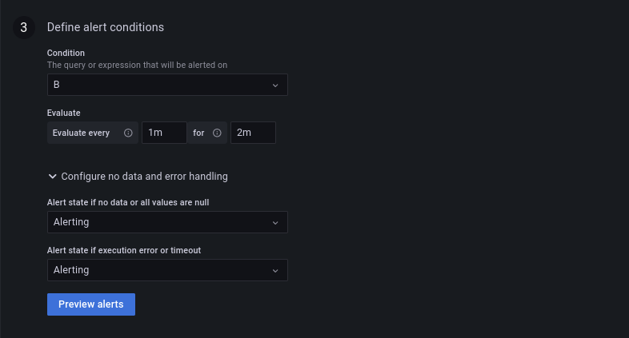
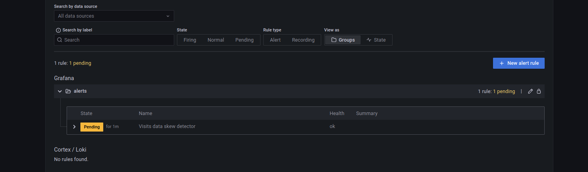
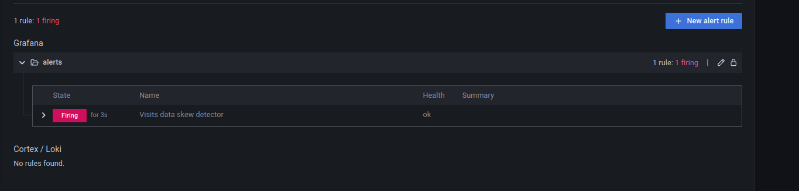
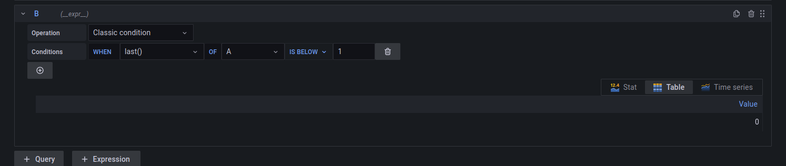
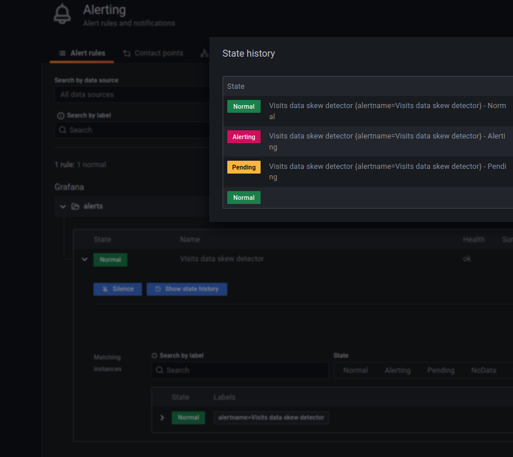

# Skew detector - PostgreSQL

1. Start the Docker containers:
```
cd docker
docker-compose down --volumes; docker-compose up
```

2. Create partitioned tables:

```sql
docker exec -ti dedp_postgresql psql --user dedp_test -d dedp

CREATE TABLE dedp.visits_all_range (
    visit_id CHAR(2) NOT NULL,
    event_time TIMESTAMP NOT NULL,
    user_id  TEXT NOT NULL,
    page VARCHAR(20) NULL,
    PRIMARY KEY(visit_id, event_time)
) PARTITION BY RANGE(event_time);

CREATE TABLE dedp.visits_all_range_20240824 PARTITION OF dedp.visits_all_range
    FOR VALUES FROM('2024-08-24 00:00:00') TO ('2024-08-24 23:59:59');

CREATE TABLE dedp.visits_all_range_20240825 PARTITION OF dedp.visits_all_range
    FOR VALUES FROM('2024-08-25 00:00:00') TO ('2024-08-25 23:59:59');
 
CREATE TABLE dedp.visits_all_range_20240826 PARTITION OF dedp.visits_all_range
    FOR VALUES FROM('2024-08-26 00:00:00') TO ('2024-08-26 23:59:59');
```

3. Insert skewed data where the second partition (2024-08-25) gets 3x more data than the others:

```sql
INSERT INTO dedp.visits_all_range (visit_id, event_time, user_id, page) 
VALUES ('v1', '2024-08-24 05:00:00', 'user1 ', 'page_1.html'),
('v2', '2024-08-24 05:05:00', 'user2 ', 'page_2.html'),
('v3', '2024-08-24 15:00:00', 'user3 ', 'about.html'),
('v4', '2024-08-24 10:00:00', 'user1 ', 'contact.html');

INSERT INTO dedp.visits_all_range (visit_id, event_time, user_id, page) 
VALUES ('v1', '2024-08-25 05:00:00', 'user1 ', 'page_1.html'),
('v2', '2024-08-25 05:05:00', 'user2 ', 'page_2.html'),
('v3', '2024-08-25 15:00:00', 'user3 ', 'about.html'),
('v4', '2024-08-25 10:00:00', 'user1 ', 'contact.html'),
('v5', '2024-08-25 15:00:00', 'user3 ', 'about.html'),
('v6', '2024-08-25 15:00:00', 'user3 ', 'contact.html'),
('v7', '2024-08-25 15:05:00', 'user3 ', 'page_2.html'),
('v8', '2024-08-25 15:07:00', 'user3 ', 'page_2.html'),
('v9', '2024-08-25 15:12:00', 'user3 ', 'about.html'),
('v9', '2024-08-25 15:17:00', 'user3 ', 'page_4.html'),
('v9', '2024-08-25 15:20:00', 'user3 ', 'about.html'),
('v9', '2024-08-25 15:25:00', 'user3 ', 'page_2.html');

INSERT INTO dedp.visits_all_range (visit_id, event_time, user_id, page) 
VALUES ('v1', '2024-08-26 05:00:00', 'user1 ', 'page_1.html'),
('v2', '2024-08-26 05:05:00', 'user2 ', 'page_2.html'),
('v3', '2024-08-26 15:00:00', 'user3 ', 'about.html'),
('v4', '2024-08-26 10:00:00', 'user1 ', 'contact.html');
```

4. Go to Grafana: (http://localhost:3000/login; admin/admin) and create a new alert:

* Add a PostgreSQL new data source:
  * Host: postgresql:5432
  * Database: dedp
  * User/password: dedp_test
  * TLS/SSL: disable
  * PostgreSQL details / version: 12+
  * Click on "Save & test"; you should see "Database connection OK"

* "+ Create > Folder", call it _alerts_


* Add a new alert from Alerting > Alert rules > New alert rule
  * Configure the rule:
    * name: "Visits data skew detector"
    * type: Grafana-managed alert
    * folder: alerts
  * Set this to the "A" part after clicking on "Edit SQL": 
```sql
SELECT
  NOW() AS "time",
  (STDDEV(n_live_tup) / AVG(n_live_tup)) * 100 AS value
  FROM pg_catalog.pg_stat_user_tables
WHERE relname != 'visits_all_range' AND relname LIKE 'visits_all_range_%';
```

* Configure the "B" part as below:



* Configure the "Alert conditions" as below:



* Click on "Save and exit"

5. Go to the alerts page at [http://localhost:3000/alerting/list](http://localhost:3000/alerting/list). The page should
show the alert in the _Normal_ state first, and after approximately 1 minute, it should move to the _Pending_ state:


6. Since we configured the evaluation window to 2 minutes, wait extra 2-3 minutes to see the alert passing to the _Firing_ state:


7. Rebalance the dataset:
```sql
INSERT INTO dedp.visits_all_range (visit_id, event_time, user_id, page) 
VALUES ('v1', '2024-08-25 11:00:00', 'user1 ', 'page_1.html'),
('v2', '2024-08-25 11:05:00', 'user2 ', 'page_2.html'),
('v3', '2024-08-25 11:00:00', 'user3 ', 'about.html'),
('v4', '2024-08-25 11:00:00', 'user1 ', 'contact.html');

INSERT INTO dedp.visits_all_range (visit_id, event_time, user_id, page) 
VALUES ('v1', '2024-08-24 08:00:00', 'user1 ', 'page_1.html'),
('v2', '2024-08-24 08:05:00', 'user2 ', 'page_2.html'),
('v3', '2024-08-24 08:01:00', 'user3 ', 'about.html'),
('v4', '2024-08-24 08:00:00', 'user1 ', 'contact.html'),
('v5', '2024-08-24 08:00:00', 'user3 ', 'about.html'),
('v6', '2024-08-24 08:00:00', 'user3 ', 'contact.html'),
('v7', '2024-08-24 08:05:00', 'user3 ', 'page_2.html'),
('v8', '2024-08-24 08:07:00', 'user3 ', 'page_2.html'),
('v9', '2024-08-24 08:12:00', 'user3 ', 'about.html'),
('v9', '2024-08-24 08:17:00', 'user3 ', 'page_4.html'),
('v9', '2024-08-24 08:20:00', 'user3 ', 'about.html'),
('v9', '2024-08-24 08:25:00', 'user3 ', 'page_2.html');

INSERT INTO dedp.visits_all_range (visit_id, event_time, user_id, page) 
VALUES ('v1', '2024-08-26 18:00:00', 'user1 ', 'page_1.html'),
('v2', '2024-08-26 18:05:00', 'user2 ', 'page_2.html'),
('v3', '2024-08-26 18:11:00', 'user3 ', 'about.html'),
('v4', '2024-08-26 18:00:00', 'user1 ', 'contact.html'),
('v5', '2024-08-26 18:00:00', 'user3 ', 'about.html'),
('v6', '2024-08-26 18:00:00', 'user3 ', 'contact.html'),
('v7', '2024-08-26 18:05:00', 'user3 ', 'page_2.html'),
('v8', '2024-08-26 18:07:00', 'user3 ', 'page_2.html'),
('v9', '2024-08-26 18:12:00', 'user3 ', 'about.html'),
('v9', '2024-08-26 18:17:00', 'user3 ', 'page_4.html'),
('v9', '2024-08-26 18:20:00', 'user3 ', 'about.html'),
('v9', '2024-08-26 18:25:00', 'user3 ', 'page_2.html');
```

8. Wait 1-2 minutes to see the alert passing to the _Normal_ state again:



You can also click on the "Show state history" button to see the most recent alert changes:
