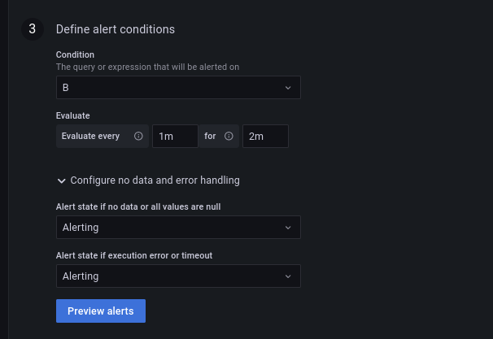

# Lag detector - Apache Spark Structured Streaming and Apache Kafka

1. Start Apache Kafka broker and generate the dataset:
```
rm -rf /tmp/dedp/ch10/02-time-detectors/01-lag-detector-apache-spark-apache-kafka-grafana
mkdir -p /tmp/dedp/ch10/02-time-detectors/01-lag-detector-apache-spark-apache-kafka-grafana/checkpoint
cd docker
docker-compose down --volumes; docker-compose up
```

2. Explain the [tables_creator.py](tables_creator.py)
* the code creates a table to store the visits we're going to observe

3. Run the `tables_creator.py`

4. Explain the [visits_writer_job.py](visits_writer_job.py)
* the job inserts new visits to the monitored Delta Lake table
* but before writing the data, the job is sleeping for 15 seconds to simulate some latency
* besides, there is a `stream_listeners.BatchCompletionSlaListener` called whenever a micro-batch completes;
It sends an event with the micro-batch duration to the _Prometheus Push Gateway_ that is a persistent Prometheus
storage that can be queried from Grafana to get some metrics not natively exported by JMX or any other connector.

5. Start the `visits_writer_job.py`.

6. Go to Grafana (http://localhost:3000/login; admin/admin)
7. Add the detector in the alerting part:

* "+ Create > Folder", call it _alerts_
* Alerting > Alert rules > New alert rule
* Configure the rule:
  * name: "SLA miss visits synchronizer"
  * type: Grafana-managed alert
  * folder: alerts
* Set this to the Metrics browser: `visits_sync_duration`
* Configure the "B" part as below:


* Configure the "Define alert conditions" as below:



* Click on "Save and exit"

8. Stop the `visits_writer_job.py` and wait 2-3 minutes.

9. Restart the `visits_writer_job.py`.

10. Go to [http://localhost:3000/alerting/list](http://localhost:3000/alerting/list) and wait next 2-3 minutes. The alert should move to "_Pending_" state:


11. Wait 2-3 minutes to see the alert passing to the "_Firing_" state:


12. Stop the data-generator to give the job time to catch up:
```
$ docker stop docker-data_generator-1

$ docker ps
CONTAINER ID   IMAGE                              COMMAND                  CREATED          STATUS                    PORTS                                                                                                                             NAMES
5241a94e5bf5   sscaling/jmx-prometheus-exporter   "usr/local/bin/dumb-…"   11 minutes ago   Up 11 minutes             0.0.0.0:5556->5556/tcp, :::5556->5556/tcp                                                                                         docker-jmx-kafka-1
24badb05e33b   grafana/grafana:8.4.5              "/run.sh"                11 minutes ago   Up 11 minutes             0.0.0.0:3000->3000/tcp, :::3000->3000/tcp                                                                                         dedp_docker_grafana
c1a196b77422   prom/prometheus:v2.34.0            "/bin/prometheus --c…"   11 minutes ago   Up 11 minutes             0.0.0.0:9090->9090/tcp, :::9090->9090/tcp                                                                                         docker-prometheus-1
1df740155265   bitnami/kafka:3.5                  "/opt/bitnami/script…"   11 minutes ago   Up 11 minutes (healthy)   0.0.0.0:9092->9092/tcp, :::9092->9092/tcp, 0.0.0.0:9094->9094/tcp, :::9094->9094/tcp, 0.0.0.0:9991->9991/tcp, :::9991->9991/tcp   kafka
ea980e529659   prom/pushgateway:v1.9.0            "/bin/pushgateway"       11 minutes ago   Up 11 minutes             0.0.0.0:9091->9091/tcp, :::9091->9091/tcp                                                                                         docker-pushgateway-1

```

13. Change the `.option('maxOffsetsPerTrigger', '50')` in the `visits_writer_job.py` to 
`.option('maxOffsetsPerTrigger', '1000')`.

14. Restart the `visits_writer_job.py`.

15. Wait 2-3 minutes. The alert should return to the _Normal_ state:


...and the history should show the changes:
