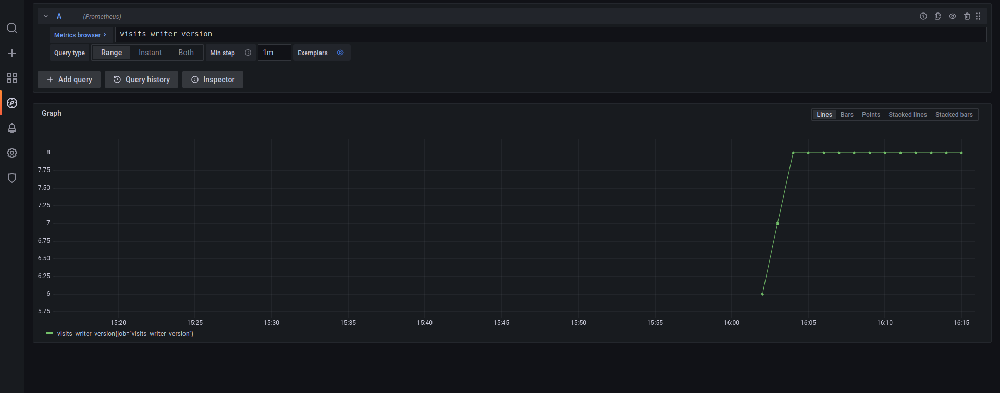
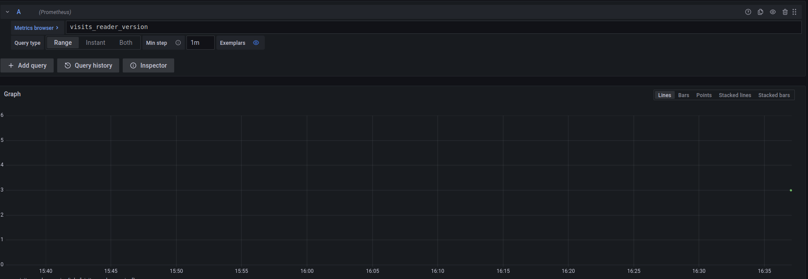
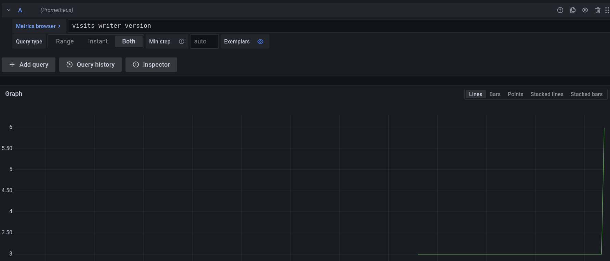
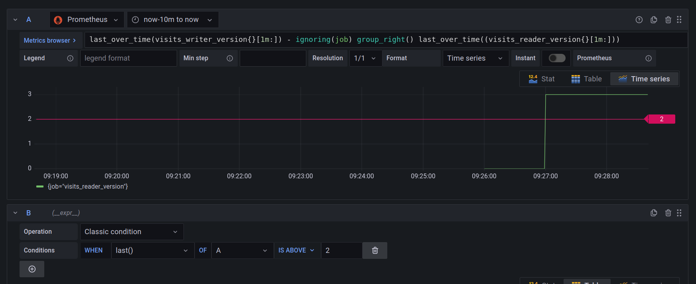
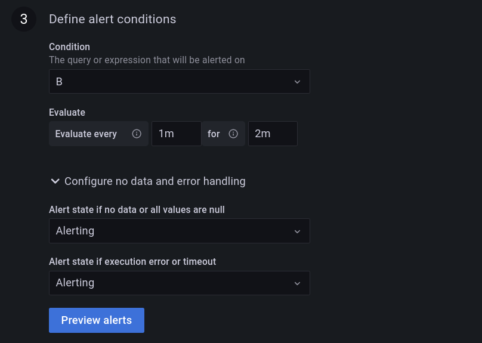
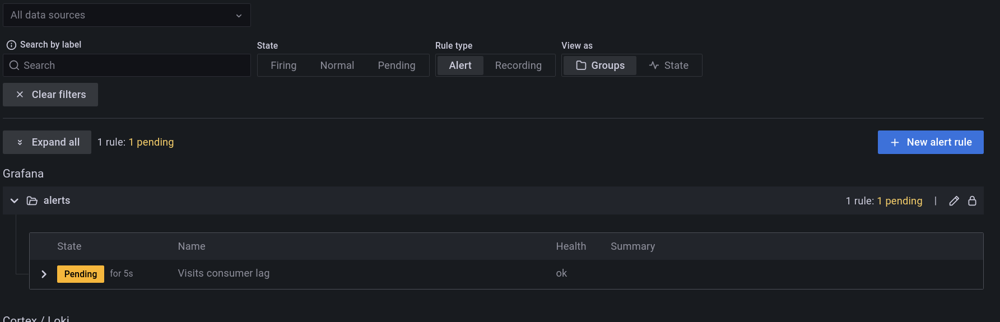
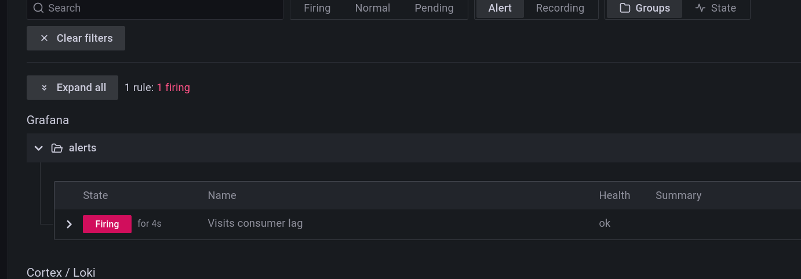
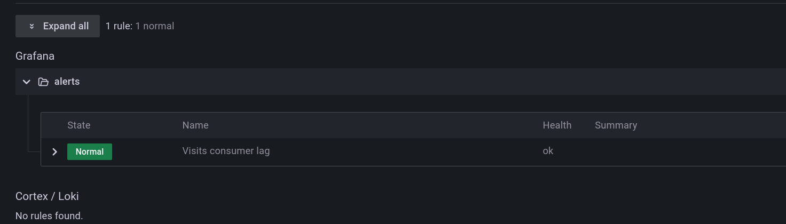
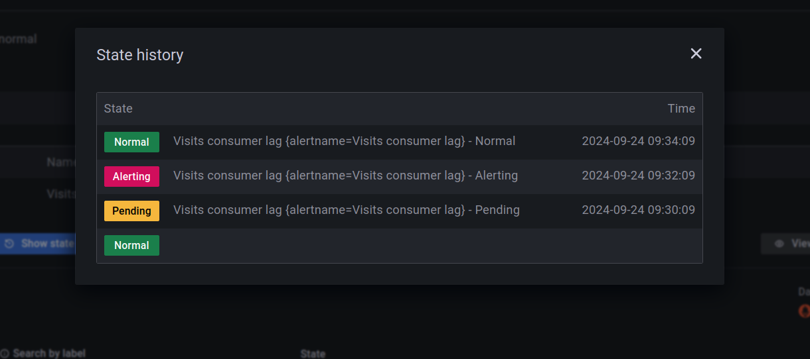

# Lag detector - Delta Lake with Apache Spark Structured Streaming

1. Explain the [create_table.py](create_table.py)
* the job creates a new _visits_ table that we're going to observe in our demo
2. Run `create_table.py`. You should get:
```
+----------------------------+------------------------+
|name                        |tableFeatures           |
+----------------------------+------------------------+
|spark_catalog.default.visits|[appendOnly, invariants]|
+----------------------------+------------------------+

+----------------------+-----+
|key                   |value|
+----------------------+-----+
|delta.minReaderVersion|1    |
|delta.minWriterVersion|2    |
+----------------------+-----+
```

3. Explain [visits_creator_job.py](visits_creator_job.py)
* the job simply adds some new random visits to the created table

4. Run `visits_creator_job.py`.

5. Run `visists_reader.py`. You should get the following output:
```
+---------+----------------------+-------+------------+
|visit_id |event_time            |user_id|page        |
+---------+----------------------+-------+------------+
|visit 1-0|2024-07-01 12:00:00.84|user 1 |index.html  |
|visit 1-1|2024-07-01 12:00:00.84|user 1 |index.html  |
|visit 1-2|2024-07-01 12:00:00.84|user 1 |index.html  |
|visit 2-0|2024-07-01 14:00:00.84|user 2 |contact.html|
|visit 2-1|2024-07-01 14:00:00.84|user 2 |contact.html|
|visit 2-2|2024-07-01 14:00:00.84|user 2 |contact.html|
|visit 3-0|2024-07-01 15:00:00.84|user 3 |about.html  |
|visit 3-1|2024-07-01 15:00:00.84|user 3 |about.html  |
|visit 3-2|2024-07-01 15:00:00.84|user 3 |about.html  |
+---------+----------------------+-------+------------+
```

6. The `visits_creator_job.py` also emitted a new metric called _visits_writer_version_ to the Prometheus Pushgateway. You can check it by logging 
to Grafana at [http://localhost:3000](http://localhost:3000) (admin/admin) and going to "Explore > Prometheus", as 
shows the screenshot below:



7. Explain [visits_consumer.py](visits_consumer.py)
* the job reads all new versions of the visits table, prints the content, and finally submits the last processed
version to the Prometheus Pushgateway

8. Run `visits_consumer.py`.

9. Go back to the Grafana Explorer and check if the new metric is available by refreshing the page and typying
"visits_reader_version" (it may be some refresh delay due to the metrics scrapping). You should see one data point as below:



10. Let's create some lag by running the `visits_creator_job.py`. Now, the _visits_writer_version_ should have increased to 6:


11. Go back to Grafana and create a new alert:

* "+ Create > Folder", call it _alerts_
* Alerting > Alert rules > New alert rule
* Configure the rule:
  * name: "Visits consumer lag"
  * type: Grafana-managed alert
  * folder: alerts
* Set this to the Metrics browser: 
`last_over_time(visits_writer_version{}[1m:]) - ignoring(job) group_right() last_over_time((visits_reader_version{}[1m:]))`
* Configure the "B" part as below:



* Configure the "Define alert conditions" as below:



* Click on "Save and exit"

8. Go to [http://localhost:3000/alerting/list](http://localhost:3000/alerting/list); the alert should pass to the "_Pending_" state:



9. Wait 2-3 more minutes to see the alert passing to the "_Firing_" state:


10. Run `visits_consumer.py`.

11. Return to Grafana. After 1-2 minutes, the alert should be back to the "_Normal_" state:


...and the history should show the changes:
