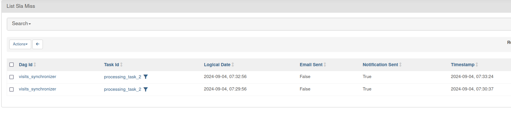

# SLA Misses - Apache Airflow

1. Explain [visits_synchronizer.py](dags/visits_synchronizer.py)
* it's a simple DAG we're going to monitor for the SLA misses
* Apache Airflow's SLA is a specific one and the current (version 2.9) limitations greatly explained Rubens Funabashi and
Felipe Wurch in their [HOW TO FIX AIRFLOW SLA](https://medium.com/@poatek/how-to-fix-airflow-sla-ab7055f85e0a) blog post
  * in a nutshell, Apache Airflow computes SLA from the start execution time; therefore, in our example, the second task
  will always be late as it starts at least 20 seconds later
    * for example, for the execution started at 08:00:00, the second task should complete by 08:00:10, however the first 
    task will last until at least 08:00:20, hence the SLA miss

2. Start the Apache Airflow instance:
```
cd ../
./start.sh
```

3. Open the Apache Airflow UI and connect: http://localhost:8080 (dedp/dedp)

4. Enable the DAG.

5. After running the pipeline, you should see the SLA misses on http://localhost:8080/slamiss/list/:



6. Remove the `time.sleep` from the DAG. After few next executions you shouldn't see any new SLA Misses entries.
