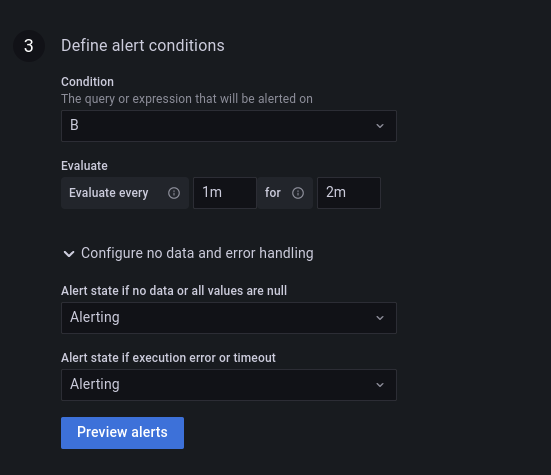

# SLA Misses - Apache Flink

1. Explain [reduced_visits_data_synchronizer_job.py](reduced_visits_data_synchronizer_job.py)
* that's the job we're going to monitor for the SLA misses
* the logic is simple; it consists of extracting only a few fields from the input message and sending so reduced
input to an output topic
* each emitted record has a field called _start_processing_time_unix_ms_ that corresponds to the processing time timestamp

2. Explain [reduced_visit_synchronizer_sla_monitoring_job.py](reduced_visit_synchronizer_sla_monitoring_job.py):
* that's the job computing the latency for each processed record
* the logic consists of creating 1-minute event time windows and computing percentiles (50, 75, 90, 99) for the 
latencies accumulated in each window
  * so generated latencies are later delivered to an Elasticsearch index
* the job mixes Table and DataStream APIs to simplify accessing Kafka record's append time attribute

3. Start Apache Kafka with the data generator:
```
cd docker
docker-compose down --volumes --remove-orphans; docker-compose up
```

4. Start `reduced_visits_data_synchronizer_job.py`

5. Start `reduced_visit_synchronizer_sla_monitoring_job.py`

6. Go to Grafana (http://localhost:3000/login; admin/admin)

7. Add the detector in the alerting part:

* Add a new data source as specified below:
  * Host: http://elasticsearch:9200
  * Index: visits_sync_sla
  * Version: 8.0+


unset JMX_PORT
kafka-console-consumer.sh --topic reduced_visits --bootstrap-server localhost:9092 --from-beginning --property print.timestamp=true


* "+ Create > Folder", call it _alerts_
* Alerting > Alert rules > New alert rule
* Configure the rule:
  * name: "SLA miss visits synchronizer"
  * type: Grafana-managed alert
  * folder: alerts
* Configure the "A" and "B" parts as below:


* Configure the "Define alert conditions" as below:



* Click on "Save and exit"

8. Go to [http://localhost:3000/alerting/list](http://localhost:3000/alerting/list); the alert should be in "_Pending_" state:


 
9. Wait 2-3 minutes to see the alert passing to the "_Firing_" state:


10. Stop the `reduced_visits_data_synchronizer_job.py` and comment the following line in the [models.py](models.py):
```
import time
time.sleep(10)
```

11. Restart the `reduced_visits_data_synchronizer_job.py`.

12. Wait 2-3 minutes. The alert should return to the _Normal_ state:


...and the history should show the changes:
