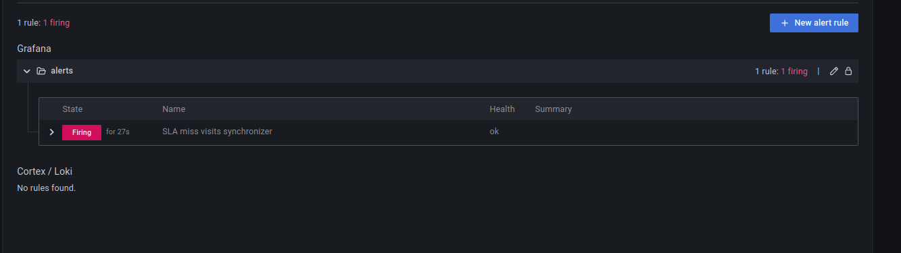
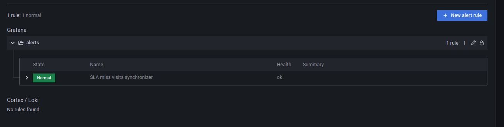

# SLA misses - Apache Spark Structured Streaming

1. Start Apache Kafka broker and generate the dataset:
```
rm -rf /tmp/dedp/ch10/02-time-detectors/02-sla-misses-apache-spark-structured-streaming/checkpoint
mkdir -p /tmp/dedp/ch10/02-time-detectors/02-sla-misses-apache-spark-structured-streaming/checkpoint
cd docker
docker-compose down --volumes; docker-compose up
```

2. Explain the [tables_creator.py](tables_creator.py)
* the code creates a table to store the visits we're going to observe

3. Run the `tables_creator.py`

4. Explain the [visits_writer_job.py](visits_writer_job.py)
* the job inserts new visits to the monitored Delta Lake table
* but before writing the data, the job is sleeping for 15 seconds to simulate some latency
* besides, there is a `stream_listeners.BatchCompletionSlaListener` called whenever a micro-batch completes;
It sends an event with the micro-batch duration to the _Prometheus Push Gateway_ that is a persistent Prometheus
storage that can be queried from Grafana to get some metrics not natively exported by JMX or any other connector.

5. Start the `visits_writer_job.py`.

6. Go to Grafana (http://localhost:3000/login; admin/admin)
7. Add the detector in the alerting part:

* "+ Create > Folder", call it _alerts_
* Alerting > Alert rules > New alert rule
* Configure the rule:
  * name: "SLA miss visits synchronizer"
  * type: Grafana-managed alert
  * folder: alerts
* Set this to the Metrics browser: `visits_sync_duration`
* Configure the "B" part as below:


* Configure the "Define alert conditions" as below:


* Click on "Save and exit"

8. Go to [http://localhost:3000/alerting/list](http://localhost:3000/alerting/list); the alert should be in "_Pending_" state:


9. Wait 2-3 minutes to see the alert passing to the "_Firing_" state:


10. Comment the `time.sleep(15)` in the `visits_writer_job.py`.

11. Restart the `visits_writer_job.py`. After 1-2 minutes, the alert should be back to the "_Normal_" state:


...and the history should show the changes:
