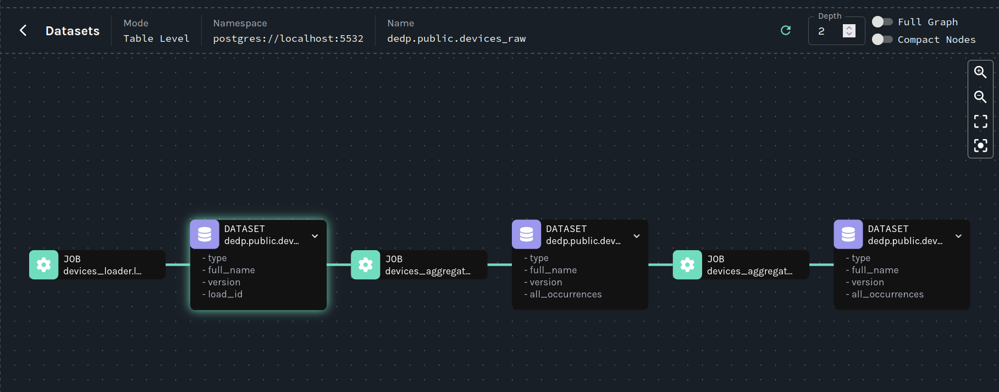

# Dataset lineage - Apache Airflow, OpenLineage, Marquez, and PostgreSQL


1. Prepare the dataset:
```
cd dataset
mkdir -p /tmp/dedp/ch10/03-data-lineage/01-dataset-tracker-openlineage-apache-airflow-marquez/input
docker-compose down --volumes; docker-compose up
```

2. Start the Docker containers:
```
cd docker
docker-compose down --volumes; docker-compose up
```

3. Explain the DAGs:
* [devices_loader.py](dags/devices_loader.py) is the first pipeline that ingest raw devices CSV data to a _devices_raw_ table
* [devices_aggregator.py](dags/devices_aggregator.py) is the direct consumer of the _devices_raw_ table; the job performs
a simple aggregation on the devices table
* [devices_aggregator_bi.py](dags/devices_aggregator_bi.py) is the consumer of the devices_aggregator; for the sake of 
simplicity it simply takes the rows as is from the _devices_aggregates_ table

4. Start the Apache Airflow instance:
```
cd ../
./start.sh
```

5. Open the Apache Airflow UI and connect: http://localhost:8080 (dedp/dedp)

6. All the 3 dags. The pipelines should run only once.

7. Go to the Marquez UI at [http://localhost:3000](http://localhost:3000), Datasets and "postgres://localhost:5532" namespace.
You should see the full lineage for all the 3 processed tables in the DAGs:

