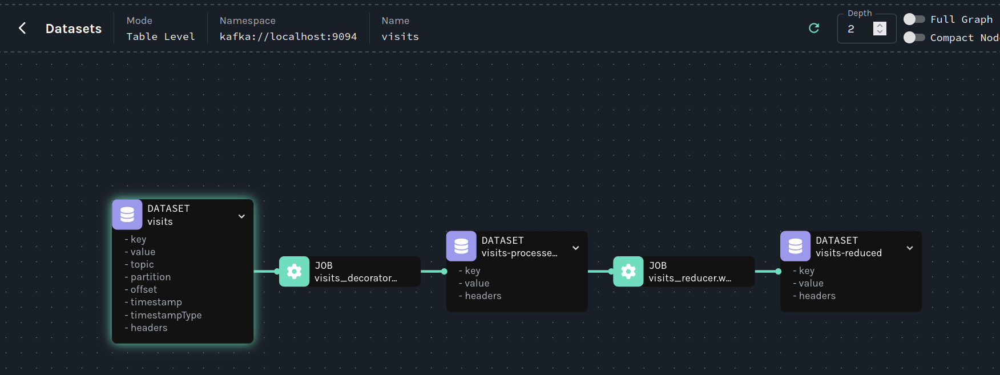

# Dataset lineage - Apache Spark, Apache Kafka, OpenLineage and Marquez

1. Start Apache Kafka broker with data generator:
```
rm -rf /tmp/dedp/ch10/03-data-lineage/01-dataset-tracker-openlineage-apache-kafka-apache-spark-marquez/
cd docker
docker-compose down --volumes; docker-compose up
```

2. Explain [spark_session_factory.py](spark_session_factory.py)
* the `create_spark_session_with_open_lineage` function returns a new `SparkSession` decorated with the OpenLineage 
listener, i.e. a component that is going to analyze the execution plan and send it to Marquez API for the lineage
visualization

3. Explain [visits_decorator_job.py](visits_decorator_job.py) and [visits_reducer_job.py](visits_reducer_job.py)
* the `visits_decorator_job.py` processes input data, adds some metadata to the header, and saves the result to a new 
Kafka topic called _visits-processed_
* the `visits_reducer_job.py` reads the _visits-processed_, extracts only few fields of the initial visit, and saves the
result to a _visits-reduced_ topic

4. Start `visits_decorator_job.py`
5. Start `visits_reducer_job.py`
6. After 1-2 minutes go to the Marquez UI at [http://localhost:3000/](http://localhost:3000/). After going to the Datasets
part, choosing "kafka://localhost:9094" namespace, and clicking on one of the topics, 
you should see the following lineage graph created:

