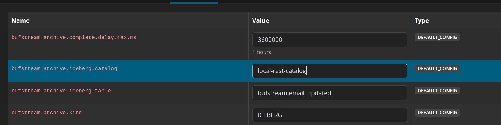
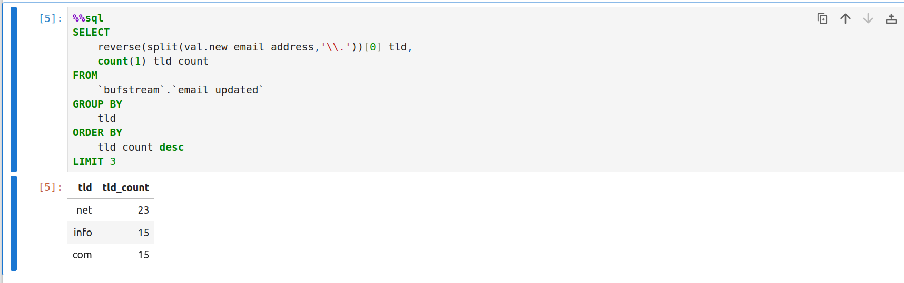

# Zero ETL - Apache Iceberg tables with Buf

The demo is brought to you with the courtesy of Buf. You'll find the up-to-date code alongside other demos on https://github.com/bufbuild/buf-examples/

1. Install Go.
2. Start Docker containers:
```
docker-compose down --volumes; docker-compose up
```

3. Produce a few records to the demo topic (email-updated):
```
go run ./cmd/producer   --topic email-updated   --group email-verifier   --csr-url "https://demo.buf.dev/integrations/confluent/bufstream-demo"
```

You should see:
```
time=2025-09-20T06:15:53.302+02:00 level=INFO msg="Creating messages" max=100
time=2025-09-20T06:15:57.269+02:00 level=INFO msg="Published message" number=1 of=100 "new email"=lenorahudson@mayer.io
time=2025-09-20T06:15:57.440+02:00 level=INFO msg="Published message" number=2 of=100 "new email"=reesewaelchi@roob.info
time=2025-09-20T06:15:57.584+02:00 level=INFO msg="Published message" number=3 of=100 "new email"=nataliawolf@kemmer.org
time=2025-09-20T06:15:57.733+02:00 level=INFO msg="Published message" number=4 of=100 "new email"=camrenlindgren@sawayn.net
...
time=2025-09-20T06:16:11.381+02:00 level=INFO msg="Published message" number=96 of=100 "new email"=rosemariebeer@douglas.net
time=2025-09-20T06:16:11.533+02:00 level=INFO msg="Published message" number=97 of=100 "new email"=vivianeprohaska@blick.com
time=2025-09-20T06:16:11.706+02:00 level=INFO msg="Published message" number=98 of=100 "new email"=lulakoss@botsford.com
time=2025-09-20T06:16:11.851+02:00 level=INFO msg="Published message" number=99 of=100 "new email"=carloshammes@becker.org
time=2025-09-20T06:16:11.994+02:00 level=INFO msg="Published message" number=100 of=100 "new email"=gloriadouglas@kessler.info

```

4. Update the demo topic config by opening http://localhost:8282/ui/bufstream-local/topic/email-updated/configs and 
setting:
* bufstream.archive.iceberg.catalog=local-rest-catalog
* bufstream.archive.iceberg.table=bufstream.email_updated
* bufstream.archive.kind=ICEBERG



5. Trigger topic archival:
```
docker exec bufstream /usr/local/bin/bufstream admin clean topics
time=2025-09-20T04:18:15.451Z level=INFO msg=clean-topics job_id=ThtLG4SxqF:VU40ZvVKydF
╭─ Job Result: clean-topics
├─ ✓ clean-topics	[#########################] 100% (3/3)
╰─ ✓ resolve-partitions	[#########################] 100% (3/3)
```

6. Open Jupyter notebook and see if the produced records were correctly synchronized 
http://localhost:8888/notebooks/notebooks/bufstream-iceberg-quickstart.ipynb


