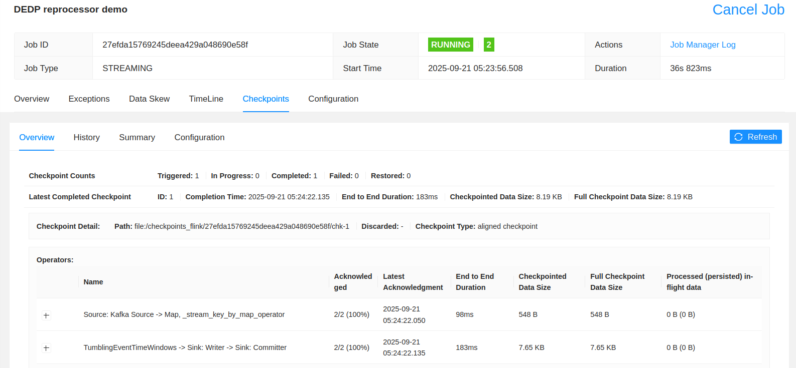
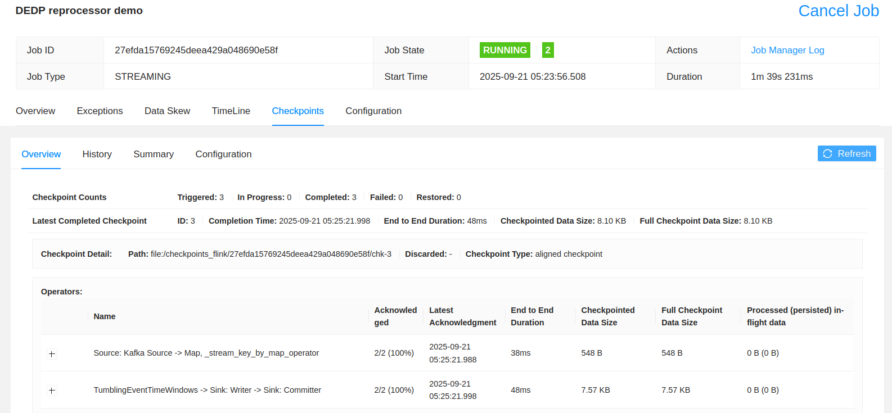
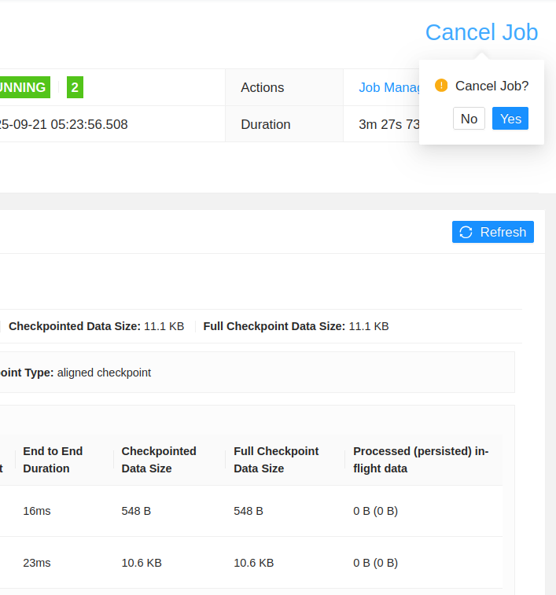
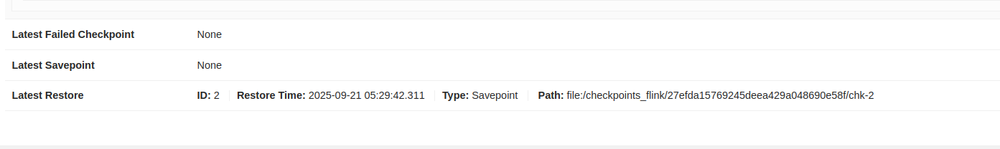

# Streaming reprocessor - Apache Flink

1. Explain the [stateful_flink_consumer.py](stateful_flink_consumer.py)
* the job counts the number of visits for each visit_id and returns the updated state with 4 new elements
  added downstream
* there are several points to keep in mind here where it comes to the reprocessing:
  * `state.checkpoints.dir` attribute that defines where the state gets checkpointed for fault-tolerance
    * it's passed in the Docker Compose: `-Dstate.checkpoints.dir="file:///checkpoints_flink"`
  * `set_externalized_checkpoint_retention` that keeps the checkpoint files even after the job cancellation
  * `env.enable_checkpointing(checkpoint_interval_20_seconds, mode=checkpoint_mode)` that impacts the state checkpointing
  * `set_delivery_guarantee(delivery_guarantee)` on the sink that provides an overall
    exactly-once delivery guarantee
  * `state.checkpoints.num-retained` specified at the configuration level will keep 10 most recent checkpoint files

In the demo we're going to configure the job either with the exactly-once delivery. Below some explanation from the [documentation](https://nightlies.apache.org/flink/flink-docs-release-1.17/docs/dev/datastream/fault-tolerance/checkpointing/)
> exactly-once vs. at-least-once: You can optionally pass a mode to the enableCheckpointing(n) method to choose between the two guarantee levels. Exactly-once is preferable for most applications. At-least-once may be relevant for certain super-low-latency (consistently few milliseconds) applications.

Therefore, this mode is important for the state consistency because it, according to the Javadoc:
>     /**
>     * Sets the checkpointing mode to "exactly once". This mode means that the system will
>     * checkpoint the operator and user function state in such a way that, upon recovery, every
>     * record will be reflected exactly once in the operator state.
>     *
>     * <p>For example, if a user function counts the number of elements in a stream, this number
>     * will consistently be equal to the number of actual elements in the stream, regardless of
>     * failures and recovery.

The `DeliveryGuarantee.EXACTLY_ONCE`, it relies on Flink's 2-Phase Commit and
Apache Kafka transactions to ensure the data is effectively written once.

3. Explain the Docker setup:
```
less docker/docker-compose.yaml
```
Checkpoint restore doesn't work in the local IDE-based Flink. That's why we rely here on the containerized version.
As you can see, the Job Manager starts our stateful job with mounted volumes for artifacts (JAR) and external 
checkpoint storage (/checkpoints).

4. Start the containers 
```
cd docker/
docker-compose down --volumes; docker-compose up
```

5. Open Apache Kafka producer:
```
docker exec -ti dedp_kafka kafka-console-producer.sh --broker-list localhost:9092 --topic visits
```
**TODO: rework this logic!**
And send some new visits:
```
{"event_id": "click-1", "visit_id": 1, "event_time": "2025-09-04T10:01:00.000000", "page": "page1"}
{"event_id": "click-2", "visit_id": 1, "event_time": "2025-09-04T10:02:00.000000", "page": "page2"}
{"event_id": "click-3", "visit_id": 1, "event_time": "2025-09-04T10:03:00.000000", "page": "page3"}
{"event_id": "click-4", "visit_id": 1, "event_time": "2025-09-04T10:04:00.000000", "page": "page4"}
{"event_id": "click-5", "visit_id": 1, "event_time": "2025-09-04T10:05:00.000000", "page": "page5"}
{"event_id": "click-6", "visit_id": 1, "event_time": "2025-09-04T10:06:00.000000", "page": "page6"}
```


6. Connect to the JobManager and submit the job:
```
docker exec -ti docker_jobmanager_1 bash
./bin/flink run -pyclientexec /usr/bin/python3 -pyexec /usr/bin/python3 -pyfs /opt/flink/usrlib/ \
  -py /opt/flink/usrlib/stateful_flink_consumer.py -Dstate.checkpoints.dir="file:///checkpoints_flink"
```
Remember the job id.

7. Open the Kafka console consumer:
```
docker exec -ti dedp_kafka kafka-console-consumer.sh --bootstrap-server localhost:9092 --topic visits_counter --from-beginning --consumer-property "isolation.level=read_committed"
```
**The consumer starts with `--consumer-property "isolation.level=read_committed"`; otherwise, it's a standard consumer that sees uncommitted messages**

8. Go to Flink UI http://localhost:8081 and check if the job is running.


9. Add some additional visits in the Kafka producer:
```
{"event_id": "click-5", "visit_id": 1, "event_time": "2025-09-04T10:07:00.000000", "page": "page7"}
{"event_id": "click-6", "visit_id": 1, "event_time": "2025-09-04T10:08:00.000000", "page": "page8"}
{"event_id": "click-7", "visit_id": 1, "event_time": "2025-09-04T10:09:00.000000", "page": "page9"}
{"event_id": "click-8", "visit_id": 1, "event_time": "2025-09-04T10:10:00.000000", "page": "page10"}
```

Adding those events should generate first records in the output topic:
```
>> VISIT -1- [2025-09-23T02:31:26.189411], range=[2025-09-04T10:00:00 to 2025-09-04T10:15:00], visits=10, partial=True
>> VISIT -1- [2025-09-23T02:31:26.212613], range=[2025-09-04T10:00:00 to 2025-09-04T10:15:00], visits=10, partial=True
```

10. Go back to the Flink UI and check if a new checkpoint was created:


11. Again, add some extra visits: 
```
{"event_id": "click-9", "visit_id": 1, "event_time": "2025-09-04T10:11:00.000000", "page": "page11"}
{"event_id": "click-10", "visit_id": 1, "event_time": "2025-09-04T10:12:00.000000", "page": "page12"}
```

It should update the emitted state:
```
>> VISIT -1- [2025-09-23T02:32:51.199940], range=[2025-09-04T10:00:00 to 2025-09-04T10:15:00], visits=12, partial=True
```

12. Go back to the Flink UI and check if a new checkpoint was created:


13. If the new checkpoint was created, remember the job ID and stop the job 


14. Restart the job from the JobManager. In the command we specify the checkpoint created after the second 
batch of records written:
```
# 27efda15769245deea429a048690e58f is the job id
ls /checkpoints_flink/27efda15769245deea429a048690e58f
# export here your checkpoint file
export CHECKPOINT_FILE=/checkpoints_flink/27efda15769245deea429a048690e58f/chk-2
./bin/flink run -pyclientexec /usr/bin/python3 -pyexec /usr/bin/python3 -pyfs /opt/flink/usrlib/ \
  -py /opt/flink/usrlib/stateful_flink_consumer.py -s file://$CHECKPOINT_FILE -Dstate.checkpoints.dir="file:///checkpoints_flink"
```

You should see the restore action in the Flink UI:


Besides, the last two records should be reprocessed and emitted to the output topic:
```
>> VISIT -1- [2025-09-23T02:34:03.155130], range=[2025-09-04T10:00:00 to 2025-09-04T10:15:00], visits=12, partial=True
```